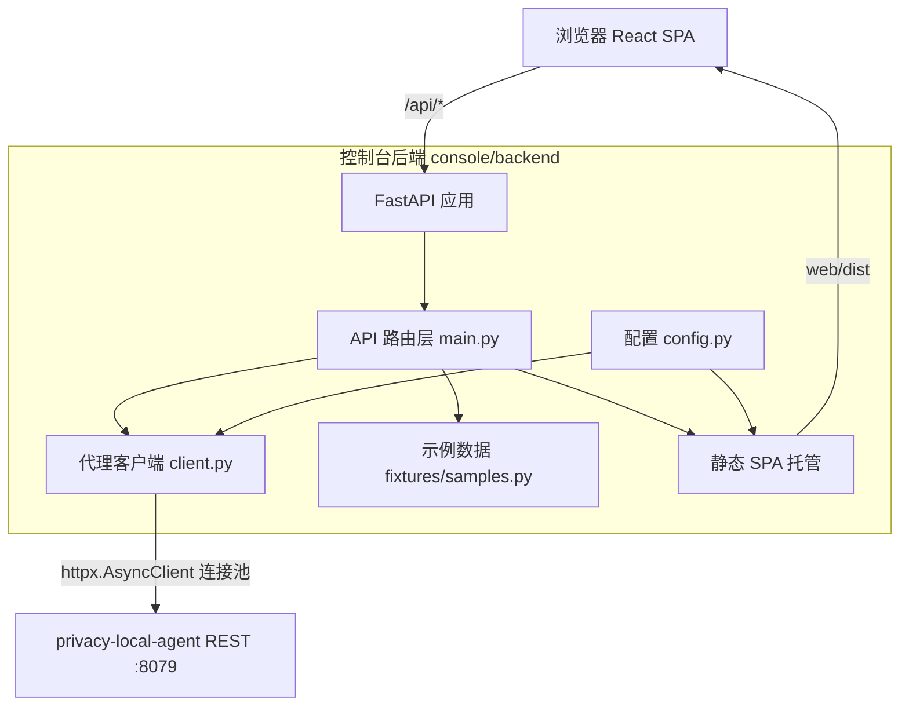
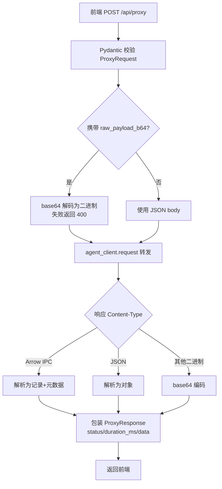

# 测试控制台后端（Python）设计文档

> 本文档定义 Privacy 测试控制台 Python 后端（`console/backend`）的技术架构、模块设计与实现细节。
>
> 关联文档：[api.md](./api.md)（接口参考）、[test.md](./test.md)（测试策略）。
> Go gRPC 后端的对应设计文档见 [backend-go/docs/design.md](../../backend-go/docs/design.md)。

---

## 1. 背景与选型

`privacy-local-agent` 的核心服务同时通过 REST（FastAPI，默认 `127.0.0.1:8079`）与 gRPC（默认 `127.0.0.1:50051`）暴露全部隐私原语（脱敏、差分隐私、K-匿名、查询混淆、数据分类）。

前端测试控制台（React）需要一个"代理层"来屏蔽跨域、统一响应格式并托管构建产物。本后端（`console/backend`）选择 **Python + FastAPI + httpx** 直接转发到 agent 的 **REST** 接口，原因如下：

- **与 agent 同语言**：请求/响应的 Pydantic 模型、字段命名与 agent 完全一致，转发层几乎零适配成本。
- **原生异步**：FastAPI 基于 ASGI，配合 `httpx.AsyncClient` 连接池可以高并发地转发请求，且与 agent 的异步生态无缝衔接。
- **二进制友好**：借助 `pyarrow` 直接在代理层解析 Arrow IPC 流，把二进制响应转换为前端可展示的 JSON 记录。
- **开发体验**：`uvicorn --reload` 热重载 + Pydantic v2 自动校验，本地开发反馈极快。

> 与之对应，`console/backend-go` 提供了 Go + gRPC 的等价实现，用于验证 gRPC 通信链路。两个后端对前端暴露**完全一致**的 JSON 契约，前端可通过右上角选择器无缝切换，并通过响应中的 `via` / `protocol` 字段直观确认当前通信方式。

---

## 2. 设计目标

- **轻量**：不引入隐私算法依赖，启动快、资源占用低。
- **透明转发**：请求体与响应体尽量原样传递，错误状态码与 `detail` 透传，保证前端看到的错误与直连 agent 一致。
- **统一契约**：所有代理响应包装为 `{status, duration_ms, data}`，前端只需一套解析逻辑。
- **二进制友好**：支持 base64 编码的二进制请求载荷与 Arrow IPC 响应的 JSON 化。
- **零配置可运行**：所有环境变量均有默认值，本地开发开箱即用。
- **输入安全**：所有请求/响应经 Pydantic v2 校验，作为输入安全的第一道防线。

---

## 3. 总体架构



Python 代理后端本身**不实现任何隐私算法**，核心定位是「**薄代理**」，只负责：

1. 接收前端的 HTTP/JSON 请求（`/api/proxy` / `/api/batch` / `/api/upload` / `/api/lb_test`）；
2. 通过应用级单例 `httpx.AsyncClient` 连接池转发到 agent 的 REST 端点；
3. 按 `Content-Type` 解析响应（JSON / Arrow IPC / 其他二进制）并统一包装；
4. 把 agent 的错误状态码与 `detail` 透传给前端；
5. 以静态资源形式托管构建好的 React SPA（`web/dist`），浏览器可直接访问控制台页面。

后端代码位于 `console/backend/app/`，按职责拆分为四个模块，保持良好内聚与低耦合。

---

## 4. 目录布局

```text
console/backend/
├── app/
│   ├── __init__.py
│   ├── main.py               # FastAPI 入口：路由、Pydantic 模型、静态 SPA 托管
│   ├── client.py             # PrivacyAgentClient：转发到 agent 的 httpx 客户端
│   ├── config.py             # Settings：基于 pydantic-settings 的环境变量配置
│   ├── fixtures/
│   │   └── samples.py        # 所有 agent 端点的示例请求载荷
│   └── routes/
│       └── __init__.py       # 预留的路由分包（当前路由集中在 main.py）
├── tests/
│   ├── test_routes.py        # /api/health、/api/samples、/api/proxy 单元测试
│   └── test_upload_lb.py     # /api/upload、/api/lb_test 单元测试
├── docs/                     # 设计、API、测试文档
│   ├── design.md
│   ├── api.md
│   └── test.md
├── smoke_test.py             # 经 /api/proxy 逐个调用所有示例端点的冒烟测试
├── requirements.txt          # 运行时依赖
├── run.sh                    # 一键启动脚本（uvicorn --reload）
└── README.md
```

---

## 5. 核心模块设计

### 5.1 应用入口（`app/main.py`）

职责：

- 定义全部 Pydantic 请求/响应模型（`ProxyRequest` / `ProxyResponse` / `BatchRequest` / `BatchResponse` 等）；
- 注册 API 端点：`/api/health`、`/api/samples`、`/api/proxy`、`/api/batch`、`/api/upload`、`/api/lb_test`；
- 通过 `lifespan` 管理 `httpx.AsyncClient` 连接池的预热与释放；
- 注册 CORS 中间件（允许 Vite 开发服务器跨域）；
- 挂载静态 SPA（`/assets/*` + SPA 回退路由）；
- 统一异常处理器，把错误规范化为 `{"detail", "status"}`。

**生命周期管理**：`lifespan` 在应用启动时调用 `agent_client._get_client()` 预热连接池，避免首个请求懒初始化带来的额外延迟；应用退出时优雅关闭客户端，释放连接。

**静态 SPA 托管**：采用「`/assets` 静态目录 + 其余路径回退 `index.html`」的经典方案：

- `/assets/*` 直接返回带内容哈希的 JS/CSS 构建产物（强缓存友好）；
- 其余非 API 路径一律返回 `index.html`，由前端路由接管；
- 回退路由注册在最后，优先级最低，不会遮挡 `/api/*` 与 `/assets/*`；
- 目录不存在时（如仅后端开发场景）应用仍可提供 API，不报错。

### 5.2 代理客户端（`app/client.py`）

`PrivacyAgentClient` 是后端与 agent 通信的**唯一出口**，设计为应用级单例 `agent_client`：

- **连接池复用**：内部懒初始化一个 `httpx.AsyncClient`，复用 TCP 连接；
- **直连保证**：显式设置 `trust_env=False`，不读取系统代理配置，避免本地代理工具（如 Clash）导致「All connection attempts failed」；
- **认证支持**：配置了 `PRIVACY_AGENT_API_KEY` 时自动附加 `Authorization: Bearer` 头；
- **响应解析**：按 `Content-Type` 区分三类响应——
  - Arrow IPC 流 → 解析为「记录列表 + schema 元数据」，NaN 替换为 `None`；
  - JSON → 解析为 Python 对象；
  - 其他二进制 → base64 编码后返回；
- **异常转换**：网络层错误 → `502 Bad Gateway`；agent 非 2xx → 透传原状态码与 `detail`。

### 5.3 配置模块（`app/config.py`）

基于 `pydantic-settings` 从环境变量（可选 `.env` 文件）加载配置。所有项均有默认值，字段通过 `alias` 映射到环境变量名。详见 [api.md](./api.md) 的环境变量表。

`populate_by_name = True` 允许测试中直接用字段名构造 `Settings`，便于单元测试。

### 5.4 示例数据（`app/fixtures/samples.py`）

`EndpointSample` 描述单个可测试端点的元数据与示例载荷：请求方法 / 路径 / 展示标签 / 功能分类 / 描述 / 默认请求体 / 二进制载荷 / 后端可用性标识（`rest` / `both`）。

示例数据刻意保持**最小化与确定性**：只用于验证连通性、展示合法的请求形状，用户可在 UI 中编辑后再发送。`get_samples()` 返回全部示例，`find_sample()` 支持按「方法 + 路径」查找。

对于需要二进制输入的端点（如 `/v1/privacy/dp/arrow_ipc`），`_arrow_ipc_payload()` 会构造一个 5 行小表并编码为 base64，由前端经 `rawPayloadB64` 字段传递。

---

## 6. 代理转发机制

### 6.1 统一代理入口 `/api/proxy`

前端把"想发给 agent 的请求"封装为统一结构：

```json
{
  "method": "POST",
  "path": "/v1/privacy/mask",
  "body": { "field_name": "email", "value": "alice@example.com" }
}
```

`client.request` 按以下优先级选择请求体形态：

1. `raw_payload_b64`（base64 二进制，如 Arrow IPC）> `body`（JSON）> 无请求体；
2. 转发后按响应 `Content-Type` 解析：
   - `application/vnd.apache.arrow.stream` → 用 `pyarrow` 解析为记录 + schema 元数据；
   - `application/json` → 直接 `response.json()`；
   - 其他二进制 → base64 编码后返回，保证前端能安全展示。

### 6.2 文件上传 `/api/upload`

前端以 multipart 上传 CSV/JSON 与操作类型，后端读取文件内容后**原样以 multipart 透传**给 agent 的 `/v1/privacy/process_file`。文件解析与隐私算法全部由 agent 负责，后端仅做转发与 `ProxyResponse` 包装。

### 6.3 批量测试 `/api/batch`

`requests` 中的子请求被**顺序**逐个转发，单个失败不中断整批，最终汇总 `total / passed / failed` 与逐项结果。

### 6.4 负载均衡测试 `/api/lb_test`

由本后端自行实现 `round_robin` / `random` / `least_connections` 三种分发策略，向用户填写的多个 agent REST 地址并发发送探测请求，统计各节点命中数与延迟分布（avg/min/max），供前端可视化对比。探测逻辑通过可注入的 `httpx.AsyncBaseTransport` 与端点解耦，便于用 `MockTransport` 单测。

---

## 7. 请求转发流程

以 `POST /api/proxy` 为例：



批量端点 `POST /api/batch` 逐个**顺序**转发子请求，单个失败不中断批次，最终汇总 `total / passed / failed` 与逐条结果。

---

## 8. 响应包装与后端身份标识

所有代理响应统一包装为 `ProxyResponse`：

```json
{ "status": 200, "duration_ms": 12.3, "data": { ... }, "via": "python-rest", "protocol": "REST" }
```

- `status` / `duration_ms` / `data`：逻辑状态码、转发耗时、agent 返回数据；
- `via` = `"python-rest"`：标识本请求由 Python REST 后端处理；
- `protocol` = `"REST"`：标识本后端与 agent 的通信协议。

`via` / `protocol` 与 Go 后端（`go-grpc` / `gRPC`）形成对照，是"双后端无缝切换可被直观验证"的关键设计。

---

## 9. 静态 SPA 托管

采用"`/assets` 静态目录 + 其余路径回退 `index.html`"的经典 SPA 方案：

- `/assets/*` 直接返回带内容哈希的 JS/CSS 构建产物（强缓存友好，内容变则 URL 变）；
- 其余非 API 路径一律返回 `index.html`，由前端路由接管；
- `index.html` **不带哈希**，必须返回 `Cache-Control: no-cache`，否则重新构建前端后浏览器仍加载旧版本；
- 静态目录不存在时（仅后端开发场景）应用仍正常启动，只提供 API。

---

## 10. 可测试性设计

- 使用 `fastapi.testclient.TestClient` 直接调用应用路由，无需真实启动服务；
- 通过 `unittest.mock.AsyncMock` 对 `agent_client.request` / `request_multipart` 打桩，单元测试**不依赖**运行中的 agent；
- `_run_lb_test` 接受可注入的 `transport`，用 `httpx.MockTransport` 伪造后端节点；
- `smoke_test.py` 面向真实环境，经 `/api/proxy` 逐个调用所有示例端点，失败只打印不中断。

---

## 11. 错误处理设计

| 场景                   | 处理方式                                               |
| ---------------------- | ------------------------------------------------------ |
| 请求体校验失败         | Pydantic 自动返回 422                                  |
| base64 解码失败        | 返回 400，`detail` 说明原因                            |
| agent 不可达 / 超时    | 返回 502，`detail` 为网络错误描述                      |
| agent 返回非 2xx       | 透传原状态码，`detail` 取自 agent 响应                 |
| 批量子请求异常         | 吸收异常，记入该条结果，不中断批次                     |
| `/api/health` 探测失败 | 仍返回 200，`agent == "unreachable"`，便于前端友好提示 |

统一异常处理器把 FastAPI 默认错误响应规范化为 `{"detail": ..., "status": ...}`，前端 `ResponsePanel` 依赖该结构解析并展示错误。

---

## 12. 安全与可观测性

- **认证**：`PrivacyAgentClient._headers` 在配置了 `PRIVACY_AGENT_API_KEY` 时附加 `Authorization: Bearer <key>`；
- **直连保证**：`httpx.AsyncClient(trust_env=False)` 不读取系统代理，避免本地代理工具（如 Clash）导致"connection failed"；
- **输入校验**：所有请求体均为 Pydantic v2 模型，作为输入安全的第一道防线；
- **CORS**：宽松中间件仅服务于本地 Vite 开发服务器，生产环境控制台与后端同源部署；
- **错误透传**：agent 的非 2xx 状态码与 `detail` 原样透传，前端看到的错误与直连 agent 一致。

---

## 13. 非功能设计

- **性能**：连接池复用 + lifespan 预热，避免每请求重建连接；转发耗时 `duration_ms` 精确到 0.01ms 并返回前端用于性能展示。
- **安全**：Pydantic 校验所有输入；API Key 仅放在请求头，不落盘；生产环境应配合 agent 的 TLS / 认证使用。
- **可维护性**：模块按职责单一拆分；全部代码含详细中文注释；前后端数据契约与前端 `types/api.ts` 一一对应。

---

## 14. 测试策略

- 单元测试基于 `pytest` + `fastapi.testclient.TestClient`，通过 mock `agent_client.request` 覆盖全部端点，无需启动真实 agent。
- 冒烟测试 `smoke_test.py` 遍历所有示例端点，通过后端代理真实发送请求并统计结果。

详见 [test.md](./test.md)。

---

## 15. 扩展方式

新增一个代理端点时：

1. 在 `app/fixtures/samples.py` 中添加 `EndpointSample`（含示例 body 与 `backend` 可用性标识）；
2. 若为常规 JSON 接口，无需改动后端——前端经 `/api/proxy` 即可透明转发；
3. 若需要二进制载荷，使用 `raw_payload_b64` + `content_type` 字段；
4. 若为文件上传类接口，参考 `/api/upload` 经 `request_multipart` 转发；
5. 在 `tests/` 中补充对应的单元测试（mock `agent_client`）。
