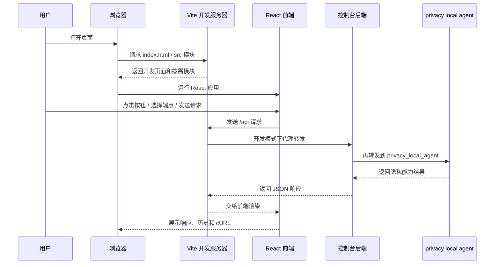
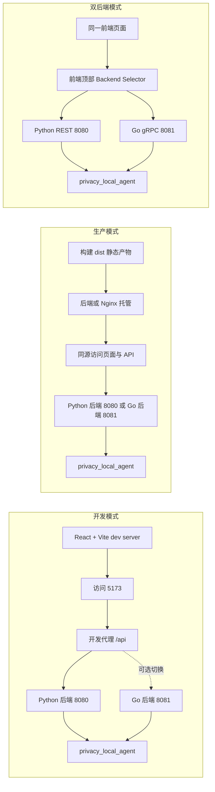
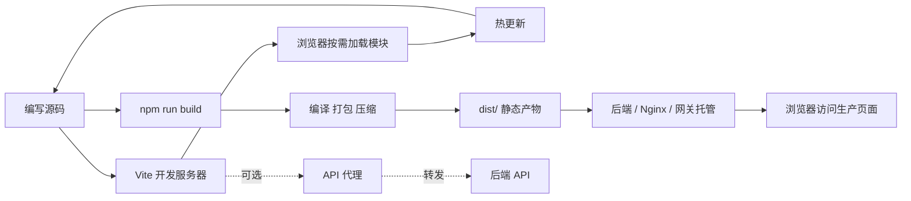
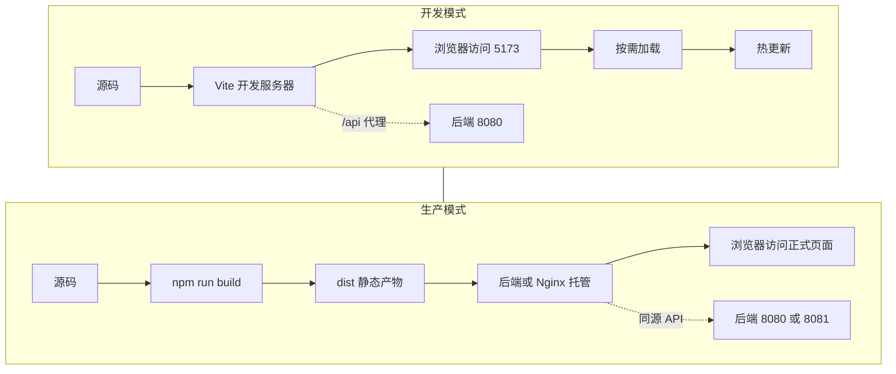
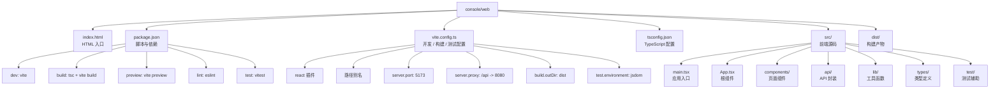
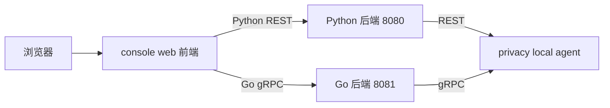

# Vite 详解：原理、项目结构、配置方式与 `console/web` 实战

本文面向 `privacy-local-agent` 的测试控制台前端，系统说明什么是 Vite、它为什么快、它的工作原理、项目结构、配置写法，以及它在 `console/web` 中是如何被使用的。

## 目录

- [1. Vite + React + 后端代理的完整请求时序图](#1-vite--react--后端代理的完整请求时序图)
- [2. Vite 是什么](#2-vite-是什么)
- [3. Vite 为什么这么快](#3-vite-为什么这么快)
- [4. Vite 的工作原理](#4-vite-的工作原理)
- [5. Vite 项目结构通常长什么样](#5-vite-项目结构通常长什么样)
- [6. `console/web` 里的 Vite 项目结构](#6-consoleweb-里的-vite-项目结构)
- [7. Vite 配置怎么写](#7-vite-配置怎么写)
- [8. Vite 配置的常见场景](#8-vite-配置的常见场景)
- [9. Vite 在 `console/web` 项目里是怎么用的](#9-vite-在-consoleweb-项目里是怎么用的)
- [10. 在这个项目里，Vite 和其他工具的分工](#10-在这个项目里vite-和其他工具的分工)
- [11. 常见配置示例](#11-常见配置示例)
- [12. 对 `console/web` 的实用理解](#12-对-consoleweb-的实用理解)
- [13. 快速上手命令](#13-快速上手命令)
- [14. 小结](#14-小结)

---

## 1. Vite + React + 后端代理的完整请求时序图

如果你想先从“前端请求到底是怎么走的”这个角度理解 `console/web`，可以先看下面这张总览图：



这张图表达的是：

- **Vite** 主要负责前端开发服务器、模块加载和开发代理；
- **React** 负责页面渲染、状态管理和用户交互；
- **控制台后端** 负责把前端请求转发给真正的上游服务；
- **`privacy_local_agent`** 才是执行隐私原语的核心服务。

### 1.1 开发模式 / 生产模式 / 双后端模式的总览对比图

下面这张图从“前端页面怎么来、请求怎么走、后端怎么选”三个角度，把三种常见模式放在一起对比：



从这张图可以直接看出：

- **开发模式**：重点是热更新、快速联调和 `/api` 代理；
- **生产模式**：重点是 `dist/` 静态托管、同源访问和稳定部署；
- **双后端模式**：重点是前端可以在 Python REST 和 Go gRPC 两条后端链路之间切换。

---

## 2. Vite 是什么

Vite 是一个现代前端构建工具，常被用来开发 React、Vue、Svelte 等前端应用。它同时承担两类工作：

1. **开发服务器**：本地启动、热更新、代理请求、按需加载模块；
2. **生产构建器**：把源码打包成可部署的静态文件。

你可以把它理解成：

- 开发阶段：提供一个非常快的前端运行环境；
- 部署阶段：把代码打成 `dist/` 目录供服务器托管。

---

## 3. Vite 为什么这么快

Vite 快，核心不是“魔法优化”，而是换了一套更适合现代浏览器的开发思路。

### 3.1 利用浏览器原生 ESM

在开发模式下，Vite 不会像传统打包器那样一开始就把整个项目全部打包。它更倾向于：

- 让浏览器直接加载原生 ES Module；
- 只在页面真的访问到某个模块时，才去请求它；
- 减少启动时的全量打包开销。

### 3.2 依赖预构建

第三方依赖往往体积大、格式杂。Vite 会先对依赖做一次预构建（通常由 esbuild 参与），把它们整理成浏览器和开发服务器更容易处理的形式。

这样做的好处是：

- 开发服务器启动更快；
- 大量第三方依赖不会拖慢模块解析；
- 依赖缓存命中后，二次启动更稳定。

### 3.3 HMR 热更新

Vite 支持 HMR（Hot Module Replacement，热模块替换）：

- 修改一个组件时，不必整个页面刷新；
- 浏览器通常只更新受影响的模块；
- UI 改动、样式调整、交互调试体验很好。

---

## 4. Vite 的工作原理

可以把 Vite 分成三个阶段来理解。

### 4.1 Vite 工作流程图

下面这张图把“开发时”和“构建时”的流程放在一起看，会更容易理解 Vite 在项目中的角色：



这张图对应的核心结论是：

- **开发时**：Vite 负责快速启动、模块按需加载和热更新；
- **构建时**：Vite 负责把源码变成可部署的静态资源；
- **联调时**：Vite 可以通过代理把前端请求转发到后端。

### 4.2 开发时：开发服务器 + 按需加载

当你运行：

```bash
npm run dev
```

实际上通常等价于启动一个 Vite 开发服务器。它会：

1. 监听一个本地端口，例如 `5173`；
2. 提供 HTML、JS、CSS 等资源；
3. 按需解析模块导入；
4. 对源码变动进行 HMR；
5. 对 API 请求做反向代理（如果配置了 `server.proxy`）。

### 4.3 构建时：把源码转成静态资源

当你运行：

```bash
npm run build
```

Vite 会调用构建流程，把前端源码编译、打包、压缩，最终输出到 `dist/`。

这个目录里的内容就是部署产物，通常由：

- 后端服务；
- Nginx；
- 网关；
- 对象存储 / 静态托管服务

来提供给浏览器。

### 4.4 预览时：本地模拟生产构建结果

当你运行：

```bash
npm run preview
```

Vite 会用本地服务器预览构建后的 `dist/`，方便你在发布前检查：

- 页面是否能正常打开；
- 静态资源是否引用正确；
- 路由是否能回退；
- 构建后的页面是否有样式或脚本缺失。

### 4.5 开发模式 vs 生产模式的 Vite 部署对比图

这张图把 Vite 在两种模式下的职责画在一起，便于把“开发体验”和“最终部署”区分开来：



从这张图可以直接看出：

- **开发模式** 关注的是速度、热更新和联调；
- **生产模式** 关注的是稳定、同源托管和可部署性；
- Vite 在两者之间的角色不同，但都很关键。

---

## 5. Vite 项目结构通常长什么样

一个典型 Vite 项目一般包含这些内容：

```text
project/
├── index.html
├── package.json
├── vite.config.ts
├── tsconfig.json
├── src/
│   ├── main.tsx
│   ├── App.tsx
│   ├── components/
│   ├── api/
│   ├── lib/
│   └── types/
└── dist/              # build 之后生成
```

### 5.1 各文件的作用

- `index.html`：Vite 的入口 HTML；
- `src/main.tsx`：应用启动入口；
- `src/App.tsx`：根组件；
- `vite.config.ts`：Vite 配置；
- `package.json`：脚本、依赖与项目元信息；
- `dist/`：生产构建产物。

---

## 6. `console/web` 里的 Vite 项目结构

结合本项目的实际结构，`console/web` 可以理解为一个标准的 React + Vite 前端工程。

### 6.1 `console/web` 目录结构说明图

下面这张图展示了 `console/web` 的主要目录和文件，以及它们之间的关系：



从这张图可以直接读出几件事：

- `src/` 是真正写业务代码的地方；
- `vite.config.ts` 负责开发、构建、代理和测试环境配置；
- `package.json` 负责脚本入口；
- `dist/` 是构建后的发布产物，不是源码目录。

从 `console/web/package.json` 可以看到脚本：

```json
{
  "scripts": {
    "dev": "vite",
    "build": "tsc && vite build",
    "preview": "vite preview",
    "lint": "eslint . --ext ts,tsx --report-unused-disable-directives --max-warnings 0",
    "test": "vitest"
  }
}
```

这说明：

- `dev`：启动 Vite 开发服务器；
- `build`：先做 TypeScript 检查，再执行 Vite 构建；
- `preview`：预览构建结果；
- `lint`：做前端代码风格检查；
- `test`：跑 Vitest 测试。

从 `console/web/vite.config.ts` 可以看到，项目使用了：

- `@vitejs/plugin-react`：支持 React；
- `alias`：把 `@` 指向 `src`；
- `server.port = 5173`：开发服务器端口；
- `server.proxy`：把 `/api` 代理到 Python 后端 `127.0.0.1:8080`；
- `build.outDir = 'dist'`：构建输出目录；
- `test.environment = 'jsdom'`：前端测试环境。

---

## 7. Vite 配置怎么写

Vite 的配置一般写在 `vite.config.ts` 或 `vite.config.js` 中。

### 7.1 基本写法

```ts
import { defineConfig } from 'vite'
import react from '@vitejs/plugin-react'

export default defineConfig({
  plugins: [react()],
})
```

### 7.2 常见配置项

#### `plugins`

用于接入框架或额外能力。

```ts
plugins: [react()]
```

在 `console/web` 里，它负责支持 React JSX / TSX。

#### `resolve.alias`

用于定义路径别名，减少相对路径层级过深的问题。

```ts
resolve: {
  alias: {
    '@': path.resolve(__dirname, './src'),
  },
}
```

这样你就可以写：

```ts
import { request } from '@/api/client'
```

而不是：

```ts
import { request } from '../../../api/client'
```

#### `server.port`

开发服务器端口。

```ts
server: {
  port: 5173,
}
```

#### `server.proxy`

把前端请求代理到后端，常用于开发模式解决跨域。

```ts
server: {
  proxy: {
    '/api': {
      target: 'http://127.0.0.1:8080',
      changeOrigin: true,
    },
  },
}
```

这表示：

- 浏览器请求 `http://localhost:5173/api/...`
- Vite 转发到 `http://127.0.0.1:8080/api/...`
- 对浏览器来说，它像是同源请求

#### `build.outDir`

构建输出目录。

```ts
build: {
  outDir: 'dist',
  emptyOutDir: true,
}
```

#### `test`

如果项目接入 Vitest，可以在这里配置测试环境。

```ts
test: {
  globals: true,
  environment: 'jsdom',
  setupFiles: './src/test/setup.ts',
}
```

---

## 8. Vite 配置的常见场景

### 8.1 本地开发

目标：

- 启动快；
- 热更新快；
- 与后端联调方便。

常见配置：

- `server.port`
- `server.proxy`
- `resolve.alias`
- React / Vue 插件

### 8.2 生产构建

目标：

- 输出稳定的静态资源；
- 给后端或 Nginx 托管；
- 构建产物可直接发布。

常见配置：

- `build.outDir`
- `base`
- `build.rollupOptions`
- 代码分割策略

### 8.3 组件测试

如果项目用 Vitest：

- 可以直接复用 Vite 的配置；
- 测试环境可以设成 `jsdom`；
- 适合测试 React 组件和交互逻辑。

---

## 9. Vite 在 `console/web` 项目里是怎么用的

这是最关键的部分。

### 9.1 前端是一个独立应用

`console/web` 是一个单独的 React 前端，它负责：

- 展示接口列表；
- 发送请求；
- 展示 JSON 响应；
- 生成 cURL；
- 记录请求历史；
- 支持在 Python 后端和 Go 后端之间切换。

Vite 正好负责它的：

- 本地开发服务器；
- 构建产物生成；
- 开发代理；
- 测试配置。

### 9.1.1 `console/web` 请求链路图

下面这张图把前端请求在两种后端之间的流向画出来。无论选 Python REST 还是 Go gRPC，前端本质上都是先把请求发到对应的控制台后端，再由后端转发到 `privacy_local_agent`：



这张图对应的实际含义是：

- 前端不会直接实现隐私算法；
- 前端也不会直接和 agent 里的算法代码耦合；
- 前端只负责把用户操作转成 API 请求；
- 真正的隐私能力都在 `privacy_local_agent` 里执行。

### 9.2 开发模式下怎么跑

你在 `console/web` 下通常会执行：

```bash
cd console/web
npm install
npm run dev
```

这会启动一个 Vite 开发服务器，通常在：

```text
http://127.0.0.1:5173
```

同时，你还需要启动后端，例如 Python 后端：

```bash
cd ../backend
./run.sh
```

为什么要这样？因为前端页面要去请求 `/api/*`，而真正的 API 在后端。

### 9.3 `/api` 代理的作用

本项目的 Vite 配置里有：

```ts
server: {
  proxy: {
    '/api': {
      target: 'http://127.0.0.1:8080',
      changeOrigin: true,
    },
  },
}
```

这意味着：

- 前端开发服务器收到 `/api` 请求；
- 它会转发到 Python 后端 `8080`；
- 这样开发时就更像“同源访问”；
- 有助于减少浏览器跨域问题。

不过要注意：

- 这个代理主要是给 **开发模式** 用的；
- 如果你的前端逻辑直接使用绝对后端地址，也可能绕过代理；
- 商业化产品模式通常更推荐同源托管前端静态资源。

### 9.4 构建后怎么部署

当你执行：

```bash
cd console/web
npm run build
```

会生成：

```text
console/web/dist/
```

然后由后端或其他静态服务器托管。

在这个项目里：

- Python 后端会把 `dist/` 当静态资源；
- Go 后端也可以挂载相同的 `dist/`；
- `console/start.sh`、`console/start-go.sh` 等脚本会自动帮你处理这部分流程。

### 9.5 后端切换和 Vite 的关系

页面里的 Backend Selector 负责切换前端请求的上游后端：

- Python REST 后端：`8080`
- Go gRPC 后端：`8081`

Vite 本身并不决定你最终调用谁，它只负责：

- 在开发时提供一个本地前端运行环境；
- 必要时帮你把 `/api` 转发出去。

真正的“请求发给谁”，由前端业务代码和页面里的 backend 选择逻辑决定。

---

## 10. 在这个项目里，Vite 和其他工具的分工

### 10.1 Vite 负责

- 前端开发服务器；
- 热更新；
- 构建；
- 开发代理；
- 静态资源打包；
- 测试环境接入。

### 10.2 React 负责

- 组件化 UI；
- 页面状态管理；
- 交互逻辑。

### 10.3 TypeScript 负责

- 类型检查；
- 接口约束；
- 减少运行时错误。

### 10.4 后端负责

- 真正执行 `privacy_local_agent` 的 API 转发；
- 提供健康检查、示例数据等能力；
- 生产环境时托管前端 `dist/`。

---

## 11. 常见配置示例

### 11.1 React + 路径别名 + 代理

```ts
import { defineConfig } from 'vite'
import react from '@vitejs/plugin-react'
import path from 'path'

export default defineConfig({
  plugins: [react()],
  resolve: {
    alias: {
      '@': path.resolve(__dirname, './src'),
    },
  },
  server: {
    port: 5173,
    proxy: {
      '/api': {
        target: 'http://127.0.0.1:8080',
        changeOrigin: true,
      },
    },
  },
  build: {
    outDir: 'dist',
    emptyOutDir: true,
  },
})
```

### 11.2 只想预览构建产物

```bash
npm run build
npm run preview
```

适合检查：

- 静态文件是否可用；
- 页面在构建后是否正常；
- 部署前有没有路径问题。

---

## 12. 对 `console/web` 的实用理解

如果你只记住一件事，可以记住这个：

> **Vite 是 `console/web` 的“本地开发引擎 + 构建引擎”**。

在这个项目里，它帮助你：

- 开发时快速看到页面变化；
- 用代理把前端请求接到后端；
- 构建后生成 `dist/`；
- 让 Python / Go 后端托管静态前端时保持一致的发布方式。

---

## 13. 快速上手命令

```bash
cd console/web
npm install
npm run dev
```

生产构建：

```bash
cd console/web
npm run build
```

测试：

```bash
cd console/web
npm test
```

代码检查：

```bash
cd console/web
npm run lint
```

---

## 14. 小结

Vite 的核心价值可以总结成三句话：

1. **开发快**：热更新和按需加载让前端开发体验很好；
2. **构建稳**：能把现代前端项目打成适合部署的静态产物；
3. **配置清晰**：在 React 项目里尤其适合做本地开发、代理和测试接入。

对于 `console/web` 而言，Vite 不是“额外工具”，而是前端开发和发布流程的基础设施。

