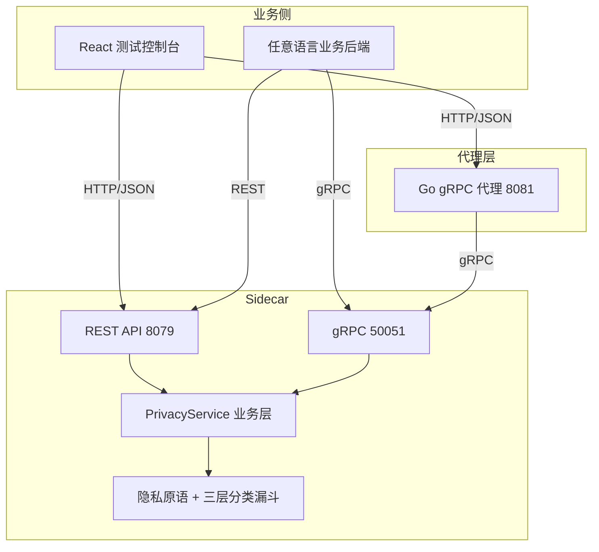
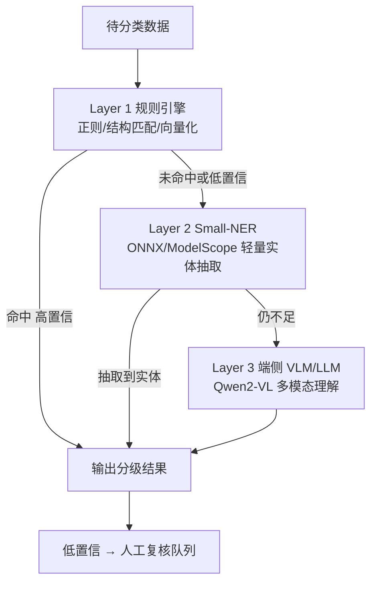
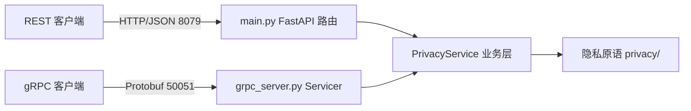
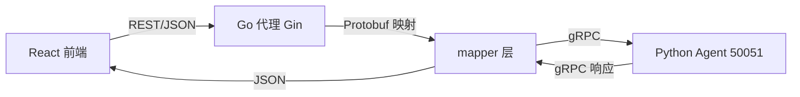
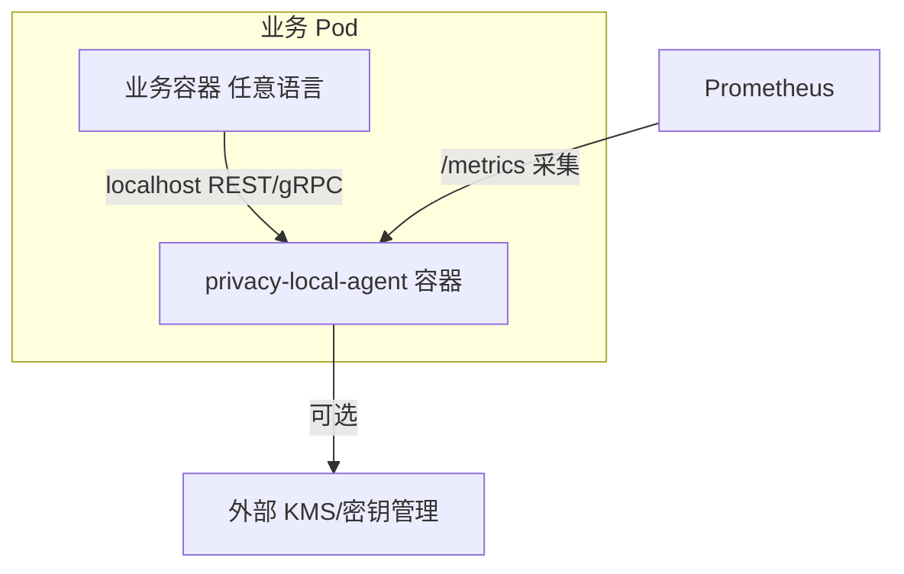

# privacy-local-agent 架构设计文档

> 本文档系统性介绍 privacy-local-agent 全栈所采用的架构技术，逐项解释**为何这样选择**（选型动机）与**如何设计实现**（落地方式）。
>
> 关联文档：[architecture-summary.md](architecture-summary.md)（工程实践速览）、[index.md](index.md)（文档总入口）。
>
> 适用读者：架构评审者、新加入的工程师、希望参照本项目范式的其他团队。

---

## 目录

- [一、总体架构与设计哲学](#一总体架构与设计哲学)
- [二、算法与数据安全层](#二算法与数据安全层)
- [三、Python 后端层（Sidecar 引擎）](#三python-后端层sidecar-引擎)
- [四、Go 后端代理层（Console Gateway）](#四go-后端代理层console-gateway)
- [五、前端 Console 层](#五前端-console-层)
- [六、部署与云原生层](#六部署与云原生层)
- [七、技术选型总表](#七技术选型总表)
- [八、架构权衡与演进方向](#八架构权衡与演进方向)

---

## 一、总体架构与设计哲学

### 1.1 项目定位

privacy-local-agent 是一个**语言无关的隐私计算 Sidecar**：以独立进程/容器形式部署，通过 REST 与 gRPC 双协议对外暴露隐私原语（脱敏、差分隐私、K-匿名、查询混淆）与三层数据分类分级能力。任意语言的业务后端都可以像调用本地服务一样调用它，而无需嵌入特定语言的 SDK。



### 1.2 核心设计哲学

本项目的架构选型遵循四条贯穿始终的原则：

| 原则 | 含义 | 在各层的体现 |
|---|---|---|
| **确定性优先** | 隐私算法必须有可证明的数学保证，不依赖"黑盒" | DP/K-Anon 全部选用经典可验证算法；分类漏斗中规则引擎永远在最前 |
| **优雅降级** | 重依赖缺失时自动退化为可用子集，而非启动失败 | NER/LLM 缺失 → NoOp；OTel 未装 → no-op；pandas 缺失 → 纯 Python 规则引擎 |
| **双协议同源** | 一套业务逻辑，多种接入方式，避免重复实现 | REST 与 gRPC 共享同一 `PrivacyService` |
| **云原生就绪** | 12-Factor 配置、可观测性、容器化、弹性伸缩 | 全环境变量驱动、Prometheus/OTel、多阶段镜像、Helm Chart |

### 1.3 分层架构

代码按"关注点分离"组织为五个清晰的层次，各层职责单一、边界明确：

```
privacy_local_agent/
├── privacy/           → 算法层：隐私原语 + 三层分类漏斗（无状态）
├── security/          → 安全层：认证 / 授权 / 限速 / TLS
├── observability/     → 可观测层：指标 / 追踪 / 结构化日志
├── gateway/           → 网关层：多实例负载均衡与代理
├── service.py         → 业务编排层：PrivacyService（状态与预算在此）
├── main.py            → REST 入口（FastAPI）
└── grpc_server.py     → gRPC 入口
```

**设计要点**：隐私原语保持**无状态**（纯函数式），所有状态（预算、配置、连接）收敛到 `PrivacyService` 与 `BudgetAccountant`。这使得算法层可以被独立测试、独立复用，也保证了 REST/gRPC 两个入口的行为完全一致。

---

## 二、算法与数据安全层

算法层是本项目的核心，位于 `privacy_local_agent/privacy/`。其最高光的创新是**三层递进式数据分类分级漏斗**，同时配套了一组经过数学验证的经典隐私原语。

### 2.1 三层递进式分类漏斗（3-Layer Funnel）

#### 2.1.1 架构设计

数据分类分级（判断某字段/记录/表属于哪个敏感等级 L1~L5）是数据安全治理的起点。难点在于：**明确模式的数据要快，语义模糊的数据要准**。本项目用"漏斗"结构同时满足两者——越往下层，处理能力越强、单位成本越高，因此只让"漏下来"的少量数据进入下层：



三层的具体分工（实现见 [classification.py](../privacy_local_agent/privacy/classification.py) 的 `_classify_field_internal`）：

| 层 | 引擎 | 技术 | 触发条件 | 特点 |
|---|---|---|---|---|
| **L1** | `DefaultRuleEngine` / `VectorizedRuleEngine` | 正则 + 字段名 + 结构匹配，pandas 向量化 | 总是先执行 | 毫秒级，处理 80%+ 明确模式（身份证、手机号、ICD10…） |
| **L2** | `ONNXSmallNerEngine` / `ModelScopeSmallNerEngine` | ONNX Runtime / ModelScope 轻量 NER（DAMO RaNER 医疗模型） | `enable_small_ner` 且（无标签 或 等级 ≤ L3） | 中等耗时，抽取疾病/药物/基因等上下文实体 |
| **L3** | `Qwen2VLClassifier` | 端侧多模态大模型 Qwen2-VL-2B-Instruct（torch + transformers） | `enable_llm` 或 置信度 < `llm_confidence_threshold` | 最慢但最强，解决复杂语义与多模态识别 |

#### 2.1.2 为何这样选择

- **为什么是"漏斗"而不是"单一大模型"**：若所有数据都过 LLM，延迟与算力成本不可接受（端侧设备尤甚）；若只用规则，又无法理解"他确诊了那种病"这类语义模糊表述。漏斗用**廉价的规则层过滤掉绝大多数确定性数据**，只让真正困难的少量数据进入昂贵的大模型层，是延迟、成本、准确率三者的最优平衡。这正是当前 AI Agent 安全与端侧隐私治理领域最前沿的落地范式。
- **为什么 L1 永远在最前**：规则引擎的输出是**确定、可解释、可审计**的（命中了哪条规则一目了然），把确定性逻辑前置，保证了整体结果的可信下限。
- **为什么 L2 用轻量 NER 而非直接上 LLM**：实体抽取（疾病、药物、手术）是结构化任务，几百 MB 的 NER 模型即可胜任，无需数十亿的 LLM，成本差一个数量级。

#### 2.1.3 如何设计实现

**层间流转的门控逻辑**（`_classify_field_internal`）：

```python
# L1：总是先评估（除非外部已预计算向量化标签）
if initial_tags is None and cp.enable_rule_engine:
    tags = self.rule_engine.evaluate(field_name, value, cp)

# L2：仅当"没有标签"或"等级还不够高(≤L3)"时才下沉
if cp.enable_small_ner and (not tags or final_level.value <= SensitivityLevel.L3.value):
    ner_tags = self._run_small_ner(field_name, value)

# L3：仅当"显式启用"或"置信度低于阈值"时才动用大模型
if cp.enable_llm or confidence < cp.llm_confidence_threshold:
    llm_result = self.llm.classify(str(value), final_level, confidence)
```

**优雅降级（NoOp 模式）**：每一层的重依赖都允许缺失。初始化时按 `ONNX > ModelScope > NoOp` 与 `Qwen2-VL > NoOp` 的优先级自动探测，依赖不存在或模型目录缺失时注入空实现（`NoOpSmallNerEngine` / `NoOpLlmClassifier`），服务照常启动，只是该层不产生结果。这让同一份代码可以在"无 ML 依赖的轻量容器"和"带 GPU 的完整容器"里无缝运行。

**延迟加载（Lazy Loading）**：`torch`/`transformers`/`onnxruntime` 从不在模块顶层导入，而是在引擎首次被实际使用时才 `import` 并加载权重，避免拖慢冷启动、避免无 ML 依赖环境直接 ImportError。

**向量化批处理**：整表分类时（`_classify_table_vectorized`），L1 规则通过 pandas 的 `evaluate_series` **按列批量**计算，把逐行 Python 循环变成列级向量操作；NER/LLM/复合规则仍按记录处理。规则层在大数据集上可获得 10~100x 加速。

**配套治理机制**：
- **影子模式（Shadow Mode）**：新规则集以 `shadow_version` 并行跑一遍但不生效，对比差异（`_compute_shadow_diff`），实现规则灰度验证；
- **人工复核（Review Store）**：低置信/基因组等高敏结果进入复核队列（`classification_review.py`），支持确认、修正与导出训练样本；
- **复合规则（Composite Rules）**：基于"字段组合"的上下文判定（如"姓名+诊断"同时出现才升级），由 `CompositeRuleEngine` 在记录级后处理；
- **异步任务**：大表分类可提交为后台 Job（`classification_async.py`），避免阻塞请求。

### 2.2 差分隐私（Differential Privacy）

#### 2.2.1 为何这样选择

DP 是唯一具有**严格数学定义**的隐私量化框架（ε-DP / (ε,δ)-DP）。本项目选用**拉普拉斯机制**与**高斯机制**这两个最经典、工业界普遍认可的方案，而非实验性算法，以保证端侧执行时的**确定性与低资源消耗**。实现见 [dp.py](../privacy_local_agent/privacy/dp.py)。

#### 2.2.2 如何设计实现

- **机制枚举**：`Mechanism(str, Enum)` 同时提供类型安全与字符串向后兼容（`Mechanism.LAPLACE == "laplace"`）。
- **覆盖的聚合**：count / sum / mean / histogram / vector_sum（DP-SGD 风格）/ vector_mean / 私有 SQL groupby（Tau-Thresholding）。
- **先定敏感度再加噪**：sum/mean 要求显式传入 `clip_lower/clip_upper`，在"看到数据之前"就确定敏感度边界，杜绝数据依赖的敏感度泄露。
- **预算会计（BudgetAccountant）**：每次查询先向会计申请 (ε, δ)，耗尽即拒绝。增强点包括：
  - **RDP Accountant**：基于 Rényi 散度，对多次查询的隐私损失给出比朴素组合更紧的上界；
  - **时间窗口重置**：`PRIVACY_BUDGET_WINDOW_SECONDS` 防止长运行 Sidecar 预算永久耗尽；
  - **SQLite 持久化**：`PRIVACY_BUDGET_DB` 让多实例共享一致预算（内存模式不跨进程）；
  - **HMAC 审计日志**：`BudgetAuditLogger` 用 HMAC-SHA256 对每笔消耗签名，防篡改。
- **分布式累加器（Accumulator）**：MapReduce 场景下各 Worker 本地做**无噪**累加，Master 用 `+` 合并后**只注入一次**噪声，避免"每个 Worker 各自加噪"导致的噪声放大。

### 2.3 K-匿名（K-Anonymity）

#### 2.3.1 为何这样选择

K-匿名保证"任何准标识符（QI）组合至少与 k-1 条记录相同"，是抵御**链接攻击**的经典手段。本项目分两个粒度实现：

- **记录级**（[kano.py](../privacy_local_agent/privacy/kano.py)）：基于**领域泛化层次**（age/zipcode/gender/salary/education 的 hierarchy 函数）对单条记录做最小泛化，适合实时、单条场景；
- **数据集级**（[kano_table.py](../privacy_local_agent/privacy/kano_table.py)）：采用经典的 **Mondrian 多维分区算法**，对整表做全局最优划分，适合批量发布场景。

#### 2.3.2 如何设计实现

Mondrian 的核心是"递归地选跨度最大的维度、按中位数切分"，直到每个分区满足 k 或达到最大深度：

```python
def _mondrian_pd(sub_df, depth):
    # 选择跨度（max-min）最大的准标识维度
    # 按该维度中位数切分为左右两半
    # 递归处理，直到分区大小 < 2k 或深度耗尽
    ...
```

实现上提供了 **pandas 向量化版本**（`_mondrian_pd`，用 DataFrame 切片避免 Python list 排序开销）与纯 Python 版本（`_mondrian`）两套，按输入类型自动选择。泛化时同样复用领域层次函数，保证两个粒度语义一致。

### 2.4 查询混淆（Query Obfuscation）

#### 2.4.1 为何这样选择

查询日志本身会泄露用户意图（"频繁查询某疾病"即暴露健康状态）。本项目采用**虚设查询注入（Dummy Query Injection，K-Degree 匿名化查询）**：把真实查询混入若干条虚假查询中一起发出，使观察者无法从日志中区分真伪。这是对抗**侧信道与意图分析**的轻量有效手段。实现见 [qol.py](../privacy_local_agent/privacy/qol.py)。

#### 2.4.2 如何设计实现

- **领域查询池**：内置医疗（MEDICAL）与通用（GENERIC）两个 dummy 查询模板池；
- **两种生成策略**：
  - `SLOT_FILLING`（语义槽位替换）：匹配查询中的实体词，替换为同类近邻实体，生成的 dummy 语义逼真、难以分辨；
  - `LENGTH_SIMILARITY`（长度相近抽样）：从池中选取与真实查询长度接近的条目，对抗基于长度的流量分析；
- **随机化**：真实查询的插入位置随机，dummy 数量可配，进一步消除位置特征。

### 2.5 数据脱敏（Masking）

[masking.py](../privacy_local_agent/privacy/masking.py) 提供**字段名感知**的 PII 脱敏：根据字段名（如 `phone`/`id_card`/`email`）自动选择对应的脱敏策略（部分遮盖、哈希、泛化），无需调用方逐字段指定算法。支持字段/记录/批量/DataFrame（PyArrow 列级向量化）多种粒度，是漏斗分类结果的直接执行端——"先分级、后按级脱敏"。

### 2.6 向量化与零拷贝加速

算法层统一通过 [data_adapters.py](../privacy_local_agent/privacy/data_adapters.py) 适配 list / ndarray / Arrow / sparse 多种输入，并在内部：

- 用 `np.ascontiguousarray` 获得 C-contiguous 内存布局加速数值运算；
- 用 **PyArrow Table** 做零拷贝数据交换（DP 结果可 `to_arrow()` 直接返回，供下游列式处理）；
- 用 `scipy.sparse` 优化高维稀疏矩阵。

大数据量下比纯 Python 循环快 10~100x，是"端侧低资源"目标的关键支撑。

---

## 三、Python 后端层（Sidecar 引擎）

Python 后端是算法能力的服务化载体，位于 `privacy_local_agent/` 根目录与 `security/`、`observability/`、`gateway/` 子包。

### 3.1 REST + gRPC 双栈统一暴露

#### 3.1.1 为何这样选择

不同调用方诉求不同：gRPC 适合**内部高并发、强类型、低延迟**的服务间调用；REST/JSON 适合**调试、浏览器、脚本与遗留系统**。与其二选一，不如两者都提供，且**共享同一套业务逻辑**，避免双份实现带来的行为漂移。

#### 3.1.2 如何设计实现



- REST 入口 [main.py](../privacy_local_agent/main.py)（FastAPI），gRPC 入口 [grpc_server.py](../privacy_local_agent/grpc_server.py)，两者都只做"协议解析 → 调用 `PrivacyService` → 协议封装"，**不含业务逻辑**；
- Protobuf 契约定义在 [proto/privacy.proto](../proto/privacy.proto)，用 `grpc_tools.protoc` 生成 `privacy_pb2.py` / `privacy_pb2_grpc.py`；
- [server.py](../privacy_local_agent/server.py) 在同一进程内同时拉起两个服务（REST 8079 + gRPC 50051）。

### 3.2 FastAPI + Pydantic v2

#### 3.2.1 为何这样选择

- **FastAPI**：原生 async、自动 OpenAPI 文档、依赖注入（`Depends`）天然适合做"安全中间件链"，是 Python 异步 Web 框架的事实标准；
- **Pydantic v2**：核心用 **Rust（pydantic-core）重写**，校验性能相比 v1 提升数倍；且 v2 的 `model_validate` / 严格模式让"请求体即第一道输入防线"真正可行。所有请求/响应均为 Pydantic 模型，任何非法输入在到达算法前即被拒绝。

#### 3.2.2 如何设计实现

- 请求模型集中在 [classification_models.py](../privacy_local_agent/privacy/classification_models.py) 等文件，全部为 Pydantic v2 `BaseModel`；
- 安全与限速通过 FastAPI 依赖注入挂载，与业务解耦：

```python
SECURITY_DEPS = [Depends(get_current_identity), Depends(rate_limit_dependency)]

@app.post("/api/v1alpha1/dp/count", dependencies=SECURITY_DEPS)
async def dp_count(req: DPCountRequest): ...
```

- **健康检查 `/health` 刻意不挂安全依赖**，否则 K8s liveness/readiness 探针会因无凭证而失败。

### 3.3 云原生可观测性（Observability）

#### 3.3.1 为何这样选择

Sidecar 处于所有请求的必经路径上，必须"可被观测"才能上生产。本项目按可观测性**三支柱**（Metrics / Tracing / Logging）全部落地，且遵循"**可选依赖、零开销降级**"原则——不装 OpenTelemetry 也能正常跑。

#### 3.3.2 如何设计实现（`observability/` 包）

| 支柱 | 文件 | 技术 | 说明 |
|---|---|---|---|
| Metrics | `metrics.py` | prometheus-client | 20+ 指标：请求计数/时延、DP 查询、分类各层命中、剩余预算 Gauge；经 `/metrics` 导出 |
| Tracing | `tracing.py` | OpenTelemetry（OTLP） | 可选；未安装时 no-op，零开销；配置 `OTEL_EXPORTER_OTLP_ENDPOINT` 即启用 |
| Logging | `logging_config.py` | python-json-logger | 结构化日志，JSON/Text 双格式（`PRIVACY_LOG_FORMAT`），request_id 全链路透传 |
| 横切 | `middleware.py` / `context.py` | FastAPI 中间件 + ContextVar | 统一注入 request_id、记录访问日志、传播上下文 |

分类漏斗各层的命中/未命中、DP 查询、预算消耗都埋了指标，使"哪一层处理了多少数据、花了多少时间"在 Prometheus/Grafana 中一目了然。

### 3.4 安全体系（`security/` 包）

#### 3.4.1 为何这样选择

Sidecar 暴露的是"隐私计算"这种高敏能力，必须默认假设运行在不可信网络中。因此安全不是可选项，而是**分层纵深防御**：传输层、认证层、授权层、限速层层层设卡，且全部**opt-in**（环境变量开启），不影响本地开发体验。

#### 3.4.2 如何设计实现

| 层 | 文件 | 技术 | 说明 |
|---|---|---|---|
| 传输 | `tls.py` | TLS 1.3 / mTLS | 双向证书认证（gRPC 场景校验客户端证书），`PRIVACY_TLS_ENABLED` 开启 |
| 认证 | `auth.py` | API Key（Bearer Token） | 内/外部 Key 分离，`PRIVACY_AUTH_ENABLED` 开启 |
| 授权 | `identity.py` | RBAC（scope-based） | `require_permission("dp:query")` 按能力域授权 |
| 限速 | `ratelimit.py` | 令牌桶（limits 库） | 按 identity 独立限速，防单租户耗尽资源 |
| 配置 | `config.py` | 环境变量 | 安全参数集中管理 |

### 3.5 网关与负载均衡（`gateway/` 包）

生产环境通常需要多副本 Agent。[gateway/balancer.py](../privacy_local_agent/gateway/balancer.py) 内置负载均衡器，支持**加权轮询 / 最少连接 / 随机**三种策略，配合异步健康检查（HTTP + gRPC）自动摘除/恢复不健康节点；[http_proxy.py](../privacy_local_agent/gateway/http_proxy.py) 与 [grpc_proxy.py](../privacy_local_agent/gateway/grpc_proxy.py) 分别代理两种协议。客户端无需感知后端拓扑。

### 3.6 可选依赖分组

`pyproject.toml` 将依赖分为三组，配合"优雅降级"实现按需安装：

```toml
[project.optional-dependencies]
observability = ["opentelemetry-sdk", "opentelemetry-exporter-otlp", ...]
ml = ["torch>=2.2.0", "transformers>=4.38.0", "onnxruntime>=1.17.0", ...]
```

核心功能（规则分类 + 全部隐私原语）只依赖基础组；ML 与可观测能力按需叠加。这是第 2.1 节 NoOp 降级在依赖管理层面的对应设计。

---

## 四、Go 后端代理层（Console Gateway）

Go 后端位于 `console/backend-go/`，是测试控制台与 Python Agent 之间的**网关代理**：把前端的 REST/JSON 请求转换为 gRPC 调用转发给 Agent，同时可直接托管前端静态资源。

### 4.1 Go 1.25 + Gin：高并发轻量代理

#### 4.1.1 为何这样选择

代理层的工作是"高并发的 IO 转发 + 编解码"，这正是 Go 的主场：

- **Goroutine 原生并发**：每个请求一个 goroutine，调度开销仅 KB 级（对比线程的 MB 级），单机即可轻松支撑数万并发连接，CPU/内存占用极低；
- **静态编译单二进制**：无运行时依赖，镜像小、启动快、部署简单；
- **Gin**：Go 生态最成熟的 HTTP 框架，中间件机制完善（CORS、Recovery、Logger），性能优异。

用 Go 而非 Python 写代理层，是因为代理处于"所有前端请求的必经之路"，其吞吐与资源占用直接决定控制台体验；Go 在这类场景的性价比显著高于 Python。

#### 4.1.2 如何设计实现

- 依赖见 [go.mod](../console/backend-go/go.mod)：`go 1.25.0` + `gin v1.12.0` + `grpc v1.82.1`；
- 入口 [cmd/server/main.go](../console/backend-go/cmd/server/main.go)：加载配置 → 建 gRPC 连接 → 注册路由 → 启动 HTTP 服务 → **监听 SIGINT/SIGTERM 优雅关闭**（5 秒超时，等待活跃请求完成）；
- 配置全部来自环境变量（`internal/config/config.go`），与 Python 侧保持 12-Factor 一致；
- 内置宽松 CORS 中间件，支持 Vite 开发服务器跨域调用与双后端切换。

### 4.2 极速 JSON 序列化（ByteDance Sonic）

#### 4.2.1 为何这样选择

代理层对每个请求都要做 JSON 解析与再序列化，编解码延迟是主要开销之一。[ByteDance Sonic](https://github.com/bytedance/sonic) 是基于 **JIT + SIMD** 的极速 JSON 库，解析/序列化速度可达标准库的 5~10 倍。Gin 1.12 已原生集成 sonic 作为可选高性能 JSON 后端（go.mod 中 `sonic v1.15.0` 即由 Gin 引入），在支持的平台上可显著降低代理层编解码延迟。

#### 4.2.2 如何设计实现

- sonic 作为 Gin 的依赖被引入（`go.mod` 中 `github.com/bytedance/sonic v1.15.0`）；
- Gin 在编译时可通过 build tag（`-tags sonic`）启用 sonic 作为 JSON 编解码后端，不支持的平台自动回退标准实现，保证可移植性；
- 配合 `goccy/go-json`、`json-iterator` 等依赖，Gin 在不同构建配置下均能获得优于标准库 `encoding/json` 的性能。

### 4.3 与 Protobuf / gRPC 原生集成

#### 4.3.1 为何这样选择

如果 Go 代理用 HTTP 转发到 Python 的 REST 接口，会引入"JSON → Python 解析 → 再 JSON"的多级转译开销。直接走 **gRPC + Protobuf**：二进制编码体积更小、解析更快，且契约由 `.proto` 强约束，前后端字段不一致的问题在编译期即暴露。

#### 4.3.2 如何设计实现



- `internal/agent/client.go`：封装到 Python Agent 的 gRPC 连接，可选附加 `authorization: Bearer` 元数据；
- `internal/mapper/mapper.go`：REST JSON 模型 ↔ Protobuf 消息的双向映射层，是与 Python 端 `privacy.proto` 对齐的核心；
- `internal/handlers/handlers.go`：REST 路由（`/api/health`、`/api/proxy`、`/api/batch`、`/api/upload`、`/api/lb_test`）+ 静态 SPA 托管；
- 对前端暴露与 Python 后端**完全一致的 JSON 契约**（含 `via`/`protocol` 后端身份标识），使前端可在两后端间无感切换。

---

## 五、前端 Console 层

前端位于 `console/web/`，是用于验证 Agent 全部能力的测试控制台。

### 5.1 Vite 5：秒级构建与 HMR

#### 5.1.1 为何这样选择

传统 Webpack 在大型项目中冷启动与热更新缓慢，严重拖累开发体验。**Vite 5** 的解法是：

- **开发态**：基于浏览器原生 ESM + **esbuild**（Go 编写）做依赖预构建，无需打包即可启动，毫秒级 HMR；
- **生产态**：基于 **Rollup** 打包，产物优化成熟。

对于"内部测试控制台"这种追求快速迭代的场景，Vite 的开发体验优势是决定性的。

#### 5.1.2 如何设计实现

[vite.config.ts](../console/web/vite.config.ts) 中配置：

- `@` 路径别名指向 `src/`，简化导入；
- 开发代理 `/api → http://127.0.0.1:8080`（`changeOrigin: true`），作为同源回退方案；
- 构建产物输出到 `dist/`，由 Python/Go 后端同源托管（详见 [backend/docs/ops.md](../console/backend/docs/ops.md) 的开发/生产模式与 CORS 方案）。

### 5.2 React 18 + TypeScript 5

#### 5.2.1 为何这样选择

- **React 18**：基于 **Hooks 的纯函数组件**是当前前端的主流范式，心智负担低、生态最全；并发特性（Concurrent Rendering）为流畅交互提供基础；
- **TypeScript 5（strict）**：前端与后端交互大量 JSON 契约，**静态类型**能在编译期捕获字段拼写/类型错误，配合 `@/types/api` 中的接口定义，使"契约变更 → 编译报错"成为第一道防线。

#### 5.2.2 如何设计实现

- 全部组件为函数组件 + Hooks（`useState`/`useEffect`/`useCallback`），无 class 组件；
- API 调用集中在 [src/api/client.ts](../console/web/src/api/client.ts)，通过可变基址 `API_BASE` 支持双后端切换（`BackendSelector`）；
- 数据文件解析（[src/utils/fileParse.ts](../console/web/src/utils/fileParse.ts)）用状态机实现 CSV 解析，与后端 records 语义对齐，支撑"处理前后对比"视图。

### 5.3 TailwindCSS：原子化样式

#### 5.3.1 为何这样选择

**TailwindCSS** 用原子化工具类（utility-first）替代手写 CSS：样式与结构同处一处、高度解耦，且构建时**按需生成、自动 purge 未使用类**，最终产物体积极小。对快速搭建的内部控制台而言，它免去了命名、文件组织与样式冲突的心智负担。

#### 5.3.2 如何设计实现

- `tailwindcss + postcss + autoprefixer` 集成进 Vite 构建管线；
- 组件内直接书写工具类（如 `rounded-lg border-gray-200 bg-gray-50`），配合差异高亮等业务样式快速实现。

---

## 六、部署与云原生层

### 6.1 Docker 多阶段按需构建（core / ml 镜像分离）

#### 6.1.1 为何这样选择

ML 依赖（torch/transformers/onnxruntime）动辄数 GB，而**绝大多数生产场景只需要规则分类 + 隐私原语**。若打成单一镜像，会让只需轻量能力的部署平白背负巨大的拉取/存储/启动成本。因此按能力把镜像**分级**：

- `core` 镜像：仅核心依赖，体积小、启动快，覆盖 DP/K-匿名/脱敏/规则分类；
- `ml` 镜像：在 core 基础上叠加 ML 依赖，支持 NER/LLM 三层完整漏斗。

这与第 3.6 节的"可选依赖分组"、第 2.1 节的"NoOp 降级"是同一条设计主线在镜像层的延伸：**能力可裁剪，降级不失能**。

#### 6.1.2 如何设计实现

[Dockerfile](../Dockerfile) 用三个 stage 实现：

```dockerfile
FROM python:3.10-slim AS base          # 公共基础 + 核心依赖（利用缓存）
FROM base AS core                      # 轻量镜像：--target core
FROM core AS ml                        # 完整镜像：--target ml，叠加 requirements-ml.txt
```

```bash
docker build --target core -t privacy-local-agent:0.1.0 .
docker build --target ml   -t privacy-local-agent:0.1.0-ml .
```

依赖拆分为 `requirements-core.txt` 与 `requirements-ml.txt`；`base` 先装核心依赖以最大化镜像层缓存命中。

### 6.2 Kubernetes / Helm 生态支持

#### 6.2.1 为何这样选择

Sidecar 的最终形态是"与业务 Pod 共同部署、弹性伸缩"。Kubernetes 是容器编排事实标准，**Helm** 是 K8s 应用打包事实标准。提供完整的 Chart 与原生资源，才能支撑"从单机测试到生产集群"的平滑过渡。

#### 6.2.2 如何设计实现

三种部署形态，覆盖不同成熟度：

| 方式 | 路径 | 适用场景 |
|---|---|---|
| Docker Compose | `deploy/docker-compose/` | 单机本地测试 |
| 原生 K8s + Kustomize | `deploy/k8s/` | 轻量、无需 Helm 的集群 |
| Helm Chart | `deploy/helm/privacy-local-agent/` | 生产级参数化部署 |

Helm Chart 的 `templates/` 提供了工业级全套资源：

- `deployment.yaml` / `service.yaml` / `serviceaccount.yaml` / `namespace.yaml`：基础工作负载；
- `hpa.yaml`：**水平弹性伸缩**，按 CPU/内存/自定义指标自动扩缩副本；
- `networkpolicy.yaml`：网络隔离，限制只有授权来源可访问 Sidecar；
- `servicemonitor.yaml`：对接 Prometheus Operator，自动采集 `/metrics`；
- `configmap.yaml` / `secret.yaml`：配置与密钥注入（API Key、TLS 证书经 Secret 管理）；
- `ingress.yaml`：可选的对外暴露入口。

配合 `values.yaml` / `values-production.yaml` / `values-ml.yaml` 多套取值文件，实现"一份 Chart、多种环境"。

### 6.3 Sidecar 部署模型



业务容器与 Agent 容器共享网络命名空间，通过 `localhost` 通信，**零网络跳转、天然隔离**。Agent 独立扩缩、独立升级，业务无感知。这正是"Sidecar"模式相对"嵌入式 SDK"的核心价值：语言无关、独立生命周期、统一治理。

---

## 七、技术选型总表

| 层 | 技术 | 版本 | 选型理由（一句话） |
|---|---|---|---|
| 算法 | 三层漏斗（Rule→NER→LLM） | — | 廉价规则过滤 + 端侧大模型兜底，延迟/成本/准确率最优平衡 |
| 算法 | Laplace / Gaussian DP | — | 经典可证明机制，端侧确定性执行 |
| 算法 | Mondrian K-匿名 | — | 数据集级全局最优划分，工业标准 |
| 算法 | Dummy Query 查询混淆 | — | 轻量对抗意图分析/侧信道 |
| 算法 | NumPy / PyArrow / scipy.sparse | — | 向量化 + 零拷贝，10~100x 加速 |
| Python | FastAPI | ≥0.110 | 异步 + 依赖注入 + 自动文档，Python Web 事实标准 |
| Python | Pydantic v2 | ≥2.6 | Rust 核心数倍性能，强类型输入防线 |
| Python | grpcio / protobuf | ≥1.62 | 高并发强类型 RPC，与 REST 共享业务层 |
| Python | prometheus-client / OTel / json-logger | — | 可观测三支柱，可选依赖零开销降级 |
| Python | limits（令牌桶）/ TLS / RBAC | — | 安全纵深防御，全 opt-in |
| Go | Go | 1.25 | Goroutine 高并发、静态编译、低资源占用 |
| Go | Gin | 1.12 | 成熟高性能 HTTP 框架，中间件完善 |
| Go | ByteDance Sonic | 1.15 | JIT+SIMD 极速 JSON，降低代理编解码延迟 |
| Go | grpc-go / protobuf | 1.82 | 原生 Protobuf 集成，避免多级 HTTP 转译 |
| 前端 | Vite | 5.2 | esbuild/Rollup，秒级启动 + 毫秒 HMR |
| 前端 | React + TypeScript | 18.2 / 5.2 | Hooks 函数组件 + strict 类型，契约编译期校验 |
| 前端 | TailwindCSS | 3.4 | 原子化样式，产物极小、开发极快 |
| 部署 | Docker 多阶段 | core/ml | 镜像分级，轻量与 ML 能力按需裁剪 |
| 部署 | Helm / K8s / Compose | — | 云原生标准，HPA/NetworkPolicy/ServiceMonitor 全套 |

---

## 八、架构权衡与演进方向

### 8.1 关键权衡（Trade-offs）

| 决策 | 收益 | 代价 / 注意 |
|---|---|---|
| Sidecar 独立进程（而非嵌入 SDK） | 语言无关、独立扩缩、统一治理 | 多一跳本地网络开销；需独立运维 |
| REST + gRPC 双栈 | 兼顾调试便利与高性能 | 需维护两套协议封装与 `.proto` 契约 |
| 三层漏斗 | 延迟/成本/准确率平衡 | 层间阈值需调优；LLM 层结果需复核机制兜底 |
| 预算时间窗口重置 | 防长运行预算耗尽 | 存在组合攻击风险，需按业务评估 |
| 宽松 CORS（`*`） | 本地开发/双后端切换零配置 | 仅限可信网络，生产应收紧或同源部署 |
| core/ml 镜像分离 | 部署体积可控 | 需维护两套依赖清单与构建目标 |

### 8.2 已知缺口与演进方向

- **KMS 集成与自动密钥轮换**尚未实现（当前 HMAC 密钥需外部注入），是硬化生产部署的前置项；
- **负载/混沌/内存泄漏测试套件**尚未建立，需补齐以验证大规模长时间运行稳定性；
- Go 代理的 gRPC 当前使用 insecure credentials，生产应升级为 mTLS；
- 覆盖率门禁现为 60%，随测试完善应逐步提升至 80%+；
- 漏斗 L3 可探索更小/更快的端侧模型（如量化版 VLM）以进一步压低尾延迟。

### 8.3 一句话总结

本项目以"**确定性算法为底、漏斗式智能分级为锋、双协议 Sidecar 为骨、云原生可观测为翼**"，在端侧资源约束下同时获得了工业级确定性与大模型语义理解能力，其组件与范式均为当前业界成熟且前沿的工业级选择。
