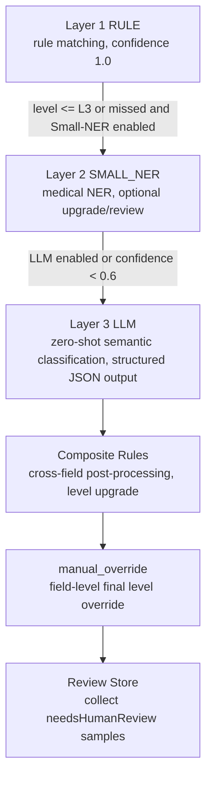
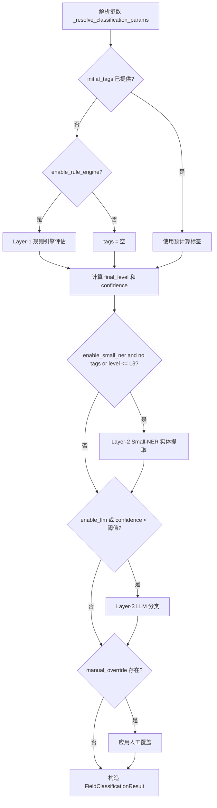
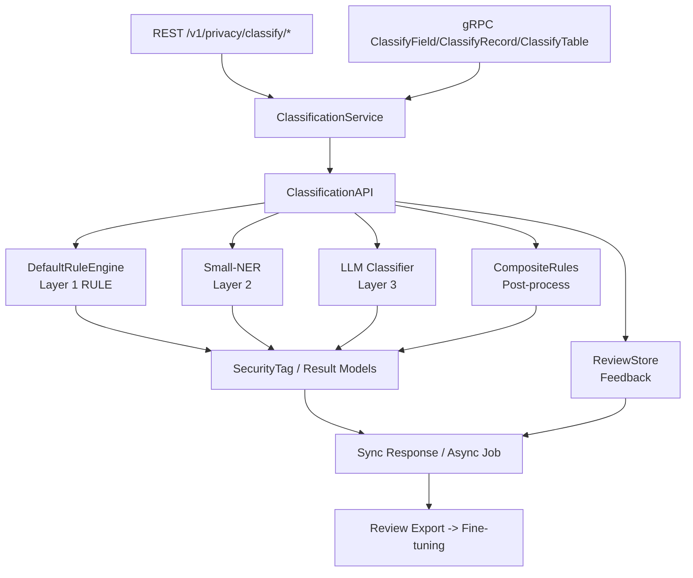
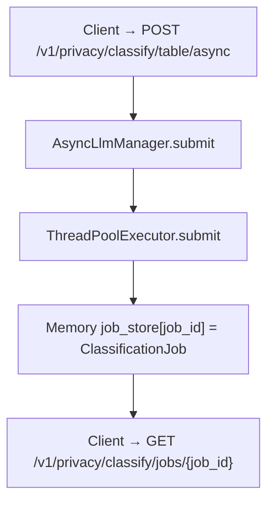
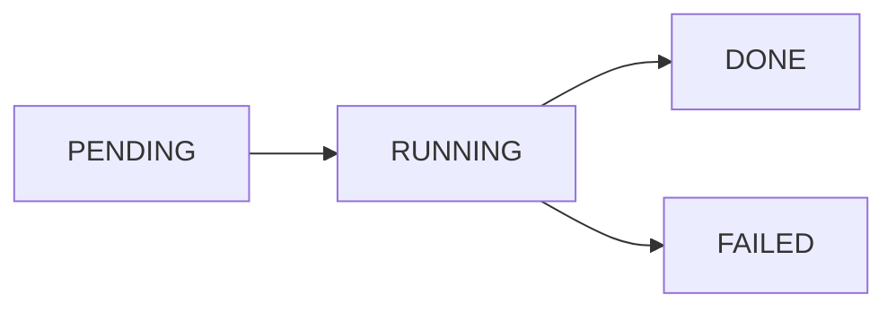
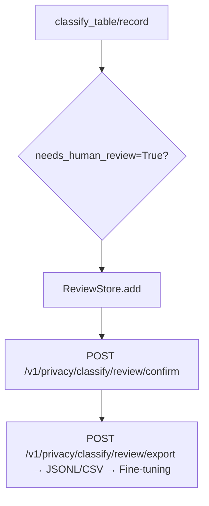

# 数据分类分级设计文档

## 1. 概述

本文档定义 `privacy-local-agent` 数据分类分级模块的算法原理、技术架构与实现细节。该模块通过三层漏斗式分类引擎，自动识别敏感数据并输出统一的敏感度等级与标签。

本版本在原有架构基础上新增：

- SecretFlow 联邦数据结构输入适配。
- 复合/上下文敏感规则识别。
- Layer 3 LLM 同步与异步两套推理接口。
- 基于 `needsHumanReview` 的轻量复核闭环。
- Zero-Knowledge 扫描原则落地。
- 内置 JR/T 0197、GB/T 35273、GDPR 合规规则模板。
- 规则集版本化与影子模式。

## 2. 设计目标

- 建立 L1~L5 敏感度等级体系与统一标签体系。
- 实现规则引擎 → 轻量级 NER → 多模态大模型的三层递进分类架构。
- 支持字段级、记录级、表级分类。
- 支持多种输入格式与参数治理模型。
- 支持跨字段组合规则识别，解决上下文敏感场景。
- 提供同步与异步两套 Layer 3 推理接口，异步接口避免阻塞主链路。
- 提供轻量人工复核 API 与样本导出能力。
- 保障扫描过程不泄露原始数据。
- 支持规则模板切换、版本化与影子模式灰度评估。
- 暴露一致的 REST/gRPC 接口与 Prometheus 指标。

## 3. 算法原理

### 3.1 三层漏斗分类架构



#### 3.1.1 规则引擎（Layer 1）

`DefaultRuleEngine.evaluate(field_name, value, params)` 按以下顺序收集标签：

1. **字段名规则**：对字段名执行归一化（转小写、移除下划线与空格）后，按子串包含或正则方式匹配基因组相关关键词。所有字段名规则命中后均标记为 **L5（极高风险）**，`source_engine = RULE`。具体规则组如下：

   | 规则 ID | 类别（category） | 匹配模式 | 说明 |
   |---|---|---|---|
   | `RULE_ID_G_001` | `GENOMIC_BRCA_TP53` | 字段名包含 `brca1`、`brca2`、`tp53` | 高外显率遗传性癌症基因（乳腺癌/卵巢癌/ Li-Fraumeni 综合征），属于最高敏感级别基因标记 |
   | `RULE_ID_G_002` | `GENOMIC_VARIANT` | 字段名或字段值匹配正则 `rs\d+`（dbSNP 编号），或字段名包含 `snp`、`cnv`、`genome`、`genomic` | 基因组变异位点标识，涵盖 SNP 单核苷酸多态性、CNV 拷贝数变异及全基因组数据 |
   | `RULE_ID_G_003` | `GENOMIC_HINT` | 字段名包含 `gene`、`mutation`、`variant` | 基因/突变/变异通用提示词，覆盖未明确指定具体基因名但语义涉及基因组学的字段 |
   | `RULE_ID_G_004` | `GENOMIC_FILE` | 字段名包含 `bam`、`vcf`、`fastq` | 基因组测序文件格式标识（BAM 比对文件、VCF 变异文件、FASTQ 原始读段文件） |

   **归一化规则**：`_normalize_field_name(name)` 将字段名转为小写并移除 `_` 和空格。例如 `BRCA1_Status` → `brca1status`，`SNP_ID` → `snpid`，确保大小写与命名风格不影响匹配。

   **可配置性**：基因组关键词列表通过 `ClassificationParams.genomic_keywords` 参数暴露，默认值为 `["brca1", "brca2", "tp53", "rs", "snp", "cnv", "genome", "genomic", "gene", "mutation", "variant"]`，可通过 YAML profile 或请求级参数扩展。

   **合规模板扩展字段名规则**（由 `_apply_template_field_rules` 实现，仅在激活对应模板时生效）：

   | 模板 | 规则 ID | 类别 | 匹配模式 | 等级 |
   |---|---|---|---|---|
   | `jrt0197` | `RULE_ID_JRT_001` | `FINANCE_ACCOUNT` | `bankcard`、`cardno`、`credit`、`transaction`、`asset`、`balance`、`account` | L4 |
   | `gbt35273` / `gdpr` | `RULE_ID_GBT_001` | `PII_CONTACT_LOCATION` | `email`、`address`、`location`、`轨迹` | L3 |
   | `gdpr` | `RULE_ID_GDPR_001` | `GDPR_SPECIAL_CATEGORY` | `biometric`、`fingerprint`、`face`、`health`、`genetic`、`race`、`ethnicity`、`political`、`religion`、`sexual` | L4 |
2. **值规则（PII 标识符）**：对字段值进行格式校验与校验和验证，识别个人身份信息。具体规则如下：

   | 规则 ID | 类别（category） | 匹配逻辑 | 等级 | 说明 |
   |---|---|---|---|---|
   | `RULE_ID_001` | `PII_ID_CARD` | 18 位身份证号正则 + 加权校验和（权重 `[7,9,10,5,8,4,2,1,6,3,7,9,10,5,8,4,2]`，模 11 查表 `['1','0','X','9','8','7','6','5','4','3','2']`） | L3 | 中国大陆 18 位身份证号，包含格式校验（地区码+出生日期+顺序码）和第 18 位校验码验证 |
   | `RULE_ID_002` | `PII_MOBILE` | 正则 `^1[3-9]\d{9}$` | L3 | 中国大陆 11 位手机号，第二位为 3-9 |
   | `RULE_ID_003` | `PII_MEDICAL_CARD` | 9 位数字 + 加权校验和（权重 `[7,9,10,5,8,4,2,1]`，第 9 位 = `(10 - sum%10) % 10`） | L3 | 上海医保卡号 9 位数字校验 |
   | `RULE_ID_004` | `MEDICAL_ICD10_*` | ICD-10 编码格式解析（`^[A-Z]\d{2}(\.\d{0,2})?$`）+ 区间映射 | L3/L4 | 国际疾病分类编码，默认 L3；落入敏感区间时升级为 L4 |

   **ICD-10 敏感区间映射**（通过 `ClassificationParams.icd10_l4_intervals` 配置）：

   | 区间 | 升级类别 | 含义 |
   |---|---|---|
   | B20–B24 | `MEDICAL_ICD10_HIV` | HIV/AIDS 相关疾病 |
   | F20–F29 | `MEDICAL_ICD10_PSYCHIATRIC` | 精神分裂症等精神疾病 |
   | C00–C97 | `MEDICAL_ICD10_CANCER` | 恶性肿瘤 |

3. **值规则（基因组文件内容检测）**：对字段值进行前缀/模式匹配，识别基因组测序文件内容与序列片段：

   | 规则 ID | 类别（category） | 匹配逻辑 | 等级 | 说明 |
   |---|---|---|---|---|
   | `RULE_ID_G_010` | `GENOMIC_BAM` | 值以 `BAM\x01` 或 `@SQ` 开头 | L5 | BAM 二进制比对文件魔数或 SAM 头序列 |
   | `RULE_ID_G_011` | `GENOMIC_VCF` | 值以 `##fileformat=VCF` 开头 | L5 | VCF 变异调用文件标准头 |
   | `RULE_ID_G_012` | `GENOMIC_FASTQ` | 值以 `@` 开头且包含 SRR/ERR/DRR 访问号，或第 3 行为 `+` 分隔符 | L5 | FASTQ 原始测序读段文件（SRA 访问号前缀或四行格式特征） |
   | `RULE_ID_G_013` | `GENOMIC_SEQUENCE` | 值中匹配正则 `[ATCGNatcgn]{50,}`（连续 50+ 碱基字符） | L5 | 基因序列片段（DNA/RNA 碱基序列） |

4. **白名单/运营统计字段**：对字段名归一化后进行子串匹配，将公开/运营类字段标记为低敏感度：

   | 规则 ID | 类别（category） | 匹配模式（默认值） | 等级 | 说明 |
   |---|---|---|---|---|
   | `RULE_ID_L1_001` | `PUBLIC_REPORT` | `public_field_whitelist`：`public_report`、`annual_summary`、`科普` | L1 | 公开报表/科普类字段，可自由使用 |
   | `RULE_ID_L2_001` | `OPERATIONAL_STAT` | `operational_field_patterns`：`turnover_rate`、`device_usage`、`inventory` | L2 | 运营统计字段（周转率、设备使用率、库存），仅限内部使用 |

   白名单与运营统计模式均通过 `ClassificationParams` 参数暴露，可通过 YAML profile 或请求级参数自定义扩展。

所有命中标签的 `confidence = 1.0`，`source_engine = RULE`，`engine_layer = L1_RULE`。标签去重以 `(level, category)` 为键，保留首次出现顺序。

合规模板（JR/T 0197、GB/T 35273、GDPR）通过扩展默认规则集合实现。

为提升大数据集表分类吞吐量，系统还提供可选的 `VectorizedRuleEngine`（`privacy_local_agent/privacy/classification_vectorized.py`）。该引擎基于 pandas Series 对 Layer-1 规则做列式向量化匹配，语义与 `DefaultRuleEngine` 保持一致，可通过 `ClassificationAPI(use_vectorized=True)` 启用；未安装 pandas 时自动回退到 `DefaultRuleEngine`。

#### 3.1.2 Small-NER（Layer 2）

基于 ONNX Runtime 或 ModelScope 的医疗领域 NER 模型，识别疾病、症状、药物、手术、解剖部位等实体。详细设计参见 `docs/classification_ner/design.md`。

**触发条件**：当 `enable_small_ner=True` 且 Layer-1 未命中标签或最终等级 ≤ L3 时触发。

**引擎选择优先级**：

1. 检测本地 ONNX 模型文件（`.models/raner_cmeee.onnx`），存在则加载 `ONNXSmallNerEngine`。
2. 否则尝试加载 `ModelScopeSmallNerEngine`（需安装 modelscope 依赖）。
3. 缺失依赖时降级为 `NoOpSmallNerEngine`（不返回任何实体）。

**分词器**：内置纯 Python 实现的 `SimpleChineseBertTokenizer`，无第三方分词库依赖：

- 字符级切分，英文大小写折叠（提升医学缩写如 HIV、AIDS 的识别稳定性）。
- 编码输出 `(input_ids, attention_mask, token_type_ids)`，默认 `max_len=128`，padding 对齐。

**BIO 标记解析**：模型输出经 softmax 后取 argmax 得到每个 token 的标签索引，通过 BIO 序列标注解析（B-xxx / I-xxx / O）还原实体边界与类型。

**实体类型与敏感度映射**：

| 实体标签（label） | 敏感度等级 | 类别（category） | 规则 ID | 说明 |
|---|---|---|---|---|
| `GENOMIC_HINT` | L5 | `GENOMIC_HINT` | `NER_GENE_001` | 基因相关实体，标记 `needs_human_review=True` |
| `MEDICAL_DISEASE`（敏感关键词） | L4 | `MEDICAL_SENSITIVE_DISEASE` | `NER_DIS_SENSITIVE` | 命中敏感疾病关键词时升级 |
| `MEDICAL_DISEASE`（普通） | L3 | `MEDICAL_DISEASE` | `NER_DIS_NORMAL` | 普通疾病实体 |
| `MEDICATION` | L3 | `MEDICATION` | `NER_DRU_001` | 药物实体 |
| `SURGERY` | L3 | `SURGERY` | `NER_PRO_001` | 手术/操作实体 |
| `BODY_PART` | L3 | `BODY_PART` | `NER_BOD_001` | 解剖部位实体 |

**敏感疾病关键词列表**（触发 L4 升级）：`hiv`、`精神分裂`、`艾滋`、`梅毒`、`肿瘤`、`癌症`、`白血病`、`抑郁症`。

Small-NER 输出的标签 `source_engine = SMALL_NER`，置信度取模型 softmax 概率值。命中后 `engine_layer` 升级为 `L2_SMALL_NER`。

#### 3.1.3 LLM/VLM（Layer 3）

基于本地 Qwen2-VL-2B-Instruct，处理图片、手写病历与非结构化文本。详细设计参见 `docs/classification_llm/design.md`。

**触发条件**：当 `enable_llm=True`，或上游置信度 < `llm_confidence_threshold`（默认 0.6）时触发。

**引擎选择与降级**：

1. 尝试加载 `Qwen2VLClassifier`，检测本地模型目录（`.models/Qwen2-VL-2B-Instruct`）是否存在。
2. 模型目录不存在或依赖缺失时降级为 `NoOpLlmClassifier`。
3. `NoOpLlmClassifier` 行为：当上游置信度 < 0.6 时返回保守回退结果（保持上游等级 + 标记 `needs_human_review=True`），否则返回 None。

**多模态输入检测**（`_detect_image` 方法）：

| 输入类型 | 检测逻辑 | 处理方式 |
|---|---|---|
| 本地图片路径 | 后缀为 `.jpg/.jpeg/.png/.bmp/.webp` 且文件存在 | `PIL.Image.open` 加载 |
| Data URI | 匹配 `data:image/xxx;base64,...` 前缀 | Base64 解码后加载 |
| 纯 Base64 | 长度 > 100 且非 URL，尝试 `base64.b64decode(validate=True)` | 解码成功则作为图片处理 |
| 纯文本 | 以上均不匹配 | 直接作为文本输入 |

**推理流程**：

1. 延迟初始化模型（双重检查锁定确保线程安全）。
2. 检测设备：CUDA > MPS > CPU，自动选择硬件加速。
3. 构建 system/user prompt，要求模型输出结构化 JSON：
   ```json
   {
     "final_level": "L1/L2/L3/L4/L5",
     "sub_category": "分类标签简称",
     "confidence": 0.0,
     "reasoning": "定级判别的推理过程说明",
     "needs_human_review": false
   }
   ```
4. 将推理提交到专用线程池（单线程），设置超时保护（默认 180s，通过 `PRIVACY_VLM_TIMEOUT` 配置）。
5. 超时或异常时返回 None 触发降级，不阻塞主链路。

**线程安全设计**：

- `threading.Lock` 保护模型初始化与推理过程，避免多线程并发推理导致显存/内存争用 OOM。
- 专用单线程 `ThreadPoolExecutor`（`vlm-infer`）隔离推理，配合 `future.result(timeout=...)` 超时机制。

**预热机制**：

- `warmup()` 同步加载模型权重，建议在后台线程/协程中调用。
- `warmup_async()` 通过 `loop.run_in_executor` 异步预热，避免阻塞事件循环。
- 环境变量 `PRIVACY_WARMUP_LLM=true` 可在 REST 启动时自动触发异步预热。

LLM 输出的标签 `source_engine = LLM`，命中后 `engine_layer` 升级为 `L3_LLM`。

#### 3.1.4 字段分类执行流程

`_classify_field_internal(field_name, value, params, initial_tags)` 的完整执行流程：



**关键决策逻辑**：

- `final_level`：取所有标签中的最高等级；无标签时使用 `default_level`（默认 L3）。
- `confidence`：规则引擎命中为 1.0；未命中为 0.0；NER/LLM 取模型输出置信度。
- `engine_layer`：记录最终决策来源（L1_RULE → L2_SMALL_NER → L3_LLM）。
- `field_value`：当 `return_field_values=True` 时返回字段值摘要；图片/二进制数据仅返回 `[image data, ~123 KB]` 形式的尺寸摘要。
- `needs_human_review`：任一标签标记 `needs_human_review=True` 则整体标记为需要复核。

#### 3.1.5 记录级与表级聚合

**记录级分类**（`classify_record`）：

1. 对记录中每个字段执行 `classify_field`，得到 `field_results`。
2. 聚合所有字段标签（去重），`final_level` 取所有字段的最高等级，`confidence` 取最高置信度。
3. 应用复合规则后处理：`CompositeRuleEngine.evaluate(record, field_results)` 检查字段名组合，命中则升级 `final_level`。

**表级分类**（`classify_table`）：

1. 判断是否使用向量化引擎（`rule_engine` 是否提供 `evaluate_series` 方法）。
2. **向量化路径**：对每列批量计算 Layer-1 标签，然后每行复用预计算标签执行 NER/LLM/复合规则。
3. **标量路径**：每行执行 `classify_record`，聚合结果。
4. 收集复核条目（当 `enable_review=True`）。
5. 影子模式对比（当 `shadow_mode=True`）：用 `shadow_version` 重新分类并计算 `ShadowDiff`。
6. 表级 `final_level` 取所有记录的最高等级。

### 3.2 复合/上下文敏感规则

#### 3.2.1 问题定义

单字段敏感度不足以描述真实风险。例如：

- `name=L3`、`id_card=L3`、`mobile=L3` 单独出现均为 L3。
- 三者同时出现在同一条记录中时，应升级为 L5 `COMPOSITE_PII_COMBO`。

#### 3.2.2 复合规则 DSL

每条复合规则包含：

- `name`：规则名称。
- `field_patterns`：字段名正则列表（对归一化后的字段名执行 `re.search`，忽略大小写）。
- `min_matches`：最少命中字段数（每个 pattern 最多匹配一个字段）。
- `target_level`：升级后的敏感度等级。
- `category`：升级后的类别标签。
- `rule_id`：规则 ID。

示例：

```json
{
  "name": "高敏感个人信息组合",
  "field_patterns": ["name", "id_card", "mobile", "phone"],
  "min_matches": 3,
  "target_level": "L5",
  "category": "COMPOSITE_PII_COMBO",
  "rule_id": "COMP_001"
}
```

**内置默认复合规则**（`CompositeRuleEngine.DEFAULT_RULES`）：

| 规则 ID | 名称 | 字段模式（正则） | 最少命中 | 目标等级 | 类别 |
|---|---|---|---|---|---|
| `COMP_001` | 高敏感个人信息组合 | `^name$`、`id_card\|idcard\|identity`、`mobile\|phone\|cell` | 3 | L5 | `COMPOSITE_PII_COMBO` |
| `COMP_002` | 医疗基因组合 | `diagnosis\|disease\|illness`、`gene\|genomic\|mutation\|brca\|tp53\|rs\d+` | 2 | L5 | `COMPOSITE_MEDICAL_GENOMIC` |
| `COMP_003` | 金融账户组合 | `bank_card\|bankcard\|card_no\|account\|credit\|transaction` | 1 | L4 | `COMPOSITE_FINANCE_COMBO` |

复合规则标签的 `source_engine = COMPOSITE`，`confidence = 1.0`。当 `target_level ≥ L5` 时自动标记 `needs_human_review = True`。

自定义规则可通过请求参数 `compositeRules` 传入，将替代默认规则集。

#### 3.2.3 执行时机

复合规则作为 `classify_record` 的后处理步骤执行：

1. 先对记录内每个字段执行三层漏斗分类，得到 `field_results`。
2. `CompositeRuleEngine.evaluate(record, field_results)` 检查字段名组合。
3. 若命中，则向记录添加 `SecurityTag`，并重新计算 `final_level`。
4. 复合规则标签的 `source_engine = COMPOSITE`。

### 3.3 参数治理模型

参数优先级（高到低）：

```
manual_override > request params > YAML profile > template defaults > default
```

`ParameterResolver` 负责加载 profile；`ClassificationAPI` 通过 `_resolve_classification_params` 合并多层参数。

**参数合并流程**：

1. 从 YAML profile 解析器获取基础参数（`source = "profile"`）。
2. 根据 `template` 名称激活合规模板默认值（仅填充未设置的 key）。
3. 应用请求级参数覆盖（最高优先级，`source = "request"`）。
4. 通过 Pydantic `model_validate` 校验并构造 `ClassificationParams`。
5. 若存在 `manual_override` 则 `source = "manual"`。

**完整参数列表**（`ClassificationParams` 模型）：

| 参数名 | 别名（alias） | 类型 | 默认值 | 说明 |
|---|---|---|---|---|
| `version` | — | `str` | `"1.0.0"` | 参数配置版本号 |
| `default_level` | `defaultLevel` | `SensitivityLevel` | `L3` | 未命中任何规则时的默认敏感度 |
| `enable_rule_engine` | `enableRuleEngine` | `bool` | `True` | 是否启用 Layer-1 规则引擎 |
| `enable_small_ner` | `enableSmallNer` | `bool` | `False` | 是否启用 Layer-2 Small-NER |
| `enable_llm` | `enableLlm` | `bool` | `False` | 是否启用 Layer-3 LLM |
| `llm_confidence_threshold` | `llmConfidenceThreshold` | `float` | `0.6` | LLM 触发置信度阈值 |
| `icd10_l4_intervals` | `icd10L4Intervals` | `list[dict]` | B20-B24, F20-F29, C00-C97 | ICD-10 敏感区间配置 |
| `genomic_keywords` | `genomicKeywords` | `list[str]` | 11 个基因组关键词 | 基因组字段名匹配关键词 |
| `public_field_whitelist` | `publicFieldWhitelist` | `list[str]` | `public_report`、`annual_summary`、`科普` | L1 公开字段白名单 |
| `operational_field_patterns` | `operationalFieldPatterns` | `list[str]` | `turnover_rate`、`device_usage`、`inventory` | L2 运营统计字段模式 |
| `manual_override` | `manualOverride` | `dict[str, SensitivityLevel]` | `{}` | 字段级人工覆盖映射 |
| `template` | — | `str \| None` | `None` | 合规模板名称（`jrt0197`/`gbt35273`/`gdpr`） |
| `rule_set_version` | `ruleSetVersion` | `str` | `"1.0.0"` | 规则集版本，写入 AuditInfo |
| `shadow_mode` | `shadowMode` | `bool` | `False` | 是否启用影子模式 |
| `shadow_version` | `shadowVersion` | `str \| None` | `None` | 影子模式对比的规则集版本 |
| `return_field_values` | `returnFieldValues` | `bool` | `True` | 是否在结果中返回字段值 |
| `composite_rules` | `compositeRules` | `list[Any]` | `[]` | 自定义复合规则（替代默认） |
| `enable_review` | `enableReview` | `bool` | `True` | 是否启用复核队列收集 |
| `review_export_mask` | `reviewExportMask` | `bool` | `False` | 复核导出时是否对 input 脱敏 |

### 3.4 敏感度等级定义

| 等级 | 含义 | 典型示例 |
|---|---|---|
| L1 | 公开/可自由使用 | 运营统计字段、公开报表字段 |
| L2 | 内部使用 | 一般业务字段 |
| L3 | 受限使用 | 普通个人信息 |
| L4 | 高风险 | 身份证号、病史、敏感疾病 |
| L5 | 极高风险 | 基因数据、生物特征、多字段组合 |

### 3.5 Zero-Knowledge 扫描

> **Zero-Knowledge Scan 的核心原则：sidecar 不将原始数据持久化到日志、指标、复核存储或任何外部系统。**

具体措施：

- 访问日志仅记录 method/path/status/duration/byte size，不记录请求/响应体。
- 错误日志中对用户输入进行 `redact` 处理，最多保留前 8 字符。
- `ClassificationParams.return_field_values` 控制是否在结果中返回 `field_value`。
- 复核导出时支持对 `input` 字段哈希或掩码。

## 4. 架构设计

### 4.1 整体架构



### 4.2 异步推理架构



- 异步任务不阻塞 REST/gRPC 主线程。
- 使用内存 `dict` 存储 job，带 TTL 清理。
- 任务失败时记录错误信息，不泄露原始数据。

**任务生命周期状态机**：



| 状态 | 含义 |
|---|---|
| `PENDING` | 已提交，等待线程池调度 |
| `RUNNING` | 正在执行分类任务 |
| `DONE` | 执行成功，结果存储在 `job.result` |
| `FAILED` | 执行异常，错误信息存储在 `job.error` |

**配置参数**：

| 环境变量 | 默认值 | 说明 |
|---|---|---|
| `PRIVACY_ASYNC_MAX_WORKERS` | `4` | 线程池最大工作线程数 |
| `PRIVACY_ASYNC_JOB_TTL_SECONDS` | `3600` | 已完成任务保留时间（秒），超过后自动清理 |
| `PRIVACY_ASYNC_MAX_JOBS` | `1000` | 最大并发任务数，超过时拒绝新任务并抛出 `RuntimeError` |

**TTL 清理机制**：每 60 秒检查一次，删除已完成且超过 TTL 的任务。任务 ID 格式为 `cls-{uuid_hex[:12]}`。

### 4.3 复核闭环架构



**存储模式**：

| 模式 | 触发条件 | 说明 |
|---|---|---|
| 内存模式 | 未配置 `PRIVACY_REVIEW_DB` | 进程重启后数据丢失，适合开发/测试 |
| SQLite 持久化 | 配置 `PRIVACY_REVIEW_DB` 环境变量 | 启动时自动加载历史记录，进程重启不丢失 |

**复核条目收集逻辑**：

1. 遍历记录中每个字段的分类结果，收集 `needs_human_review=True` 的字段。
2. 若记录整体需要复核但无具体字段，创建记录级复核条目（`field_name = "__record__"`）。
3. 每个复核条目包含：`review_id`、`record_index`、`field_name`、`field_value`、`predicted_level`、`predicted_tags`、`status`。

**复核确认 API**：`confirm(review_id, corrected_level, reviewer, comment)` 将条目状态从 `PENDING` 更新为 `CONFIRMED`，记录修正等级与复核人。

**导出格式**：

| 格式 | 说明 |
|---|---|
| JSONL | 每行一个 JSON 对象，含 `fine_tuning_text` 字段用于 LLM 微调 |
| CSV | 标准 CSV 格式，含表头 |

**微调文本格式**（`fine_tuning_text` 字段）：

```
### Input
字段名: xxx
字段值: xxx
### Predicted
L3
### Corrected
L4
### Comment
复核说明
```

**Zero-Knowledge 保护**：导出时 `mask_input=True` 将对 `field_value` 执行 `redact`（保留前 8 字符 + `***`）。

## 5. 数据模型

参见 `privacy_local_agent/privacy/classification_models.py`：

- `SensitivityLevel`: L1~L5 枚举。
- `EngineLayer`: L1_RULE / L2_SMALL_NER / L3_LLM。
- `SecurityTag`: 单个分类标签。
- `FieldClassificationResult`: 字段级结果。
- `RecordClassificationResult`: 记录级结果，聚合字段结果，可含复合规则标签。
- `TableClassificationResult`: 表级结果，聚合记录结果，可含 `review_entries` 与 `shadow_diff`。
- `ClassificationResult`: 包装器，可含 record/table + audit。
- `ClassificationParams`: 参数治理模型，新增 `template`、`rule_set_version`、`shadow_mode`、`shadow_version`、`return_field_values`、`async_llm`。
- `CompositeRule`: 复合规则定义。
- `ShadowDiff`: 影子模式差异。
- `ClassificationJob` / `ClassificationJobResult`: 异步任务模型。
- `ReviewEntry`: 复核条目模型。

**SecurityTag 字段说明**：

| 字段 | 类型 | 说明 |
|---|---|---|
| `level` | `SensitivityLevel` | 敏感度等级（L1–L5） |
| `category` | `str` | 分类类别标签（如 `PII_ID_CARD`、`GENOMIC_BRCA_TP53`） |
| `confidence` | `float` | 置信度 [0.0, 1.0]，规则引擎始终为 1.0，NER/LLM 取模型输出 |
| `source_engine` | `str` | 来源引擎：`RULE` / `SMALL_NER` / `LLM` / `COMPOSITE` / `MANUAL` |
| `rule_id` | `str` | 规则 ID，用于指标埋点与结果追溯 |
| `version` | `str` | 规则版本（默认 `"1.0.0"`） |
| `needs_human_review` | `bool` | 是否需要人工复核 |

**FieldClassificationResult 字段说明**：

| 字段 | 类型 | 说明 |
|---|---|---|
| `field_name` | `str` | 字段名 |
| `field_value` | `str \| None` | 字段值摘要（受 `return_field_values` 控制，图片/二进制数据仅返回尺寸摘要） |
| `tags` | `list[SecurityTag]` | 所有命中的安全标签 |
| `final_level` | `SensitivityLevel` | 最终敏感度（取所有标签最高级或人工覆盖） |
| `confidence` | `float` | 综合置信度 |
| `engine_layer` | `EngineLayer` | 最终决策引擎层级 |
| `needs_human_review` | `bool` | 是否需要人工复核 |
| `reasoning` | `str` | 分类推理说明（规则命中列表或 LLM 推理过程） |

**AuditInfo 字段说明**：

| 字段 | 说明 |
|---|---|
| `version` | 分类原语版本 |
| `profile_version` | 参数配置版本 |
| `timestamp` | UTC 时间戳 |
| `rule_engine_version` | 规则引擎版本 |
| `rule_set_version` | 规则集版本 |
| `parameter_source` | 参数来源（`default`/`profile`/`request`/`manual`） |

## 6. 多格式适配

| 输入 | 方法 | 说明 |
|---|---|---|
| dict | `classify_record` | 单条记录 |
| list[dict] | `classify_table` | 表 |
| JSON str/dict | `classify_json` | 自动识别 record/table |
| pandas.DataFrame | `classify_dataframe` | 可选依赖 |
| pyarrow.Table | `classify_arrow` | 可选依赖 |
| list[dict] | `classify_sql_result` | SQL 结果集 |
| sf.data.DataFrame | `classify_secretflow` | SecretFlow 联邦 DataFrame |
| HDataFrame | `classify_secretflow` | 水平联邦 DataFrame |
| VDataFrame | `classify_secretflow` | 垂直联邦 DataFrame |
| FedNdarray | `classify_secretflow` | 联邦 Ndarray |

SecretFlow 适配器通过 `privacy/data_adapters.py` 的 `to_records/from_records` 转换为内部 records 表示。

## 7. 合规模板设计

内置模板定义于 `privacy_local_agent/privacy/classification_utils.py`（`TEMPLATES` 常量）：

| 模板 | 适用场景 | 主要扩展 |
|---|---|---|
| `jrt0197` | 金融数据分类分级 | 银行卡号、交易账号、客户资产、征信信息 |
| `gbt35273` | 通用个人信息 | 姓名、身份证、手机号、住址、行踪轨迹 |
| `gdpr` | 欧盟个人数据 | 生物识别、健康、基因、种族、政治观点 |

模板通过 `ClassificationParams.template` 激活，仅在默认参数之上叠加模板默认值，不影响请求级覆盖。

## 8. 规则版本化与影子模式

### 8.1 版本化

- `rule_set_version` 写入 `AuditInfo`，便于结果追溯。
- 模板与规则引擎版本独立管理。

### 8.2 影子模式

当 `shadow_mode=True` 时：

1. 使用当前参数运行分类，得到主结果。
2. 使用 `shadow_version` 替换 `rule_set_version`，重新运行分类，得到影子结果。
3. 对比每条记录的 `final_level` 与 `tags`，生成 `ShadowDiff`。
4. 主结果保持不变，影子差异作为 `shadow_diff` 字段返回。

影子模式仅用于评估，不影响实际分级决策。

## 9. 延迟加载与降级

- **Small-NER**：检测本地 ONNX 模型，存在则加载 `ONNXSmallNerEngine`；否则尝试 `ModelScopeSmallNerEngine`；缺失依赖则降级为 `NoOpSmallNerEngine`。
- **LLM Classifier**：加载 `Qwen2VLClassifier`，根据 CUDA/MPS 自动启用硬件加速；加载失败降级为 `NoOpLlmClassifier`。
- **SecretFlow**：可选依赖，缺失时 `classify_secretflow` 抛出明确 `ImportError`。
- **Async Manager**：线程池大小可配置，默认 4；超限时拒绝新任务。
- **VectorizedRuleEngine**：需要 pandas，未安装时自动回退到 `DefaultRuleEngine`。

## 10. 可观测性指标

分类模块通过 Prometheus 指标暴露全链路可观测数据，所有指标通过 `/metrics` 端点导出。

### 10.1 Counter 指标

| 指标名 | 标签 | 说明 |
|---|---|---|
| `privacy_classification_total` | `final_level`, `layer` | 分类结果计数（按最终等级和引擎层级） |
| `privacy_classification_rule_hits_total` | `rule_id` | Layer-1 规则引擎命中计数（按规则 ID） |
| `privacy_classification_ner_total` | `status` | Layer-2 NER 调用计数（`hit`/`miss`） |
| `privacy_classification_llm_total` | `status` | Layer-3 LLM 调用计数（`success`/`hit`/`miss`/`timeout`/`error`/`init_failed`） |
| `privacy_classification_composite_hits_total` | `rule_id` | 复合规则命中计数（按规则 ID） |
| `privacy_classification_jobs_total` | `status` | 异步任务计数（`PENDING`/`DONE`/`FAILED`） |
| `privacy_classification_shadow_diff_total` | — | 影子模式差异计数 |
| `privacy_classification_templates_total` | `template` | 合规模板使用计数 |
| `privacy_classification_vectorized_batch_total` | `field_name` | 向量化批量评估计数 |

### 10.2 Histogram 指标

| 指标名 | 标签 | Bucket 范围 | 说明 |
|---|---|---|---|
| `privacy_classification_duration_seconds` | `operation` | 1ms–10s | 分类操作延迟（`field`/`record`/`table`） |
| `privacy_classification_ner_duration_seconds` | `engine` | 1ms–5s | NER 推理延迟 |
| `privacy_classification_llm_duration_seconds` | `engine` | 0.1s–120s | LLM 推理延迟 |
| `privacy_classification_jobs_duration_seconds` | `status` | 0.1s–300s | 异步任务执行延迟 |
| `privacy_classification_vectorized_batch_size` | — | 1–50000 | 向量化批次大小分布 |

### 10.3 Gauge 指标

| 指标名 | 说明 |
|---|---|
| `privacy_classification_review_queue_size` | 当前待复核队列大小（`PENDING` 状态条目数） |

### 10.4 结构化日志

所有分类模块使用 `get_logger(__name__)` 获取结构化日志器，关键事件通过 `extra={}` 携带上下文：

| 事件名 | 触发时机 | 关键 extra 字段 |
|---|---|---|
| `classification_api_initialized` | API 初始化完成 | `rule_engine`, `small_ner`, `llm`, `use_vectorized` |
| `classification_table_completed` | 表分类完成 | `num_records`, `final_level`, `duration_seconds`, `shadow_diffs` |
| `classification_manual_override_applied` | 人工覆盖生效 | `field_name`, `overridden_level` |
| `async_job_submitted` | 异步任务提交 | `job_id` |
| `composite_rule_hit` | 复合规则命中 | `rule_id`, `category`, `matched_fields` |
| `llm_classify_timeout` | LLM 推理超时 | `timeout_s`, `duration_s` |
| `review_store_initialized` | 复核存储初始化 | `mode`（`memory`/`sqlite`） |

## 11. 扩展点

- 继承 `RuleEngine` 接口扩展规则匹配逻辑。
- 继承 `SmallNerEngine` 接口对接其他微型 NER 框架。
- 继承 `LlmClassifier` 接口接入其他私有部署大模型服务。
- 继承 `CompositeRuleEngine` 接口实现更复杂的上下文推理。
- 通过 `ClassificationParams.template` 切换或新增合规模板。

## 12. 测试策略

- 20 个通用分类测试用例。
- 三层引擎协同与降级路径测试。
- 参数治理优先级测试。
- SecretFlow 适配器测试（mock）。
- 复合规则命中/未命中测试。
- 异步任务状态流转与结果获取测试。
- 复核队列确认与导出测试。
- Zero-Knowledge 日志测试。
- 合规模板切换测试。
- 影子模式差异检测测试。
- REST/gRPC 接口字段一致性测试。

## 13. 工业化评分 / Industrialization Scorecard

> **工业化软件 = 功能正确 + 性能稳定 + 安全可靠 + 可维护 + 可观测 + 可快速迭代**

本章将 `privacy_local_agent/privacy/classification*` 相关实现统一纳入工业化审核标准。评估框架参考 ISO/IEC 25010 软件产品质量模型与 Google SRE 实践，从功能质量、非功能质量、工程化标准三大层面，对分类模块进行系统化评分。

### 13.1 评估维度总览

| 维度 | 权重 | 说明 |
|------|------|------|
| 功能完整性 | 20% | 三层漏斗覆盖度、规则准确性、多格式适配、降级路径 |
| 性能 | 15% | 分类延迟、向量化吞吐、LLM 超时控制、资源利用率 |
| 可靠性 | 20% | 降级容错、异步任务状态机、TTL 清理、并发安全 |
| 安全性 | 15% | Zero-Knowledge 扫描、输入校验、脱敏策略、合规模板 |
| 可维护性 | 15% | 代码规范、双语文档、模块化、可测试性 |
| 工程化 | 15% | 可观测性（Metrics/Logs/Traces）、版本管理、CI/CD、配置管理 |
| **总分** | **100%** | |

### 13.2 评分口径

每个维度按 1~10 分评分，采用以下口径：

| 分值区间 | 判定标准 |
|---|---|
| 1~2 | 缺失或存在明显反向实现（如泄露原始数据、无校验、无类型约束）。 |
| 3~4 | 具备基础实现，但关键路径有缺口，缺乏一致性。 |
| 5~6 | 达到可用水平，主流程具备该能力，但边界场景或证据不足。 |
| 7~8 | 实现完整，覆盖主要路径，具备较好的可维护性与可追溯性。 |
| 9~10 | 实现完整且标准化，关键路径、边界场景、文档证据均齐备，可作为项目标杆。 |

### 13.3 功能质量（Functional Quality）

#### 13.3.1 正确性

| 检查项 | 满分标准 | 本模块对应实现 |
|---|---|---|
| 规则命中准确 | 所有规则经校验和/正则验证，无误报 | 身份证加权模 11 校验、医保卡校验和、ICD-10 区间映射 |
| 等级判定一致 | 相同输入始终产生相同等级 | `final_level` 取标签最高级，确定性逻辑 |
| 复合规则正确 | 字段组合匹配精确，`min_matches` 阈值生效 | `CompositeRuleEngine` 正则 + 计数 |
| 多引擎协同 | 三层漏斗递进，不遗漏不冲突 | Layer-1 → Layer-2 → Layer-3 条件触发 |

#### 13.3.2 完整性

| 检查项 | 满分标准 | 本模块对应实现 |
|---|---|---|
| 业务场景覆盖 | 字段/记录/表级分类均支持 | `classify_field`/`classify_record`/`classify_table` |
| 输入格式覆盖 | JSON/DataFrame/Arrow/SecretFlow 等 | 多格式适配器（见第 6 章） |
| 边缘情况 | 空值、空记录、超长文本、二进制数据 | 空值返回默认等级，图片仅返回尺寸摘要 |
| 合规模板 | 金融/个人信息/GDPR 模板可切换 | `jrt0197`/`gbt35273`/`gdpr` 模板 |

#### 13.3.3 兼容性与降级

| 检查项 | 满分标准 | 本模块对应实现 |
|---|---|---|
| 依赖可选 | 重依赖缺失时优雅降级，不崩溃 | ONNX/ModelScope/PyTorch 缺失 → NoOp 引擎 |
| 向量化回退 | pandas 缺失自动回退标量路径 | `VectorizedRuleEngine` → `DefaultRuleEngine` |
| 跨平台 | CPU/CUDA/MPS 自动选择 | LLM 设备检测 `cuda > mps > cpu` |

### 13.4 非功能质量（Non-Functional Quality）

#### 13.4.1 性能（Performance）

| 指标 | 目标 | 本模块实现 |
|---|---|---|
| 字段分类 RT | < 5ms（纯规则） | Layer-1 纯正则/校验和，无 I/O |
| 表分类吞吐 | > 10000 行/s（向量化） | `VectorizedRuleEngine` 基于 pandas 列式匹配 |
| LLM 推理 RT | < 180s 超时保护 | 专用线程池 + `future.result(timeout)` |
| NER 推理 RT | < 5s | ONNX Runtime 本地推理 |
| 资源利用率 | 延迟加载，空闲不占显存 | 模型仅在首次调用时初始化 |
| 可扩展性 | 线程池大小可配置 | `PRIVACY_ASYNC_MAX_WORKERS` 环境变量 |

**性能埋点**：

- `privacy_classification_duration_seconds`（Histogram，按 `operation` 标签区分 field/record/table）
- `privacy_classification_ner_duration_seconds`（Histogram）
- `privacy_classification_llm_duration_seconds`（Histogram）
- `privacy_classification_vectorized_batch_size`（Histogram，批次大小分布）

#### 13.4.2 可靠性（Reliability）

| 指标 | 目标 | 本模块实现 |
|---|---|---|
| 容错性 | 单引擎故障不影响整体 | 三层漏斗逐层降级，NoOp 兜底 |
| 并发安全 | 多线程推理不争用 | `threading.Lock` + 双重检查锁定 |
| 异步任务 | 状态机完整，不丢失 | PENDING → RUNNING → DONE/FAILED |
| 资源回收 | 已完成任务自动清理 | TTL 60s 周期清理，`PRIVACY_ASYNC_JOB_TTL_SECONDS` |
| 超限保护 | 任务数超限拒绝而非 OOM | `PRIVACY_ASYNC_MAX_JOBS` 上限，超出抛 `RuntimeError` |
| 恢复性 | 复核数据持久化可恢复 | SQLite 模式启动时自动加载历史记录 |

#### 13.4.3 安全性（Security）

| 检查项 | 满分标准 | 本模块实现 |
|---|---|---|
| Zero-Knowledge 扫描 | 不持久化原始数据到日志/指标/外部系统 | `redact` 保留前 8 字符 + `***` |
| 输入校验 | Pydantic 模型校验 + 快速失败 | 所有公共入口经 `ClassificationParams.model_validate` |
| 传输安全 | TLS 1.2+ | `PRIVACY_TLS_ENABLED` 启用 TLS |
| 认证授权 | API Key / mTLS | `PRIVACY_AUTH_ENABLED` + 网关 mTLS |
| 审计追溯 | 每次分类可追溯规则版本与参数来源 | `AuditInfo`（rule_set_version, parameter_source, timestamp） |
| 合规性 | 内置合规模板 | JR/T 0197、GB/T 35273、GDPR |
| 导出脱敏 | 复核导出不泄露原文 | `review_export_mask=True` 对 field_value 执行 redact |
| 指标安全 | 指标标签不含敏感信息 | 仅记录 rule_id/level/status 等匿名标签 |

#### 13.4.4 可维护性（Maintainability）

| 检查项 | 满分标准 | 本模块实现 |
|---|---|---|
| 代码规范 | type hints + `from __future__ import annotations` | 所有模块统一使用 |
| 圈复杂度 | 单函数 < 10 | 规则引擎按规则 ID 拆分独立函数 |
| 模块化 | 低耦合、高内聚 | 10 个独立模块，职责单一 |
| 双语文档 | 中英文 docstring + Execution Steps | 核心类/函数均具备 |
| 可测试性 | 单元测试覆盖率 > 80% | 16 个测试文件，mock 重依赖 |
| 接口契约 | Pydantic schema 即文档 | `classification_models.py` 统一定义 |
| 枚举/常量 | 避免魔法字符串 | `SensitivityLevel`/`EngineLayer` 枚举 + 规则 ID 常量 |

### 13.5 工程化标准（Engineering Standards）

#### 13.5.1 可观测性（Observability）

可观测性三大支柱在本模块的落地：

| 支柱 | 实现 | 说明 |
|---|---|---|
| **Metrics** | Prometheus Counter/Histogram/Gauge（见第 10 章） | 15 个分类指标，覆盖全链路 |
| **Logs** | `get_logger(__name__)` + `extra={}` 结构化字段 | 关键事件携带 job_id/rule_id/duration 上下文 |
| **Traces** | OpenTelemetry OTLP 可选导出 | `OTEL_EXPORTER_OTLP_ENDPOINT` 配置 |

**指标埋点要求**：

- 指标值不携带敏感原文，仅记录统计量和匿名化标签。
- Counter 覆盖所有关键路径（规则命中、NER/LLM 调用、复合规则、异步任务）。
- Histogram 覆盖所有延迟敏感操作，Bucket 范围匹配实际分布。
- Gauge 反映实时状态（复核队列大小）。

**扣分建议**：

- 只有单一 Counter：通常不高于 5 分。
- 只有局部埋点、无法覆盖主路径：3~4 分。
- 指标标签维度过多或含敏感信息：1~2 分。

#### 13.5.2 版本管理与发布

| 检查项 | 满分标准 | 本模块实现 |
|---|---|---|
| 语义化版本 | SemVer 规范 | `rule_set_version` 写入 AuditInfo |
| 影子模式 | 新版本灰度评估不影响生产 | `shadow_mode=True` + `shadow_version` 对比 |
| 回滚能力 | 规则集可回退 | 版本化参数 + 模板独立管理 |
| 配置管理 | 环境分离，不硬编码 | YAML profile + 环境变量 + 请求级参数 |

#### 13.5.3 CI/CD 与代码审查

| 检查项 | 满分标准 | 本模块实现 |
|---|---|---|
| 自动化测试 | PR 触发全量测试 | `.github/workflows/ci.yml` |
| 代码审查 | 强制 Review | 分支保护 + Approve |
| 质量门禁 | Lint/Type Check 通过 | ruff + mypy + pytest |
| 构建可复现 | 依赖锁定 | `pyproject.toml` + `requirements*.txt` |

### 13.6 审核证据要求

审核某个文件时，应同时检查以下证据：

| 证据类型 | 检查内容 |
|---|---|
| **代码证据** | 关键函数、类、装饰器、异常处理、参数校验逻辑 |
| **日志证据** | 是否使用 `get_logger(__name__)`，是否通过 `extra={}` 传递上下文，是否避免泄露原始数据 |
| **指标证据** | 是否有 Counter/Histogram/Gauge，指标名、标签和埋点位置是否稳定 |
| **文档证据** | 是否具备中英文 docstring，是否包含 Execution Steps 或等价流程说明 |
| **测试证据** | 是否存在覆盖正向、异常、边界、降级路径的测试 |
| **接口证据** | REST/gRPC/Pydantic schema 是否与文档描述一致 |

### 13.7 审核判定规则

#### 13.7.1 加权评分表

| 维度 | 权重 | 得分（1-10） | 加权得分 |
|------|------|------------|----------|
| 功能完整性 | 20% | | |
| 性能 | 15% | | |
| 可靠性 | 20% | | |
| 安全性 | 15% | | |
| 可维护性 | 15% | | |
| 工程化 | 15% | | |
| **总分** | **100%** | | |

#### 13.7.2 结论分级

| 加权总分 | 结论 | 含义 |
|---|---|---|
| 9.0~10.0 | 标杆（Benchmark） | 可直接复用为团队最佳实践，作为审核样板。 |
| 7.0~8.9 | 通过（Pass） | 满足工业化要求，可进入主线。 |
| 5.0~6.9 | 有条件通过（Conditional） | 需补齐部分证据或修复缺口后复审。 |
| 1.0~4.9 | 不通过（Fail） | 存在明显工程化短板，不建议进入主线。 |

#### 13.7.3 一票否决项

无论总分多高，触发以下任一项即判定为**不通过**：

- 日志或指标泄露原始敏感数据。
- 公共入口缺少最基本的输入校验。
- 核心路径无法追踪结果来源或版本信息。
- 代码风格严重破坏可维护性，导致无法稳定回归。
- 无降级路径，重依赖缺失时进程崩溃。

### 13.8 文件级审核清单

| 文件 | 审核重点 | 重点证据 |
|------|------|------|
| `classification.py` | 主编排链路、参数解析、日志与指标完整性 | 入口函数、异常分支、审计信息 |
| `classification_models.py` | 数据模型表达、字段约束、可序列化性 | Enum/dataclass/Pydantic、默认值、别名 |
| `classification_rule_engine.py` | 规则准确性、命中去重、规则追溯 | 规则 ID、分类标签、命中顺序 |
| `classification_vectorized.py` | 向量化一致性与回退路径 | pandas 依赖检测、批量一致性 |
| `classification_composite.py` | 复合规则推理、上下文敏感升级 | 匹配字段、规则 DSL、升级逻辑 |
| `classification_async.py` | 异步任务状态机、TTL 清理、并发控制 | job_store、状态流转、超限拒绝 |
| `classification_review.py` | 复核闭环、确认/导出、脱敏策略 | review entry、导出格式、mask 逻辑 |
| `classification_utils.py` | 模板/参数治理、可扩展默认值 | templates、parameter merge、校验 |
| `classification_ner.py` | NER 降级、实体映射、模型初始化 | engine 选择、BIO 解析、超时控制 |
| `classification_llm.py` | 多模态推理、超时、线程安全、回退 | prompt、timeout、warmup、fallback |

### 13.9 审核输出模板

可在评审记录中按以下格式输出结论：

```text
文件：classification_llm.py

加权评分：
  功能完整性（20%）：9/10 — 多模态输入检测完整，降级路径清晰
  性能（15%）：8/10 — 超时保护完备，专用线程池隔离
  可靠性（20%）：9/10 — 双重检查锁定，NoOp 兜底
  安全性（15%）：9/10 — 不记录原始数据，redact 脱敏
  可维护性（15%）：8/10 — 双语文档完整，type hints 齐全
  工程化（15%）：8/10 — 指标覆盖主路径，结构化日志完整
  加权总分：8.7/10

结论：通过
亮点：结构化日志完整、LLM 超时与回退路径清晰、输入校验充分
问题：复核导出示例缺少一条端到端样例
建议：补充一个失败超时的回归测试和一条导出样例
```

### 13.10 参考标准

| 标准/模型 | 适用场景 | 本模块映射 |
|---|---|---|
| ISO/IEC 25010 | 软件产品质量模型（8 大特性） | 功能/性能/可靠性/安全性/可维护性维度 |
| Google SRE | SLI/SLO/SLA、错误预算 | 延迟 Histogram + 可用性降级 |
| SonarQube 质量门禁 | 代码质量量化（A~E 等级） | 圈复杂度、重复率、覆盖率 |
| CMMI | 软件过程成熟度（1-5 级） | 审核流程标准化、证据驱动 |
| 等保/GDPR/SOC2 | 合规性要求 | 内置合规模板 + Zero-Knowledge 扫描 |

