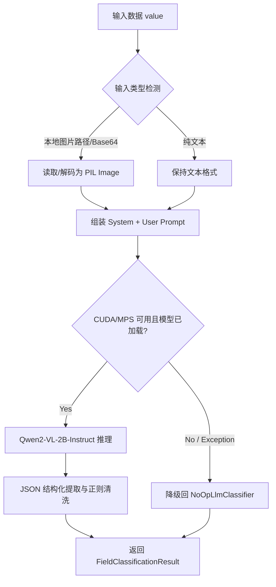

# 本地多模态大模型分类分级设计文档

## 1. 概述

本文档定义 `privacy-local-agent` 第三层分类引擎——本地多模态大模型（VLM）分类器的技术架构、算法原理与实现细节。该引擎处理病例图片、手写病历图片以及 OCR 识别后的凌乱文本，输出结构化分类分级标签。

## 2. 设计目标

- 在本地安全域内运行多模态推理，数据不离开本地环境。
- 支持图片路径、Base64 图片与纯文本三种输入格式。
- 基于 L1~L5 分类矩阵进行零样本语义推理。
- 输出固定 JSON Schema，便于系统自动解析。
- 适配 8GB 显存等轻量化本地环境，支持 CUDA/MPS/CPU 自适应。

## 3. 算法原理

### 3.1 多模态大模型分类

多模态大模型同时编码视觉与文本信息，生成统一语义表示后由解码器输出定级结果。其优势在于：

- 端到端理解图片中的文字、版式与医学上下文。
- 无需外接 OCR 引擎即可识别印刷体与手写体。
- 通过提示工程实现零样本分类，降低领域微调成本。

### 3.2 输入自适应识别

```text
Input value
    │
    ├── 本地图片路径 ──→ Image.open(path)
    ├── Base64 图片 ──→ base64 decode → PIL Image
    └── 其他 ─────────→ str(value) 纯文本
```

### 3.3 零样本语义定级

系统提示包含 L1~L5 分类矩阵定义与输出格式要求，大模型基于输入内容推理后返回固定 JSON：

```json
{
  "final_level": "L4",
  "sub_category": "MEDICAL_SENSITIVE_DISEASE",
  "confidence": 0.92,
  "reasoning": "图片中包含‘抗逆转录病毒治疗’等字样，推断属于 HIV 敏感病史，评定为 L4 级高风险数据",
  "needs_human_review": false
}
```

### 3.4 模型选型

采用 **Qwen2-VL-2B-Instruct**：

| 维度 | 说明 |
|---|---|
| 参数量 | 2.2B，FP16 推理约需 5GB 显存 |
| 多模态能力 | 原生支持图像输入，无需外接 OCR |
| 中文与手写体 | 在中文 OCR、手写体识别及医疗报告理解上表现优异 |
| 指令遵循 | 支持通过 Prompt 约束输出标准 JSON |

## 4. 架构设计



## 5. 模型下载器设计

- 支持 ModelScope（国内高速源）与 Hugging Face（含镜像站）双源下载。
- 实现脚本 `download_model.py`，支持命令行参数指定下载源。
- 使用 `snapshot_download` 实现断点续传与完整性校验。
- 默认存储目录：`.models/Qwen2-VL-2B-Instruct`。

## 6. 推理核心实现

### 6.1 依赖库

- `torch>=2.0.0`
- `transformers>=4.45.0`
- `accelerate`
- `pillow`

### 6.2 Prompt 设计

系统提示定义 L1~L5 分类标准，并要求仅输出符合 JSON Schema 的结构化内容，禁止包含 Markdown 块或额外解释。

### 6.3 JSON 解析器

解析器使用正则表达式提取 `{ ... }` 范围内文本，再通过 `json.loads` 解码。若解析失败，回滚至保守定级（L3）并记录日志。

## 7. 平台适配与降级

| 平台 | 推理模式 | 说明 |
|---|---|---|
| CUDA | FP16 | 优先启用，显存碎片优化 |
| MPS (Apple Silicon) | FP32 | 自动检测启用，避免算子不支持报错 |
| CPU | FP32 | 兜底模式 |

- 权重在第一次触发大模型定级时延迟加载。
- 若加载抛出 `ImportError`、`RuntimeError` 或 `FileNotFoundError`，切换至 `NoOpLlmClassifier` 兜底。

## 8. 非功能设计

| 维度 | 要求 |
|---|---|
| 显存控制 | CUDA FP16 ≤ 5.5GB；MPS FP32 ≤ 6.0GB |
| 推理延迟 | 纯文本 ≤ 500ms；图片/手写病历 ≤ 2.5s |
| 隐私安全 | 100% 本地执行，不向外部公网发送数据 |

## 9. 测试策略

- 本地图片、Base64 图片、文本输入分类测试。
- JSON 结构化输出解析成功率测试。
- CUDA/MPS/CPU 平台适配与降级路径测试。
- 显存占用与推理延迟基准测试。

## 10. 工业化评分 / Industrialization Scorecard

> **工业化软件 = 功能正确 + 性能稳定 + 安全可靠 + 可维护 + 可观测 + 可快速迭代**
>
> 评估框架参考 ISO/IEC 25010 与 Google SRE 实践，采用 6 维度加权评分（1–10 分）。

### 10.1 加权评分表

| 维度 | 权重 | 得分 | 说明 |
|------|------|------|------|
| 功能完整性 | 20% | 8/10 | 多模态输入检测（图片/Base64/文本）；零样本语义定级；JSON 结构化输出；降级到 NoOp |
| 性能 | 15% | 7/10 | 专用线程池 + 180s 超时保护；延迟加载模型；缺少批量推理优化 |
| 可靠性 | 20% | 9/10 | 双重检查锁定线程安全；NoOp 兆底；超时不阻塞主链路；warmup 预热机制 |
| 安全性 | 15% | 9/10 | 100% 本地执行，数据不离开本地；不记录原始数据；redact 脱敏 |
| 可维护性 | 15% | 8/10 | 双语文档完整，type hints 齐全；Prompt 设计清晰；模型下载器独立 |
| 工程化 | 15% | 8/10 | LLM 调用 Counter + 延迟 Histogram；结构化日志覆盖主路径；可选 OTLP Tracing |
| **总分** | **100%** | **8.25** | |

### 10.2 结论

**通过（Pass）**——满足工业化要求，可进入主线。

### 10.3 亮点

- 线程安全设计（双重检查锁定 + 专用单线程池）避免显存争用 OOM。
- 多平台自适应（CUDA > MPS > CPU）。
- 超时保护 + NoOp 降级确保主链路不受阻。
- warmup/warmup_async 预热机制支持生产环境快速就绪。

### 10.4 改进建议

| 优先级 | 建议 | 影响维度 |
|--------|------|----------|
| P1 | 添加批量推理接口（多字段并行推理） | 性能 +1 |
| P2 | 补充模型版本管理与 A/B 测试机制 | 工程化 +0.5 |
| P3 | 添加推理质量回归测试（固定输入检查输出一致性） | 可靠性 +0.5 |
