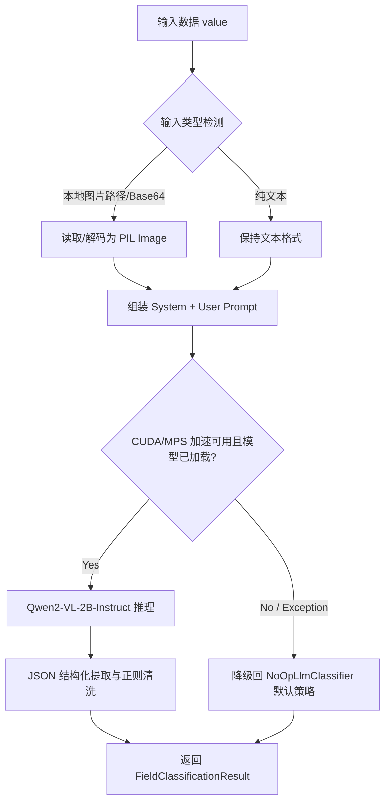

# 本地多模态大模型分类分级技术设计方案 (Technical Design)

## 1. 整体架构与数据流 (Architecture & Data Flow)

多模态大模型分类器作为 `ClassificationAPI` 的第三层拦截器（Layer-3 LLM Classifier）插入。



## 2. 模型下载器设计 (Model Downloader)

考虑到网络连通性，采用 **ModelScope (魔搭社区)** 作为国内高速下载源，同时保留 **Hugging Face** + 镜像站作为备选。

- **实现路径**：
  - 编写独立脚本 `download_model.py`，支持命令行参数指定下载源。
  - 使用 ModelScope SDK 的 `snapshot_download` 实现断点续传与完整性校验。
- **存储目录**：默认下载到当前项目工作区目录下的 `.models/Qwen2-VL-2B-Instruct`。

## 3. 多模态推理核心实现 (Inference Engine)

### 3.1 依赖库要求
- `torch>=2.0.0`：PyTorch 基础。
- `transformers>=4.45.0`：Qwen2-VL 需要较新版本的 transformers 支持。
- `accelerate`：自动管理模型片并在 GPU/CPU 间分配。
- `pillow`：图像加载与格式化。

### 3.2 输入类型自适应算法
网关分类器接收的 `value` 为 `Any`，需要根据其特征动态识别并解析：
- **图片路径匹配**：
  - 判断是否为 `str` 且符合常用图片后缀 (`.jpg`, `.png`, `.jpeg`, `.bmp`, `.webp`)。
  - 使用 `os.path.exists(value)` 验证文件真实存在。
  - 符合条件则通过 `Image.open(value)` 加载。
- **Base64 图片匹配**：
  - 匹配 `data:image/...;base64,...` 正则模式。
  - 或者判断是否为长 base64 字符串（通过 `base64.b64decode` 尝试解码并使用 `PIL.Image` 验证是否为合法图像数据）。
- **纯文本**：
  - 其他情况一律做 `str(value)` 转换，按纯文本消息处理。

### 3.3 Prompt 提示工程
设计针对医疗隐私定级任务的 Prompt：

```text
[SYSTEM PROMPT]
你是一个医疗数据分类分级领域的资深安全专家。请对输入的医疗数据（可能为文字或病例报告图片）进行敏感等级评估。
评估标准如下：
- L5 (极高风险): 包含人类基因序列、遗传信息、基因突变（如 BRCA1/TP53）或罕见病样本。
- L4 (高风险): 包含精神疾病（如精神分裂）、敏感传染病（如 HIV/AIDS/梅毒）或完整的住院病历。
- L3 (中风险): 包含个人身份信息（PII，如身份证号、手机号）、普通的门诊诊疗记录或常规检验指标数值（如血常规）。
- L2 (低风险): 仅包含医院科室运营、设备使用率或脱敏后的去标识化统计数据。
- L1 (公开级): 年度门诊总量等医院公开宣传、无任何敏感和特征的统计指标。

请严格根据上述标准进行定级，并仅输出符合以下 JSON Schema 的结构化内容，禁止包含任何 markdown 块或额外的解释文本：
{
  "final_level": "L1/L2/L3/L4/L5",
  "sub_category": "分类标签简称",
  "confidence": 0.0到1.0之间的浮点数,
  "reasoning": "定级判别的推理过程说明",
  "needs_human_review": true/false
}

[USER PROMPT]
请评估以下输入：
<图像或文字数据>
```

### 3.4 健壮性 JSON 解析器
由于大模型可能输出带有 ` ```json ` 标签的 Markdown 块，解析器将使用正则表达式匹配提取 `{ ... }` 范围内的文本，使用 `json.loads` 解码。如果解析失败，应打印报错并优雅回滚至 L3 保守定级。

## 4. 故障转移与向下兼容设计 (Graceful Fallback & Platform Adaption)

在本地没有安装 PyTorch/Transformers 或 GPU/MPS 硬件资源不足时，系统必须保持可用：
- **设备平台自适应**：
  - **Nvidia GPU (CUDA)**：优先选择。自动启用 FP16 半精度推理与显存碎片优化。
  - **Apple Silicon macOS (MPS)**：对于苹果 ARM 架构（如 M1/M2/M3），通过检测 `torch.backends.mps.is_available()` 自动启用 Metal 性能着色器硬件加速，使用 FP32 单精度避免算子不支持报错。
  - **CPU 兜底**：若上述两款硬件加速芯片均不可用，模型自动分配加载到 CPU，使用 FP32 计算。
- **延迟加载 (Lazy Loading) 与安全回退**：
  - 权重只在第一次触发大模型定级时才尝试加载。
  - 如果加载中抛出 `ImportError`（缺少依赖）、`RuntimeError`（显存不足/硬件报错）或 `FileNotFoundError`（未下载模型），分类器将自动切换至 `NoOpLlmClassifier` 兜底方案，记录警告日志，并不再重复尝试加载，以保障后续分类请求在微毫秒级内通过第一层规则和第二层 Small-NER 正常完成。

