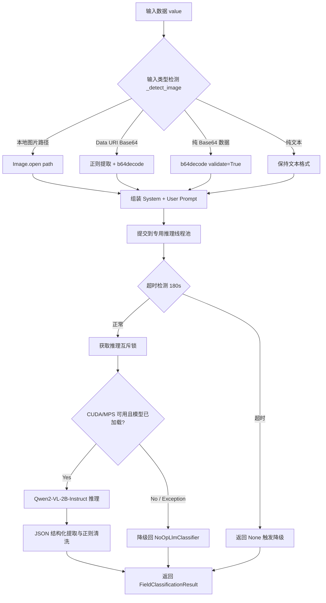

# 本地多模态大模型分类分级设计文档

## 1. 概述

本文档定义 `privacy-local-agent` 第三层分类引擎——本地多模态大模型（VLM）分类器的技术架构、算法原理与实现细节。该引擎处理病例图片、手写病历图片以及 OCR 识别后的凌乱文本，输出结构化分类分级标签。

核心实现文件：`privacy_local_agent/privacy/classification/classification_llm.py`

## 2. 设计目标

- 在本地安全域内运行多模态推理，数据不离开本地环境。
- 支持图片路径、Base64 图片（Data URI 与纯 Base64）与纯文本三种输入格式。
- 基于 L1~L5 分类矩阵进行零样本语义推理。
- 输出固定 JSON Schema，便于系统自动解析。
- 适配 8GB 显存等轻量化本地环境，支持 CUDA/MPS/CPU 自适应。
- 线程安全设计，支持 gRPC 多线程池并发调用场景。
- 推理超时保护，避免模型卡死阻塞主链路。
- 自动降级至 `NoOpLlmClassifier`，确保服务可用性。

## 3. 算法原理

### 3.1 多模态大模型分类

多模态大模型同时编码视觉与文本信息，生成统一语义表示后由解码器输出定级结果。其优势在于：

- 端到端理解图片中的文字、版式与医学上下文。
- 无需外接 OCR 引擎即可识别印刷体与手写体。
- 通过提示工程实现零样本分类，降低领域微调成本。

### 3.2 输入自适应识别

`_detect_image()` 方法实现三级检测策略：

```text
Input value
    │
    ├── 1. 本地图片路径检测
    │      条件：长度 < 512 且后缀为 .jpg/.jpeg/.png/.bmp/.webp
    │      且 os.path.exists() 验证文件存在
    │      ──→ Image.open(path)
    │
    ├── 2. Data URI 格式 Base64 检测
    │      正则：^data:image/[a-zA-Z]+;base64,(.+)$
    │      ──→ base64 decode → PIL Image
    │
    ├── 3. 纯 Base64 数据检测
    │      条件：长度 > 100 且不以 http 开头
    │      使用 base64.b64decode(validate=True) 验证
    │      ──→ base64 decode → PIL Image
    │
    └── 4. 其他 ─────────→ 返回 None，按纯文本处理
```

检测失败时记录结构化日志（使用 `redact()` 脱敏路径），不抛出异常，安全回退为文本模式。

### 3.3 零样本语义定级

系统提示包含 L1~L5 分类矩阵定义与输出格式要求，大模型基于输入内容推理后返回固定 JSON：

```json
{
  "final_level": "L4",
  "sub_category": "MEDICAL_SENSITIVE_DISEASE",
  "confidence": 0.92,
  "reasoning": "图片中包含'抗逆转录病毒治疗'等字样，推断属于 HIV 敏感病史，评定为 L4 级高风险数据",
  "needs_human_review": false
}
```

### 3.4 模型选型

采用 **Qwen2-VL-2B-Instruct**：

| 维度 | 说明 |
|---|---|
| 参数量 | 2.2B，FP16 推理约需 5GB 显存 |
| 多模态能力 | 原生支持图像输入，无需外接 OCR |
| 中文与手写体 | 在中文 OCR、手写体识别及医疗报告理解上表现优异 |
| 指令遵循 | 支持通过 Prompt 约束输出标准 JSON |
| 模型类 | `Qwen2VLForConditionalGeneration`（transformers 库） |
| 处理器 | `AutoProcessor`（含 tokenizer + 图像预处理） |

## 4. 架构设计

### 4.1 推理流程



### 4.2 三层漏斗集成

LLM 分类器作为 `ClassificationAPI` 三层漏斗的第三层（Layer-3），在以下条件下被触发：

```python
# classification.py 中的触发逻辑
if cp.enable_llm or confidence < cp.llm_confidence_threshold:
    llm_result = self.llm.classify(str(value), final_level, confidence)
```

| 触发条件 | 说明 |
|---|---|
| `enableLlm = true` | 请求参数或 YAML profile 显式启用 LLM |
| `confidence < llmConfidenceThreshold` | 上游 Layer-1/Layer-2 置信度不足（默认阈值 0.6） |

LLM 返回结果后，`ClassificationAPI` 更新 `final_level`、`confidence`、`reasoning` 并标记 `engine_layer = L3_LLM`。

### 4.3 类层次结构

```text
LlmClassifier (ABC)                      # classification_models.py 抽象基类
├── Qwen2VLClassifier                    # classification_llm.py 实际推理实现
└── NoOpLlmClassifier                    # classification_models.py 降级兜底实现
```

- **`LlmClassifier`**：定义 `classify(text, upstream_level, upstream_confidence) -> dict | None` 抽象接口。
- **`Qwen2VLClassifier`**：完整的多模态推理实现，含延迟加载、线程安全、超时保护。
- **`NoOpLlmClassifier`**：当上游置信度 < 0.6 时返回保守回退结果（标记 `needs_human_review: true`），否则返回 None。

### 4.4 自动选择逻辑

`ClassificationAPI.__init__()` 中的 LLM 自动选择策略：

```text
1. 尝试 import Qwen2VLClassifier
2. 若 ImportError → 使用 NoOpLlmClassifier
3. 若模型目录 .models/Qwen2-VL-2B-Instruct 不存在 → 使用 NoOpLlmClassifier
4. 否则 → 使用 Qwen2VLClassifier 实例
```

## 5. 模型下载器设计

实现文件：`privacy_local_agent/privacy/download_model.py`

### 5.1 下载策略

采用优先级回退机制：

```text
1. ModelScope SDK（国内速度最快）
   └── 失败 → 2. Hugging Face 镜像站（hf-mirror.com）
              └── 失败 → 输出错误信息，exit(1)
```

### 5.2 实现细节

| 特性 | 说明 |
|---|---|
| 双源支持 | `download_via_modelscope()` + `download_via_huggingface()` |
| 断点续传 | 使用 `snapshot_download` 实现 |
| 镜像加速 | 默认设置 `HF_ENDPOINT=https://hf-mirror.com`（可通过环境变量覆盖） |
| 带宽优化 | Hugging Face 下载时跳过 `*.msgpack`、`*.h5`、`*.ot` 非必要格式文件 |
| 存储路径 | 项目根目录 `.models/Qwen2-VL-2B-Instruct` |
| 模型标识 | `Qwen/Qwen2-VL-2B-Instruct` |

### 5.3 使用方式

```bash
python -m privacy_local_agent.privacy.download_model
```

依赖库（按需安装）：
- `modelscope`（首选通道）
- `huggingface_hub`（回退通道）

## 6. 推理核心实现

### 6.1 依赖库

| 依赖 | 版本要求 | 用途 |
|---|---|---|
| `torch` | >=2.0.0 | 张量计算与模型推理 |
| `transformers` | >=4.45.0 | `Qwen2VLForConditionalGeneration` + `AutoProcessor` |
| `accelerate` | — | 模型 device_map 自动分配 |
| `pillow` | — | 图像加载与预处理 |
| `qwen-vl-utils` | 可选 | `process_vision_info()` 图片处理辅助（未安装时回退为直接传入 PIL Image） |

所有 ML 依赖均为延迟导入（lazy import），不在模块顶层引入，确保缺少依赖时优雅降级。

### 6.2 Prompt 设计

系统提示（System Prompt）完整定义 L1~L5 分类标准：

```text
你是一个医疗数据分类分级领域的资深安全专家。请对输入的医疗数据进行敏感等级评估。
评估标准如下：
- L5 (极高风险): 包含人类基因序列、遗传信息、基因突变（如 BRCA1/TP53）或罕见病样本。
- L4 (高风险): 包含精神疾病（如精神分裂）、敏感传染病（如 HIV/AIDS/梅毒）或完整的住院病历。
- L3 (中风险): 包含个人身份信息（PII，如身份证号、手机号）、普通的门诊诊疗记录或常规检验指标数值。
- L2 (低风险): 仅包含医院科室运营、设备使用率或脱敏后的去标识化统计数据。
- L1 (公开级): 年度门诊总量等医院公开宣传、无任何敏感和特征的统计指标。

请严格根据上述标准进行定级，并仅输出符合以下 JSON 格式的结构化内容，
不要包含额外的解释文字或 ``` 块：
{"final_level": "...", "sub_category": "...", "confidence": ..., "reasoning": "...", "needs_human_review": ...}
```

用户提示（User Prompt）根据输入类型自适应：
- **图片输入**：`[{"type": "image", "image": <PIL Image>}, {"type": "text", "text": "请提取该图片中的文字并评估其敏感数据等级。"}]`
- **文本输入**：`[{"type": "text", "text": "请评估以下文本数据的敏感数据等级：\n{text}"}]`

### 6.3 推理执行流程

`_classify_inner()` 方法的核心执行步骤：

```text
1. _detect_image(text) → 检测并加载图片（或返回 None）
2. 构建 messages 数组（system + user）
3. processor.apply_chat_template() → 渲染为模型输入文本
4. 图片处理：
   - 优先使用 qwen_vl_utils.process_vision_info()
   - 回退为直接传入 [image] 列表
5. processor(text, images, padding=True, return_tensors="pt") → 张量化
6. 张量迁移到模型设备：{k: v.to(model.device)}
7. torch.no_grad() + model.generate(max_new_tokens=512)
8. 裁剪生成 ID（去除输入前缀）
9. processor.batch_decode() → 输出文本
10. _parse_json_result() → 结构化提取
```

### 6.4 JSON 解析器

`_parse_json_result()` 实现：

```python
# 1. 正则提取 JSON {} 区间内容（支持多行，re.DOTALL）
json_match = re.search(r"(\{.*\})", output_text, re.DOTALL)
json_str = json_match.group(1) if json_match else output_text

# 2. json.loads 解码
res = json.loads(json_str)

# 3. 校验关键字段 "final_level" 存在
if "final_level" in res:
    return res

# 4. 解析失败 → 返回 None 触发降级
```

若解析失败，记录 `llm_json_parse_failed` 警告日志并返回 `None`，由上层 `ClassificationAPI` 回退到上游引擎结果。

## 7. 平台适配与降级

### 7.1 设备检测与精度策略

| 平台 | 推理精度 | device_map | 说明 |
|---|---|---|---|
| CUDA | FP16 (`torch.float16`) | `"auto"` | 优先启用，显存碎片优化 |
| MPS (Apple Silicon) | FP32 (`torch.float32`) | `"auto"` + `.to("mps")` | 自动检测启用，避免算子不支持报错 |
| CPU | FP32 (`torch.float32`) | `None` + `.to("cpu")` | 兜底模式 |

设备检测优先级：`torch.cuda.is_available()` → `torch.backends.mps.is_available()` → CPU

### 7.2 延迟加载机制

- 权重在第一次触发大模型定级时延迟加载（`_lazy_init()`）。
- 使用**双重检查锁定（Double-Checked Locking）** 确保线程安全：
  - 快速路径：`_initialized` 或 `_init_error` 已设置时无需加锁直接返回/抛出。
  - 慢路径：获取 `self._lock` 后再次检查状态，避免多线程重复初始化。

### 7.3 降级策略

| 异常类型 | 触发场景 | 降级行为 |
|---|---|---|
| `ImportError` | 缺少 torch/transformers 依赖 | 切换至 `NoOpLlmClassifier` |
| `FileNotFoundError` | 本地模型目录不存在 | 切换至 `NoOpLlmClassifier` |
| `RuntimeError` | CUDA OOM / 模型加载失败 | 记录 `_init_error`，后续调用直接返回 None |
| `FuturesTimeoutError` | 推理超时（默认 180s） | 返回 None，触发上游降级 |
| 其他 `Exception` | 推理过程中任意异常 | 返回 None，记录错误日志 |

`NoOpLlmClassifier` 兜底行为：
- 上游置信度 < 0.6 → 返回保守结果（保持上游等级，标记 `needs_human_review: true`）
- 上游置信度 >= 0.6 → 返回 None（信任上游结果）

## 8. 线程安全与超时保护

### 8.1 线程安全设计

gRPC 使用线程池处理请求，多个工作线程可能并发调用分类器。设计两层保护：

| 机制 | 实现 | 目的 |
|---|---|---|
| 互斥锁 `self._lock` | `threading.Lock()` | 防止多线程同时初始化或推理导致显存争用 OOM |
| 专用推理线程池 | `ThreadPoolExecutor(max_workers=1, thread_name_prefix="vlm-infer")` | 将推理隔离到单独线程，配合超时机制 |

### 8.2 超时保护

```python
_INFERENCE_TIMEOUT = int(os.environ.get("PRIVACY_VLM_TIMEOUT", "180"))

future = self._executor.submit(self._do_classify, text, upstream_level, upstream_confidence)
result = future.result(timeout=self._INFERENCE_TIMEOUT)
```

- 默认超时 180 秒（Qwen2-VL-2B 在 CPU 上单张图片推理可能需要 60-120 秒）。
- 超时后放弃本次推理并返回 `None` 触发降级，避免永久阻塞 gRPC 工作线程。
- 可通过环境变量 `PRIVACY_VLM_TIMEOUT` 调整。

### 8.3 调用链路

```text
classify()                          # 公开方法，入口
  ├── _lazy_init()                  # 延迟初始化（双重检查锁定）
  └── _executor.submit(_do_classify)  # 提交到专用线程池
        └── _do_classify()          # 在专用线程中运行
              └── with self._lock:  # 获取推理互斥锁
                    └── _classify_inner()  # 实际推理逻辑
```

## 9. 预热机制

### 9.1 同步预热

```python
classifier.warmup() -> bool
```

主动触发 `_lazy_init()` 加载模型权重。同步阻塞，建议在后台线程中调用。

### 9.2 异步预热

```python
await classification_api.warmup_async() -> bool
```

通过 `asyncio.get_running_loop().run_in_executor()` 在后台线程中执行 `warmup()`，避免阻塞事件循环。

### 9.3 启动时自动预热

在 `main.py` 的 FastAPI lifespan 中：

```python
if os.environ.get("PRIVACY_WARMUP_LLM", "false").lower() == "true":
    warmup_task = asyncio.create_task(service.classification_api.warmup_async())
```

设置 `PRIVACY_WARMUP_LLM=true` 即可在服务启动时异步预热本地大模型，避免第一个请求阻塞。

### 9.4 就绪探针

| 端点 | 说明 |
|---|---|
| `GET /readyz` | 返回 `llm_ready` 字段表示 LLM 是否就绪 |
| `GET /readyz/llm` | 专用 LLM 就绪探针，未就绪时返回 503 |

`is_llm_ready()` 判断逻辑：
- `NoOpLlmClassifier` → 始终就绪（无需预热）
- `Qwen2VLClassifier` → 检查 `is_ready` 属性（`_initialized and _init_error is None`）
- 其他自定义 LLM → 默认就绪

## 10. 非功能设计

| 维度 | 要求 |
|---|---|
| 显存控制 | CUDA FP16 ≤ 5.5GB；MPS FP32 ≤ 6.0GB |
| 推理延迟 | 纯文本 ≤ 500ms；图片/手写病历 ≤ 2.5s |
| 超时保护 | 默认 180s（可配置），超时自动降级 |
| 隐私安全 | 100% 本地执行，不向外部公网发送数据 |
| 日志脱敏 | 使用 `redact()` 对路径等敏感信息脱敏（仅保留前 8 字符） |
| 并发安全 | 互斥锁 + 专用线程池，避免显存争用 |

## 11. 可观测性设计

### 11.1 Prometheus 指标

| 指标名称 | 类型 | 标签 | 说明 |
|---|---|---|---|
| `privacy_classification_llm_total` | Counter | `status` | LLM 调用总次数（status: success/error/timeout/init_failed/hit/miss） |
| `privacy_classification_llm_duration_seconds` | Histogram | `engine` | LLM 推理延迟分布（buckets: 0.1~120s） |

指标埋点位置：
- `classify()` 方法：记录 `init_failed`、`timeout`、`error` 状态及延迟
- `_classify_inner()` 方法：记录 `success`、`error` 状态
- `ClassificationAPI._classify_field_internal()`：记录 `hit`/`miss` 状态

### 11.2 结构化日志

使用 `get_logger(__name__)` 获取模块级结构化日志器，所有关键路径均有日志覆盖：

| 日志事件 | 级别 | 触发场景 |
|---|---|---|
| `qwen2vl_model_loading` | INFO | 开始加载模型权重 |
| `qwen2vl_model_initialized` | INFO | 模型初始化成功 |
| `qwen2vl_model_init_failed` | WARNING | 模型初始化失败 |
| `llm_classify_completed` | DEBUG | 推理完成 |
| `llm_classify_timeout` | ERROR | 推理超时 |
| `llm_classify_error` | ERROR | 推理异常 |
| `llm_classify_inner_error` | ERROR | 内部推理异常 |
| `llm_image_load_failed` | WARNING | 图片文件加载失败 |
| `llm_base64_decode_failed` | WARNING | Base64 解码失败 |
| `llm_json_parse_failed` | WARNING | JSON 解析失败 |
| `llm_warmup_failed` | WARNING | 预热失败 |

### 11.3 链路追踪

支持可选的 OpenTelemetry OTLP Tracing（通过 `OTEL_EXPORTER_OTLP_ENDPOINT` 环境变量启用）。

## 12. 环境变量配置

| 变量 | 默认值 | 说明 |
|---|---|---|
| `PRIVACY_VLM_TIMEOUT` | `180` | VLM 推理超时时间（秒） |
| `PRIVACY_WARMUP_LLM` | `false` | 启动时是否异步预热 LLM |
| `HF_ENDPOINT` | `https://hf-mirror.com` | Hugging Face 镜像地址（下载时） |

## 13. 测试策略

测试文件：`tests/classification/test_classification_llm.py`

### 13.1 测试覆盖

| 测试场景 | 测试方法 | 说明 |
|---|---|---|
| 本地图片路径检测 | `test_detect_image_local_path` | 创建临时 PNG 文件验证检测 |
| Base64 图片检测 | `test_detect_image_base64` | 纯 Base64 + Data URI 两种格式 |
| 纯文本输入检测 | `test_detect_image_raw_text` | 验证返回 None |
| 成功推理 | `test_classify_success` | Mock 模型输出合法 JSON |
| 加载失败降级 | `test_classify_failure_fallback` | Mock CUDA OOM 异常 |
| 手写病历 OCR | `test_classify_handwritten_medical_note` | 手写体文本推理验证 |
| 印刷体报告 | `test_classify_printed_structured_report` | 表格排版印刷报告验证 |
| 默认未就绪 | `test_qwen_classifier_not_ready_by_default` | 初始状态 is_ready=False |
| warmup 成功 | `test_qwen_classifier_warmup_success` | 预热后 is_ready=True |
| warmup 失败 | `test_qwen_classifier_warmup_failure` | 预热失败返回 False |

### 13.2 测试策略说明

- 使用 `sys.modules["torch"] = MagicMock()` 模拟 torch 模块，支持无 GPU 环境运行。
- 使用 `@pytest.mark.skipif(not HAS_PILLOW)` 跳过需要 Pillow 的图像测试。
- 通过 `@patch` 装饰器 Mock `_lazy_init` 避免实际加载模型。
- 验证 JSON 解析、降级路径、线程安全等核心逻辑。

## 14. 工业化评分 / Industrialization Scorecard

> **工业化软件 = 功能正确 + 性能稳定 + 安全可靠 + 可维护 + 可观测 + 可快速迭代**
>
> 评估框架参考 ISO/IEC 25010 与 Google SRE 实践，采用 6 维度加权评分（1–10 分）。

### 14.1 加权评分表

| 维度 | 权重 | 得分 | 说明 |
|------|------|------|------|
| 功能完整性 | 20% | 8/10 | 多模态输入检测（图片/Base64/文本）；零样本语义定级；JSON 结构化输出；降级到 NoOp |
| 性能 | 15% | 7/10 | 专用线程池 + 180s 超时保护；延迟加载模型；缺少批量推理优化 |
| 可靠性 | 20% | 9/10 | 双重检查锁定线程安全；NoOp 兆底；超时不阻塞主链路；warmup 预热机制 |
| 安全性 | 15% | 9/10 | 100% 本地执行，数据不离开本地；不记录原始数据；redact 脱敏 |
| 可维护性 | 15% | 8/10 | 双语文档完整，type hints 齐全；Prompt 设计清晰；模型下载器独立 |
| 工程化 | 15% | 8/10 | LLM 调用 Counter + 延迟 Histogram；结构化日志覆盖主路径；可选 OTLP Tracing |
| **总分** | **100%** | **8.25** | |

### 14.2 结论

**通过（Pass）**——满足工业化要求，可进入主线。

### 14.3 亮点

- 线程安全设计（双重检查锁定 + 专用单线程池）避免显存争用 OOM。
- 多平台自适应（CUDA > MPS > CPU）。
- 超时保护 + NoOp 降级确保主链路不受阻。
- warmup/warmup_async 预热机制支持生产环境快速就绪。

### 14.4 改进建议

| 优先级 | 建议 | 影响维度 |
|--------|------|----------|
| P1 | 添加批量推理接口（多字段并行推理） | 性能 +1 |
| P2 | 补充模型版本管理与 A/B 测试机制 | 工程化 +0.5 |
| P3 | 添加推理质量回归测试（固定输入检查输出一致性） | 可靠性 +0.5 |
