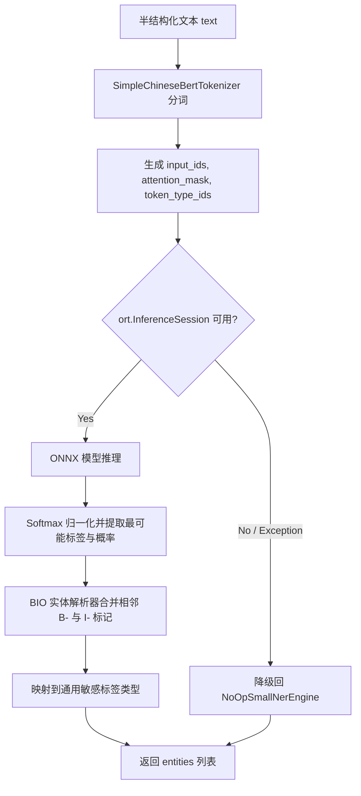

# 本地轻量级 Small-NER 技术设计方案 (Technical Design)

## 1. 整体架构与模块接口 (Architecture & Interface)

## 2. 纯 Python BERT 分词器 (SimpleChineseBertTokenizer)

由于标准的 `transformers` 库极其沉重且难以在受限运行环境中直接拉起，为了实现毫秒级的纯 CPU/GPU 推理，我们需要自主实现纯 Python 的 BERT Tokenizer。

### 2.1 算法设计
1. **词表加载**：从 `vocab.txt` 中读取所有的 token（每行一个），建立字符串到索引 `token_to_id` 的 dict 字典。
2. **字符级切分**：
   - 对于中文字符，直接按字（Char-level）切分为单个字符。
   - 对于英文字符或数字，执行 WordPiece 切分，未命中的词用 `[UNK]` 代替。
3. **序列封装**：
   - 前部自动拼接首标记 `[CLS]`（ID 通常为 101）。
   - 尾部拼接截断/结束标记 `[SEP]`（ID 通常为 102）。
   - 对不足 `max_length` 的序列进行 `[PAD]`（ID 为 0）填充，并同步生成 `attention_mask` (有内容处为 1，PAD 处为 0) 与 `token_type_ids`（全 0）。

## 3. ONNX 推理与 BIO 解析

### 3.1 推理输入输出
- **Session 输入**：
  - `input_ids`: 形状为 `[1, sequence_length]` 的整数张量。
  - `attention_mask`: 形状为 `[1, sequence_length]` 的整数张量。
  - `token_type_ids`: 形状为 `[1, sequence_length]` 的整数张量。
- **Session 输出**：
  - `logits`: 形状为 `[1, sequence_length, num_labels]` 的浮点张量。

### 3.2 概率与预测计算
使用 `numpy` 执行运算：
1. **Softmax 归一化**：
   $$P_{i,j} = \frac{e^{z_{i,j} - \max(z_i)}}{\sum e^{z_{i,k} - \max(z_i)}}$$
2. **Argmax 选取**：取出每个 token 概率最高对应的 label 索引。

### 3.3 BIO 实体合并算法 (BIO Entity Parser)
遍历 token 序列，利用状态机根据 BIO（Begin, Inside, Outside）标签逻辑将字符序列合并为实体：
- 遇到 `B-xxx`：如果当前有正在构建的实体，将其保存并结束。初始化一个类型为 `xxx` 的新实体，其文本为当前字符。
- 遇到 `I-xxx`：如果当前有正在构建的实体且类型与 `xxx` 一致，将当前字符追加到该实体文本中，置信度取最小概率（以保证最保守评估）。如果类型不一致或当前无实体，结束前一实体。
- 遇到 `O`：如果当前有正在构建的实体，将其保存并结束。

## 4. 敏感标签映射 (Label Mapping)

由于 CMEEE / 达摩院 RaNER 医疗实体类型为英文简称，我们在识别出实体后，会自动映射到统一的安全规则引擎可识别实体：
- `dis` (疾病) / `sym` (症状) $\rightarrow$ `MEDICAL_DISEASE`
- `dru` (药物) $\rightarrow$ `MEDICATION`
- `pro` (手术/操作) $\rightarrow$ `SURGERY`
- `bod` (解剖部位) $\rightarrow$ `BODY_PART`

在 `ClassificationAPI` 执行 `_run_small_ner` 时，将 NER 结果送至打标判定：
1. **同段落敏感病升级**：若某列或文本段落中抽取出姓名（PII）且同时命中特定敏感传染病/精神疾病标签，自动将定级提升至 **L4**。
2. **基因暗示敏感病升级**：若抽取出基因突变或突变检测实体，定级提升至 **L5**，并触发 `needs_human_review = True` 送人人工审计队列。

## 6. ModelScope 官方推理管道模式设计 (ModelScope Pipeline Mode)

除了超轻量、低延迟的 ONNX 推理模式，系统还提供了利用 ModelScope 官方 Transformers 管道加载并执行模型的方案：
- **Inference Pipeline**：
  - 初始化时，通过 `modelscope.pipelines.pipeline` 初始化 `Tasks.named_entity_recognition` 任务，自动识别系统中的 GPU 或 CPU 设备。
  - **动态下载与加载**：如果指定的模型 ID 未加载，ModelScope SDK 会自动触发在魔搭社区高速同步文件到本地 `.models/raner_cmeee`，并就地加载权重。
- **实体解析与标准化**：
  - ModelScope 管道提取输出格式为结构化字典：`{'output': [{'type': 'dis', 'span': '急性心肌梗死'}]}`。
  - 解析器自动迭代输出集合，利用相同的 CMEEE 简称到系统安全等级字典（`dis/sym -> MEDICAL_DISEASE` 等）进行映射，归一化输出字段列表，保持定级逻辑在两个推理引擎间 100% 对齐。

