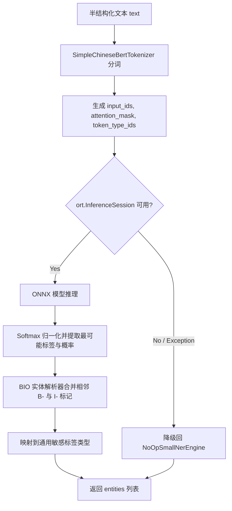

# 本地轻量级 Small-NER 分类定级设计文档

## 1. 概述

本文档定义 `privacy-local-agent` 第二层分类引擎——本地轻量级命名实体识别（Small-NER）的技术架构、算法原理与实现细节。该引擎对半结构化医疗文本进行毫秒级实体抽取，作为规则引擎的补充层。

## 2. 设计目标

- 精准识别中文医学文本中的疾病/症状、药物、手术/操作、解剖部位等实体。
- 提供 ONNX 极速模式与 ModelScope 官方管道模式两种运行方式。
- 与规则引擎和 LLM 协同，形成递进式分类漏斗。
- 实现联动定级升级机制。
- 在极简环境下提供无外部依赖的纯 Python BERT Tokenizer。

## 3. 算法原理

### 3.1 命名实体识别（NER）

NER 是从非结构化文本中定位并分类命名实体的任务。模型基于 Transformer 编码器，通过 token-level 分类预测每个 token 的 BIO 标签：

- **B-XXX**：实体 XXX 的开始。
- **I-XXX**：实体 XXX 的内部。
- **O**：非实体。

模型输出经 BIO 解析器合并为完整实体，并附带置信度分数。

### 3.2 双运行模式

| 模式 | 推理引擎 | 特点 |
|---|---|---|
| ONNX 极速模式 | `onnxruntime` + 纯 Python 分词器 | 轻量、低延迟、低显存 |
| ModelScope 管道模式 | `modelscope` 官方 Transformers Pipeline | 官方高精度、开箱即用 |

### 3.3 模型底座

采用达摩院 RaNER 医疗实体识别微调模型 `iic/nlp_raner_named-entity-recognition_chinese-base-cmeee`（ModelScope），针对中文医学文本进行领域优化。

### 3.4 联动定级升级

NER 结果送回 `ClassificationAPI` 后触发升级策略：

- 敏感病种（如 HIV、精神分裂）与 PII（姓名/身份证）同段落出现 → 升级为 **L4**。
- 基因突变/检测实体出现 → 标记为 **L5**，并触发 `needs_human_review`。

## 4. 架构设计



## 5. 纯 Python BERT 分词器

`SimpleChineseBertTokenizer` 基于 `vocab.txt` 实现：

1. **词表加载**：建立字符串到索引 `token_to_id` 的字典。
2. **字符级切分**：中文字符按字切分；英文/数字执行 WordPiece 切分，未命中词用 `[UNK]` 代替。
3. **序列封装**：首部拼接 `[CLS]`，尾部拼接 `[SEP]`，不足 `max_length` 处用 `[PAD]` 填充，并生成 `attention_mask` 与 `token_type_ids`。

## 6. ONNX 推理与 BIO 解析

### 6.1 输入输出

- **输入**：`input_ids`、`attention_mask`、`token_type_ids`，形状 `[1, sequence_length]`。
- **输出**：`logits`，形状 `[1, sequence_length, num_labels]`。

### 6.2 概率计算

使用 numpy 执行 softmax：

```
P_{i,j} = exp(z_{i,j} - max(z_i)) / sum(exp(z_{i,k} - max(z_i)))
```

再通过 argmax 取出每个 token 的预测标签。

### 6.3 BIO 实体合并

遍历 token 序列，利用状态机合并实体：

- `B-xxx`：结束当前实体，开启类型为 `xxx` 的新实体。
- `I-xxx`：若当前实体类型与 `xxx` 一致，追加字符；否则结束当前实体。
- `O`：结束当前实体。

实体置信度取所含 token 概率的最小值（保守估计）。

## 7. 敏感标签映射

CMEEE / RaNER 实体类型映射到统一安全标签：

| 原始类型 | 映射标签 |
|---|---|
| `dis`（疾病）/ `sym`（症状） | `MEDICAL_DISEASE` |
| `dru`（药物） | `MEDICATION` |
| `pro`（手术/操作） | `SURGERY` |
| `bod`（解剖部位） | `BODY_PART` |

## 8. ModelScope 管道模式

- 通过 `modelscope.pipelines.pipeline` 初始化 `Tasks.named_entity_recognition` 任务。
- 自动识别 GPU 或 CPU 设备。
- 若模型未加载，自动同步到本地 `.models/raner_cmeee`。
- 输出结构化字典后使用相同标签映射逻辑归一化。

## 9. 非功能设计

| 维度 | 要求 |
|---|---|
| 延迟 | 单次推理 ≤ 30ms |
| 包体积 | ONNX 模型文件 ≤ 100MB |
| 兼容性 | ONNX 模式无 `transformers` 依赖 |
| 鲁棒性 | 缺失模型时优雅降级 |

## 10. 测试策略

- ONNX 与 ModelScope 模式实体提取测试。
- BIO 解析器状态机测试。
- 联动升级策略（L4/L5）测试。
- 优雅降级路径测试。
- 延迟与模型体积基准测试。
