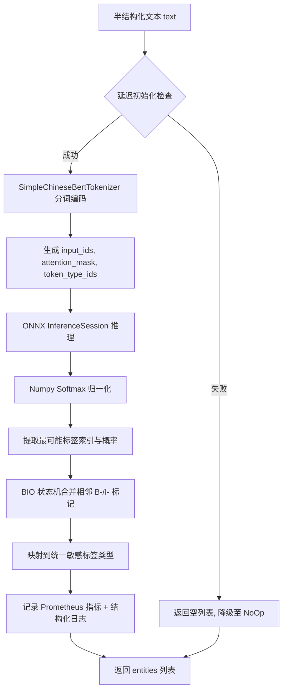

# 本地轻量级 Small-NER 分类定级设计文档

## 目录

- [1. 概述](#1-概述)
- [2. 设计目标](#2-设计目标)
- [3. 算法原理](#3-算法原理)
  - [3.1 命名实体识别（NER）](#31-命名实体识别ner)
  - [3.2 双运行模式](#32-双运行模式)
  - [3.3 模型底座](#33-模型底座)
  - [3.4 联动定级升级](#34-联动定级升级)
- [4. 架构设计](#4-架构设计)
  - [4.1 推理流程](#41-推理流程)
  - [4.2 三层漏斗集成](#42-三层漏斗集成)
  - [4.3 类层次结构](#43-类层次结构)
  - [4.4 自动选择逻辑](#44-自动选择逻辑)
- [5. 纯 Python BERT 分词器](#5-纯-python-bert-分词器)
  - [5.1 词表加载](#51-词表加载)
  - [5.2 字符级切分](#52-字符级切分)
  - [5.3 序列编码](#53-序列编码)
- [6. ONNX 推理与 BIO 解析](#6-onnx-推理与-bio-解析)
  - [6.1 输入输出](#61-输入输出)
  - [6.2 概率计算](#62-概率计算)
  - [6.3 BIO 标签映射表](#63-bio-标签映射表)
  - [6.4 BIO 实体合并状态机](#64-bio-实体合并状态机)
- [7. 敏感标签映射](#7-敏感标签映射)
- [8. ModelScope 管道模式](#8-modelscope-管道模式)
  - [8.1 管道初始化](#81-管道初始化)
  - [8.2 兼容性适配](#82-兼容性适配)
  - [8.3 输出格式与映射](#83-输出格式与映射)
- [9. 模型下载器设计](#9-模型下载器设计)
  - [9.1 下载策略](#91-下载策略)
  - [9.2 下载产物](#92-下载产物)
  - [9.3 使用方式](#93-使用方式)
- [10. Layer-2 联动定级策略](#10-layer-2-联动定级策略)
  - [10.1 触发条件](#101-触发条件)
  - [10.2 实体→SecurityTag 映射规则](#102-实体securitytag-映射规则)
  - [10.3 敏感关键字升级](#103-敏感关键字升级)
- [11. 可观测性设计](#11-可观测性设计)
  - [11.1 Prometheus 指标](#111-prometheus-指标)
  - [11.2 结构化日志](#112-结构化日志)
- [12. 非功能设计](#12-非功能设计)
- [13. 测试策略](#13-测试策略)
  - [13.1 测试覆盖](#131-测试覆盖)
  - [13.2 测试策略说明](#132-测试策略说明)
- [14. 工业化评分](#14-工业化评分)

---

## 1. 概述

本文档定义 `privacy-local-agent` 第二层分类引擎——本地轻量级命名实体识别（Small-NER）的技术架构、算法原理与实现细节。该引擎对半结构化医疗文本进行毫秒级实体抽取，作为规则引擎的补充层。

核心实现文件：`privacy_local_agent/privacy/classification/classification_ner.py`

## 2. 设计目标

- 精准识别中文医学文本中的疾病/症状、药物、手术/操作、解剖部位等实体。
- 提供 ONNX 极速模式与 ModelScope 官方管道模式两种运行方式。
- 与规则引擎和 LLM 协同，形成递进式分类漏斗。
- 实现联动定级升级机制（敏感病种 → L4，基因实体 → L5）。
- 在极简环境下提供无外部依赖的纯 Python BERT Tokenizer。
- 延迟加载模型，缺失依赖或模型文件时优雅降级至 `NoOpSmallNerEngine`。
- 全链路可观测：Prometheus 指标 + 结构化日志覆盖。

## 3. 算法原理

### 3.1 命名实体识别（NER）

NER 是从非结构化文本中定位并分类命名实体的任务。模型基于 Transformer 编码器，通过 token-level 分类预测每个 token 的 BIO 标签：

- **B-XXX**：实体 XXX 的开始（Begin）。
- **I-XXX**：实体 XXX 的内部（Inside）。
- **O**：非实体（Outside）。

模型输出经 BIO 解析器合并为完整实体，并附带置信度分数。

### 3.2 双运行模式

| 模式 | 推理引擎 | 特点 | 依赖 |
|---|---|---|---|
| ONNX 极速模式 | `onnxruntime` + 纯 Python 分词器 | 轻量、低延迟（≤30ms）、低显存 | `onnxruntime`、`numpy` |
| ModelScope 管道模式 | `modelscope` 官方 Transformers Pipeline | 官方高精度、开箱即用 | `modelscope`、`torch`、`transformers` |

### 3.3 模型底座

采用达摩院 RaNER 医疗实体识别微调模型：

| 属性 | 值 |
|---|---|
| ModelScope ID | `iic/nlp_raner_named-entity-recognition_chinese-base-cmeee` |
| 本地 ONNX 文件 | `.models/raner_cmeee.onnx` |
| 本地模型仓库 | `.models/raner_cmeee/` |
| 词表文件 | `.models/vocab.txt` |
| 领域优化 | 中文医学文本（CMeEE 数据集微调） |
| 识别实体类型 | 疾病(dis)、症状(sym)、药物(dru)、手术(pro)、检查(ite)、解剖(bod)、微生物(mic) |

### 3.4 联动定级升级

NER 结果送回 `ClassificationAPI._run_small_ner()` 后触发升级策略：

| 实体类型 | 条件 | 定级 | 规则 ID |
|---|---|---|---|
| `GENOMIC_HINT` | 基因突变/检测实体出现 | **L5** | `NER_GENE_001` |
| `MEDICAL_DISEASE` | 命中敏感关键字（HIV/精神分裂/梅毒等） | **L4** | `NER_DIS_SENSITIVE` |
| `MEDICAL_DISEASE` | 普通疾病 | **L3** | `NER_DIS_NORMAL` |
| `MEDICATION` | 药物实体 | **L3** | `NER_DRU_001` |
| `SURGERY` | 手术/操作实体 | **L3** | `NER_PRO_001` |
| `BODY_PART` | 解剖部位实体 | **L3** | `NER_BOD_001` |

基因实体（L5）同时触发 `needs_human_review = true` 标记。

## 4. 架构设计

### 4.1 推理流程



### 4.2 三层漏斗集成

Small-NER 作为 `ClassificationAPI` 三层漏斗的第二层（Layer-2），在以下条件下被触发：

```python
# classification.py 中的触发逻辑
if cp.enable_small_ner and (not tags or final_level.value <= SensitivityLevel.L3.value):
    ner_tags = self._run_small_ner(field_name, value)
```

| 触发条件 | 说明 |
|---|---|
| `enableSmallNer = true` | 请求参数或 YAML profile 显式启用 NER |
| `not tags` | Layer-1 规则引擎未命中任何标签 |
| `final_level <= L3` | 当前最高等级不超过 L3（已有 L4/L5 结果时跳过） |

NER 返回实体后，`ClassificationAPI` 将其转换为 `SecurityTag` 列表，更新 `final_level`、`confidence` 并标记 `engine_layer = L2_SMALL_NER`。

### 4.3 类层次结构

```text
SmallNerEngine (ABC)                     # classification_models.py 抽象基类
├── ONNXSmallNerEngine                   # classification_ner.py ONNX 推理实现
├── ModelScopeSmallNerEngine             # classification_ner.py ModelScope 管道实现
└── NoOpSmallNerEngine                   # classification_models.py 空实现（降级兜底）
```

- **`SmallNerEngine`**：定义 `extract(text) -> list[dict]` 抽象接口。
- **`ONNXSmallNerEngine`**：ONNX Runtime 推理 + 纯 Python 分词器，毫秒级延迟。
- **`ModelScopeSmallNerEngine`**：ModelScope 官方管道，高精度模式。
- **`NoOpSmallNerEngine`**：始终返回空列表，不执行任何操作。

### 4.4 自动选择逻辑

`ClassificationAPI.__init__()` 中的 NER 引擎自动选择策略：

```text
1. 检查 .models/raner_cmeee.onnx 是否存在
2. 若存在 → 尝试 import ONNXSmallNerEngine
   ├── 成功 → 使用 ONNXSmallNerEngine
   └── ImportError → 使用 NoOpSmallNerEngine
3. 若不存在 → 尝试 import ModelScopeSmallNerEngine
   ├── 成功 → 使用 ModelScopeSmallNerEngine
   └── ImportError → 使用 NoOpSmallNerEngine
```

优先级：**ONNX > ModelScope > NoOp**

## 5. 纯 Python BERT 分词器

`SimpleChineseBertTokenizer` 基于 `vocab.txt` 实现，无任何第三方分词库依赖：

### 5.1 词表加载

```python
def __init__(self, vocab_path: str):
    self.vocab: dict[str, int] = {}
    with open(vocab_path, encoding="utf-8") as f:
        for idx, line in enumerate(f):
            token = line.strip()
            self.vocab[token] = idx
```

- 逐行读取 `vocab.txt` 建立 `token → id` 映射字典。
- 缓存特殊 token ID：`[PAD]=0`、`[UNK]=100`、`[CLS]=101`、`[SEP]=102`。

### 5.2 字符级切分

`tokenize(text)` 方法执行字符级切分：

```text
对每个字符 char:
  ├── char 在词表中 → 直接加入 tokens
  ├── char 是字母且 char.lower() 在词表中 → 使用小写形式（大小写折叠）
  └── 其他 → 使用 [UNK] 替代
```

**大小写折叠设计**：中文 BERT 词表通常只包含小写英文字母。为提升对医学缩写（如 HIV、AIDS）的识别稳定性，当大写字母不在词表中时，自动尝试其小写形式。

### 5.3 序列编码

`encode(text, max_len=128)` 方法生成 BERT 输入三元组：

```text
执行步骤：
1. 截断 tokens 至 max_len - 2（预留 [CLS] 和 [SEP] 位置）
2. 拼接：[CLS] + tokens + [SEP]
3. 映射为 vocab ID → input_ids
4. 生成 attention_mask（有效位=1，填充位=0）
5. 生成 token_type_ids（全 0，单句模式）
6. 按 max_len 进行 [PAD] 填充对齐
```

返回：`(input_ids, attention_mask, token_type_ids)` 元组。

## 6. ONNX 推理与 BIO 解析

### 6.1 输入输出

| 方向 | 名称 | 形状 | 说明 |
|---|---|---|---|
| 输入 | `input_ids` | `[1, 128]` | Token ID 序列 |
| 输入 | `attention_mask` | `[1, 128]` | 有效位掩码 |
| 输入 | `token_type_ids` | `[1, 128]` | 句子类型（全 0） |
| 输出 | `logits` | `[1, 128, num_labels]` | 各标签的原始得分 |

### 6.2 概率计算

使用 numpy 执行数值稳定的 Softmax：

```python
# 减去最大值防止 exp 溢出
exp_logits = np.exp(logits - np.max(logits, axis=-1, keepdims=True))
probs = exp_logits / np.sum(exp_logits, axis=-1, keepdims=True)

# 取每个 token 最可能的标签索引与对应概率
label_indices = np.argmax(probs, axis=-1).tolist()
token_probs = [probs[i, label_indices[i]] for i in range(len(label_indices))]
```

### 6.3 BIO 标签映射表

CMeEE 模型的标签索引映射：

| 索引 | 标签 | 含义 |
|---|---|---|
| 0 | `O` | 非实体 |
| 1 | `B-dis` | 疾病开始 |
| 2 | `I-dis` | 疾病内部 |
| 3 | `B-dru` | 药物开始 |
| 4 | `I-dru` | 药物内部 |
| 5 | `B-pro` | 手术/操作开始 |
| 6 | `I-pro` | 手术/操作内部 |
| 7 | `B-sym` | 症状开始 |
| 8 | `I-sym` | 症状内部 |
| 9 | `B-ite` | 检查项目开始 |
| 10 | `I-ite` | 检查项目内部 |
| 11 | `B-bod` | 解剖部位开始 |
| 12 | `I-bod` | 解剖部位内部 |

### 6.4 BIO 实体合并状态机

`_parse_bio_tags()` 遍历 token 序列，利用状态机合并实体：

```text
遍历 tokens[1:-1]（跳过 [CLS] 和 [SEP]/[PAD]）：
  ├── B-xxx → 结束当前实体，开启类型为 xxx 的新实体
  ├── I-xxx → 若当前实体类型匹配 → 追加字符，置信度取 min
  │           若类型不匹配 → 结束当前实体
  └── O → 结束当前实体
```

**置信度策略**：实体置信度取所含全部 token 概率的**最小值**（保守估计），确保低置信度 token 不被忽略。

## 7. 敏感标签映射

CMEEE / RaNER 实体类型映射到统一安全标签：

| 原始类型 | 映射标签 | 说明 |
|---|---|---|
| `dis`（疾病） | `MEDICAL_DISEASE` | 通用疾病实体 |
| `sym`（症状） | `MEDICAL_DISEASE` | 症状归入疾病大类 |
| `mic`（微生物） | `MEDICAL_DISEASE` | 微生物归入疾病大类 |
| `dru`（药物） | `MEDICATION` | 药物/处方 |
| `pro`（手术/操作） | `SURGERY` | 手术及医疗操作 |
| `bod`（解剖部位） | `BODY_PART` | 身体部位/器官 |
| `GENE`（基因，仅 ModelScope） | `GENOMIC_HINT` | 基因/遗传实体 |

ONNX 模式与 ModelScope 模式使用相同的标签映射逻辑，确保输出一致性。

## 8. ModelScope 管道模式

### 8.1 管道初始化

```python
from modelscope.pipelines import pipeline
from modelscope.utils.constant import Tasks

# 优先加载本地已下载的模型目录，否则回退至 ModelScope Hub 模型 ID
model_ref = self.model_id
if os.path.isdir(self.local_model_dir):
    model_ref = self.local_model_dir

self.pipeline = pipeline(Tasks.named_entity_recognition, model=model_ref)
```

- 模型 ID：`damo/nlp_raner_named-entity-recognition_chinese-base-cmeee`
- 本地目录：`.models/raner_cmeee/`（由 `download_ner_model.py` 下载）
- 优先使用本地目录，避免推理时再次从 Hub 拉取（离线/内网部署友好）。

### 8.2 兼容性适配

`ModelScopeSmallNerEngine._lazy_init()` 包含多项兼容性 Patch，确保在较新版本 `transformers` 下正常运行：

| 问题 | 适配方案 |
|---|---|
| `transformers.onnx` 模块被移除 | 动态注入 Dummy 模块提供 `OnnxConfig` 占位 |
| `PretrainedConfig` 缺少类属性 | 动态添加 `is_decoder`、`add_cross_attention`、`bad_words_ids` 等默认值 |
| `get_extended_attention_mask` 签名变更 | 切面拦截，自动丢弃传入的 `device` 参数 |
| ModelScope `BertModel` 缺少 `get_head_mask` | 动态绑定 `PreTrainedModel.get_head_mask` |

### 8.3 输出格式与映射

ModelScope pipeline 输出示例：

```json
{
  "output": [
    {"type": "dis", "start": 11, "end": 17, "span": "急性心肌梗死"},
    {"type": "dru", "start": 20, "end": 24, "span": "阿司匹林"}
  ]
}
```

映射后输出：

```python
[
    {"text": "急性心肌梗死", "label": "MEDICAL_DISEASE", "confidence": 1.0},
    {"text": "阿司匹林", "label": "MEDICATION", "confidence": 1.0},
]
```

ModelScope 模式的置信度默认归一化为 `1.0`（管道不输出逐 token 概率）。

## 9. 模型下载器设计

实现文件：`privacy_local_agent/privacy/download_ner_model.py`

### 9.1 下载策略

采用优先级回退机制：

```text
1. ModelScope SDK（国内速度最快）
   ├── 下载完整模型仓库 → .models/raner_cmeee/
   └── 同步 vocab.txt → .models/vocab.txt
2. 若 ModelScope 失败 → Hugging Face 镜像站（hf-mirror.com）
   ├── 下载 vocab.txt → .models/vocab.txt
   └── 下载 raner_cmeee.onnx → .models/raner_cmeee.onnx
```

### 9.2 下载产物

| 文件 | 来源 | 用途 |
|---|---|---|
| `.models/raner_cmeee/` | ModelScope snapshot | ModelScope 管道模式完整模型仓库 |
| `.models/raner_cmeee.onnx` | Hugging Face 镜像 | ONNX 极速模式推理模型 |
| `.models/vocab.txt` | 两源均可 | BERT 分词器词表文件 |

### 9.3 使用方式

```bash
python -m privacy_local_agent.privacy.download_ner_model
```

Hugging Face 镜像下载特性：
- 使用 `urllib.request` 分块下载（1MB chunks），防止大文件内存溢出。
- 支持 `HF_TOKEN` 环境变量携带授权令牌访问受限资源。
- 模拟浏览器 User-Agent 避免被拒绝。

## 10. Layer-2 联动定级策略

### 10.1 触发条件

```python
if cp.enable_small_ner and (not tags or final_level.value <= SensitivityLevel.L3.value):
    ner_tags = self._run_small_ner(field_name, value)
```

NER 仅在以下全部条件满足时执行：
1. `enableSmallNer = true`（参数显式启用）
2. Layer-1 未命中任何标签，**或**当前最高等级 ≤ L3

### 10.2 实体→SecurityTag 映射规则

`_run_small_ner()` 将 NER 实体转换为 `SecurityTag`：

| 实体标签 | 敏感度等级 | 类别 | 规则 ID | 需人工复核 |
|---|---|---|---|---|
| `GENOMIC_HINT` | L5 | `GENOMIC_HINT` | `NER_GENE_001` | ✅ 是 |
| `MEDICAL_DISEASE`（敏感） | L4 | `MEDICAL_SENSITIVE_DISEASE` | `NER_DIS_SENSITIVE` | 否 |
| `MEDICAL_DISEASE`（普通） | L3 | `MEDICAL_DISEASE` | `NER_DIS_NORMAL` | 否 |
| `MEDICATION` | L3 | `MEDICATION` | `NER_DRU_001` | 否 |
| `SURGERY` | L3 | `SURGERY` | `NER_PRO_001` | 否 |
| `BODY_PART` | L3 | `BODY_PART` | `NER_BOD_001` | 否 |

所有 SecurityTag 的 `source_engine` 统一标记为 `"SMALL_NER"`。

### 10.3 敏感关键字升级

当 `MEDICAL_DISEASE` 实体的文本内容命中以下敏感关键字时，从 L3 升级至 L4：

```python
sensitive_keywords = ["hiv", "精神分裂", "艾滋", "梅毒", "肿瘤", "癌症", "白血病", "抑郁症"]
```

匹配方式为**子串包含**（`any(kw in text for kw in sensitive_keywords)`），文本统一转小写后比较。

## 11. 可观测性设计

### 11.1 Prometheus 指标

| 指标名称 | 类型 | 标签 | 说明 |
|---|---|---|---|
| `privacy_classification_ner_total` | Counter | `status` | NER 调用总次数（status: success/error/init_failed/hit/miss） |
| `privacy_classification_ner_duration_seconds` | Histogram | `engine` | NER 推理延迟分布（buckets: 0.001~5.0s） |

指标埋点位置：
- `ONNXSmallNerEngine.extract()`：记录 `success`/`error`/`init_failed` 状态及 `engine="onnx"` 延迟
- `ModelScopeSmallNerEngine.extract()`：记录 `success`/`error`/`init_failed` 状态及 `engine="modelscope"` 延迟
- `ClassificationAPI._run_small_ner()`：记录 `hit`/`miss` 状态（是否有实体命中）

### 11.2 结构化日志

使用 `get_logger(__name__)` 获取模块级结构化日志器：

| 日志事件 | 级别 | 触发场景 |
|---|---|---|
| `onnx_ner_engine_initialized` | INFO | ONNX 引擎初始化成功 |
| `onnx_ner_engine_init_failed` | WARNING | ONNX 引擎初始化失败 |
| `onnx_ner_extract_completed` | DEBUG | ONNX 推理完成（含实体数、延迟） |
| `onnx_ner_extract_error` | WARNING | ONNX 推理异常 |
| `modelscope_ner_pipeline_loading` | INFO | ModelScope 管道开始加载 |
| `modelscope_ner_engine_initialized` | INFO | ModelScope 引擎初始化成功 |
| `modelscope_ner_engine_init_failed` | WARNING | ModelScope 引擎初始化失败 |
| `modelscope_ner_extract_completed` | DEBUG | ModelScope 推理完成（含实体数、延迟） |
| `modelscope_ner_extract_error` | WARNING | ModelScope 推理异常 |

## 12. 非功能设计

| 维度 | 要求 |
|---|---|
| 延迟 | ONNX 单次推理 ≤ 30ms；ModelScope 单次推理 ≤ 200ms |
| 包体积 | ONNX 模型文件 ≤ 100MB |
| 兼容性 | ONNX 模式无 `transformers`/`torch` 依赖，仅需 `onnxruntime` + `numpy` |
| 鲁棒性 | 缺失模型/依赖时优雅降级至 `NoOpSmallNerEngine`（返回空列表） |
| 序列长度 | 默认 `max_len=128`，超长文本自动截断 |
| 隐私安全 | 100% 本地执行，不向外部公网发送数据 |

## 13. 测试策略

测试文件：`tests/classification/test_classification_ner.py`

### 13.1 测试覆盖

| 测试场景 | 测试方法 | 说明 |
|---|---|---|
| BERT 分词器 | `test_simple_bert_tokenizer` | 验证词表加载、字符切分、UNK 映射、大小写折叠、编码填充截断 |
| BIO 标签合并 | `test_parse_bio_tags` | 验证状态机合并逻辑、置信度取最小值策略 |
| ONNX 成功推理 | `test_ner_extract_success` | Mock ONNX 输出验证标签标准化映射（dru → MEDICATION） |
| 降级路径 | `test_ner_fallback_when_uninitialized` | 模型文件缺失时返回空列表不崩溃 |
| ModelScope 推理 | `test_modelscope_ner_extract_success` | Mock pipeline 输出验证实体提取与映射 |

### 13.2 测试策略说明

- 使用 `sys.modules["onnxruntime"] = MagicMock()` 模拟 onnxruntime，支持无依赖环境运行。
- 通过 `@patch` 装饰器 Mock `_lazy_init` 避免实际加载模型。
- 使用 `tmp_path` fixture 创建临时 vocab.txt 验证分词器逻辑。
- 使用 numpy 构造 dummy logits 张量验证完整推理链路。

## 14. 工业化评分

> **工业化软件 = 功能正确 + 性能稳定 + 安全可靠 + 可维护 + 可观测 + 可快速迭代**
>
> 评估框架参考 ISO/IEC 25010 与 Google SRE 实践，采用 6 维度加权评分（1–10 分）。

### 14.1 加权评分表

| 维度 | 权重 | 得分 | 说明 |
|------|------|------|------|
| 功能完整性 | 20% | 8/10 | 双引擎模式（ONNX + ModelScope）；BIO 状态机解析；敏感标签映射；联动定级升级 |
| 性能 | 15% | 9/10 | ONNX 毫秒级推理；纯 Python 分词器零依赖；延迟加载避免启动阻塞 |
| 可靠性 | 20% | 9/10 | 延迟加载 + 初始化错误缓存；NoOp 兜底；异常不抛出返回空列表 |
| 安全性 | 15% | 9/10 | 100% 本地执行；不记录原始文本数据；模型文件不入库 |
| 可维护性 | 15% | 8/10 | 双语文档完整；type hints 齐全；分词器/解析器/引擎职责分离清晰 |
| 工程化 | 15% | 8/10 | NER Counter + 延迟 Histogram；结构化日志覆盖主路径；兼容 transformers 版本漂移 |
| **总分** | **100%** | **8.55** | |

### 14.2 结论

**通过（Pass）**——满足工业化要求，可进入主线。

### 14.3 亮点

- 纯 Python BERT 分词器零第三方依赖，确保 ONNX 模式在极简环境下可用。
- 双引擎自动选择（ONNX > ModelScope > NoOp）兼顾性能与精度。
- ModelScope 兼容性 Patch 全面覆盖 transformers 版本漂移问题。
- 保守置信度策略（取 min）避免低质量 token 被忽略。
- 敏感关键字升级机制实现细粒度 L3/L4/L5 分层。

### 14.4 改进建议

| 优先级 | 建议 | 影响维度 |
|--------|------|----------|
| P1 | 支持自定义实体类型扩展（通过 YAML 配置映射规则） | 功能完整性 +1 |
| P2 | 添加批量推理接口（多文本并行 ONNX 推理） | 性能 +0.5 |
| P3 | 补充模型版本管理与热更新机制 | 工程化 +0.5 |
| P3 | 添加推理质量回归测试（固定输入检查输出一致性） | 可靠性 +0.5 |
