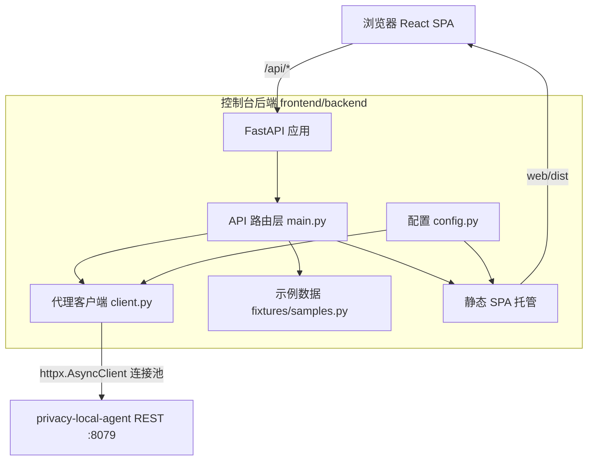
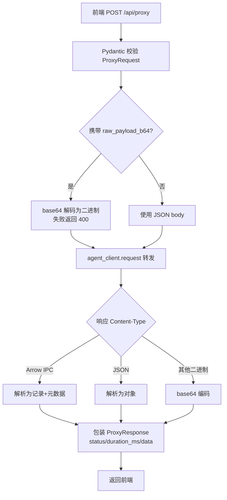

# 测试控制台后端（Python）设计文档

## 1. 概述

本文档定义 Privacy 测试控制台 Python 后端（`frontend/backend`）的技术架构、模块设计与实现细节。该后端基于 **FastAPI + httpx + Pydantic v2** 构建，是浏览器与 `privacy-local-agent` 之间的**代理层与静态资源服务器**。

它的核心定位是「**薄代理**」：不实现任何隐私算法，只负责三件事——

1. **静态托管**：把构建好的 React SPA（`web/dist`）挂载到根路径，浏览器直接通过本后端访问控制台；
2. **请求转发**：把前端的 `/api/proxy` / `/api/batch` 请求透明转发到 agent REST 服务；
3. **格式适配**：统一响应包装、解析二进制载荷（Arrow IPC）、转换错误格式。

## 2. 设计目标

- **轻量**：不引入隐私算法依赖，启动快、资源占用低。
- **透明转发**：请求体与响应体尽量原样传递，错误状态码与 `detail` 透传，保证前端看到的错误与直连 agent 一致。
- **统一契约**：所有代理响应包装为 `{status, duration_ms, data}`，前端只需一套解析逻辑。
- **二进制友好**：支持 base64 编码的二进制请求载荷与 Arrow IPC 响应的 JSON 化。
- **零配置可运行**：所有环境变量均有默认值，本地开发开箱即用。
- **输入安全**：所有请求/响应经 Pydantic v2 校验，作为输入安全的第一道防线。

## 3. 系统架构

后端代码位于 `frontend/backend/app/`，按职责拆分为四个模块，保持良好内聚与低耦合。

## 4. 核心模块设计

### 4.1 应用入口（`app/main.py`）

职责：

- 定义全部 Pydantic 请求/响应模型（`ProxyRequest` / `ProxyResponse` / `BatchRequest` / `BatchResponse` 等）；
- 注册四个 API 端点：`/api/health`、`/api/samples`、`/api/proxy`、`/api/batch`；
- 通过 `lifespan` 管理 `httpx.AsyncClient` 连接池的预热与释放；
- 注册 CORS 中间件（允许 Vite 开发服务器跨域）；
- 挂载静态 SPA（`/assets/*` + SPA 回退路由）；
- 统一异常处理器，把错误规范化为 `{"detail", "status"}`。

**生命周期管理**：`lifespan` 在应用启动时调用 `agent_client._get_client()` 预热连接池，避免首个请求懒初始化带来的额外延迟；应用退出时优雅关闭客户端，释放连接。

**静态 SPA 托管**：采用「`/assets` 静态目录 + 其余路径回退 `index.html`」的经典方案：

- `/assets/*` 直接返回带内容哈希的 JS/CSS 构建产物（强缓存友好）；
- 其余非 API 路径一律返回 `index.html`，由前端路由接管；
- 回退路由注册在最后，优先级最低，不会遮挡 `/api/*` 与 `/assets/*`；
- 目录不存在时（如仅后端开发场景）应用仍可提供 API，不报错。

### 4.2 代理客户端（`app/client.py`）

`PrivacyAgentClient` 是后端与 agent 通信的**唯一出口**，设计为应用级单例 `agent_client`：

- **连接池复用**：内部懒初始化一个 `httpx.AsyncClient`，复用 TCP 连接；
- **直连保证**：显式设置 `trust_env=False`，不读取系统代理配置，避免本地代理工具（如 Clash）导致「All connection attempts failed」；
- **认证支持**：配置了 `PRIVACY_AGENT_API_KEY` 时自动附加 `Authorization: Bearer` 头；
- **响应解析**：按 `Content-Type` 区分三类响应——
  - Arrow IPC 流 → 解析为「记录列表 + schema 元数据」，NaN 替换为 `None`；
  - JSON → 解析为 Python 对象；
  - 其他二进制 → base64 编码后返回；
- **异常转换**：网络层错误 → `502 Bad Gateway`；agent 非 2xx → 透传原状态码与 `detail`。

### 4.3 配置模块（`app/config.py`）

基于 `pydantic-settings` 从环境变量（可选 `.env` 文件）加载配置。所有项均有默认值，字段通过 `alias` 映射到环境变量名。详见 [api_reference.md](./api_reference.md) 的环境变量表。

`populate_by_name = True` 允许测试中直接用字段名构造 `Settings`，便于单元测试。

### 4.4 示例数据（`app/fixtures/samples.py`）

`EndpointSample` 描述单个可测试端点的元数据与示例载荷：请求方法 / 路径 / 展示标签 / 功能分类 / 描述 / 默认请求体 / 二进制载荷 / 后端可用性标识（`rest` / `both`）。

示例数据刻意保持**最小化与确定性**：只用于验证连通性、展示合法的请求形状，用户可在 UI 中编辑后再发送。`get_samples()` 返回全部示例，`find_sample()` 支持按「方法 + 路径」查找。

对于需要二进制输入的端点（如 `/v1/privacy/dp/arrow_ipc`），`_arrow_ipc_payload()` 会构造一个 5 行小表并编码为 base64，由前端经 `rawPayloadB64` 字段传递。

## 5. 请求转发流程

以 `POST /api/proxy` 为例：

批量端点 `POST /api/batch` 逐个**顺序**转发子请求，单个失败不中断批次，最终汇总 `total / passed / failed` 与逐条结果。

## 6. 错误处理设计

| 场景 | 处理方式 |
|---|---|
| 请求体校验失败 | Pydantic 自动返回 422 |
| base64 解码失败 | 返回 400，`detail` 说明原因 |
| agent 不可达 / 超时 | 返回 502，`detail` 为网络错误描述 |
| agent 返回非 2xx | 透传原状态码，`detail` 取自 agent 响应 |
| 批量子请求异常 | 吸收异常，记入该条结果，不中断批次 |
| `/api/health` 探测失败 | 仍返回 200，`agent == "unreachable"`，便于前端友好提示 |

统一异常处理器把 FastAPI 默认错误响应规范化为 `{"detail": ..., "status": ...}`，前端 `ResponsePanel` 依赖该结构解析并展示错误。

## 7. 非功能设计

- **性能**：连接池复用 + lifespan 预热，避免每请求重建连接；转发耗时 `duration_ms` 精确到 0.01ms 并返回前端用于性能展示。
- **安全**：Pydantic 校验所有输入；API Key 仅放在请求头，不落盘；生产环境应配合 agent 的 TLS / 认证使用。
- **可维护性**：模块按职责单一拆分；全部代码含详细中文注释；前后端数据契约与前端 `types/api.ts` 一一对应。

## 8. 测试策略

- 单元测试基于 `pytest` + `fastapi.testclient.TestClient`，通过 mock `agent_client.request` 覆盖全部端点，无需启动真实 agent。
- 冒烟测试 `smoke_test.py` 遍历所有示例端点，通过后端代理真实发送请求并统计结果。

详见 [testing.md](./testing.md)。
