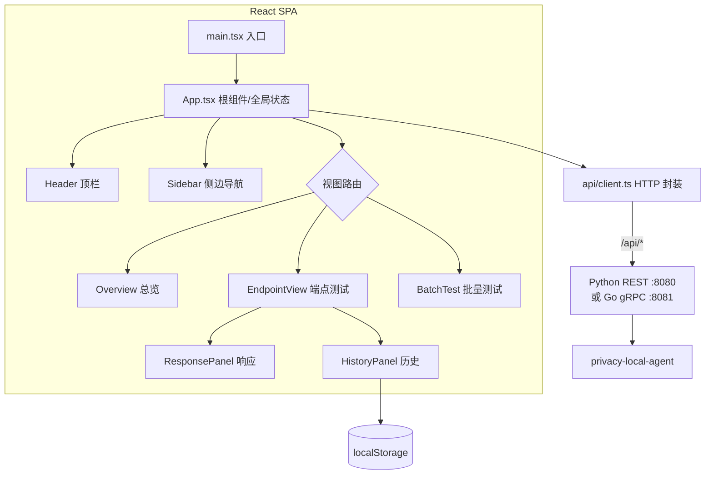

# 测试控制台前端（Web）设计文档

## 1. 概述

本文档定义 Privacy 测试控制台 Web 前端（`frontend/web`）的架构设计、组件划分与状态管理。前端基于 **React 18 + TypeScript + Vite + Tailwind CSS** 构建，是一个纯静态单页应用（SPA），所有数据通过后端 `/api/*` 接口获取。

核心定位：把 `privacy-local-agent` 的全部接口能力，组织为一个**结构清晰、可交互、可调试**的可视化控制台。

## 2. 设计目标

- **结构清晰**：三栏布局 + 分类分组，避免「所有功能挤在一页」的长列表。
- **双后端统一**：通过同一套 `/api/*` 契约对接 Python REST 与 Go gRPC 两个代理后端，可一键切换。
- **调试友好**：请求编辑、JSON 格式化、语法高亮、cURL 导出、请求历史一应俱全。
- **轻量零依赖**：图标内联 SVG、JSON 高亮手写实现，不引入第三方 UI 库。
- **类型安全**：TypeScript 全量类型化，数据契约与后端 Pydantic 模型一一对应。

## 3. 系统架构



## 4. 目录结构

```text
frontend/web/src/
├── main.tsx                 # 应用入口，挂载 React 根
├── App.tsx                  # 根组件：全局状态 + 三栏布局 + 视图路由
├── index.css                # Tailwind 入口与全局样式
├── api/
│   └── client.ts            # 后端 HTTP 调用封装（唯一 fetch 出口）
├── types/
│   └── api.ts               # 前后端数据契约（TS 类型定义）
├── lib/
│   ├── categories.ts        # 分类元数据（顺序/图标/配色/描述）
│   ├── curl.ts              # cURL 命令生成
│   └── history.ts           # 请求历史（localStorage 持久化）
└── components/
    ├── Header.tsx           # 顶栏：品牌 + 健康状态灯 + 后端切换
    ├── BackendSelector.tsx  # 后端切换下拉框
    ├── Sidebar.tsx          # 侧边导航树（搜索/分组/折叠）
    ├── Overview.tsx         # 总览页（分类卡片网格）
    ├── EndpointView.tsx     # 端点测试页（请求/响应分栏）
    ├── BatchTest.tsx        # 批量测试页
    ├── ResponsePanel.tsx    # 响应查看器（JSON 高亮/复制/下载）
    ├── HistoryPanel.tsx     # 请求历史面板
    └── icons.tsx            # 内联 SVG 图标库
```

## 5. 核心设计

### 5.1 全局状态与视图路由（`App.tsx`）

App 是唯一的**状态中心**，采用「状态提升」模式，子组件通过 props 接收数据与回调：

- `samples`：全部端点示例（来自 `/api/samples`）；
- `view`：当前主区域视图，用 **判别联合（Discriminated Union）** 表达：

```ts
type View =
  | { type: 'overview' }
  | { type: 'endpoint'; sample: EndpointSample }
  | { type: 'batch' };
```

- `health`：后端健康状态（用于状态灯与 cURL 基址推断）；
- `backend`：当前选中的后端（Python REST / Go gRPC）。

**数据流**：启动时 `Promise.all` 并行拉取 samples 与 health；切换后端时先 `setBaseUrl()` 更新 API 基址再重新拉取，并重置视图到总览。

**视图重建**：`EndpointView` 使用 `key={method-path}` 强制在切换端点时**重建组件**，避免上一个端点的请求体/响应状态残留。

### 5.2 HTTP 封装（`api/client.ts`）

所有 fetch 调用集中于此，上层组件不直接使用 fetch：

- `API_BASE` 为模块级可变基址，默认空串（同源）；`setBaseUrl()` 在切换后端时更新；
- `fetchHealth()` / `fetchSamples()` / `proxyRequest()` / `batchRequest()` 四个方法对应后端四个接口；
- 后端返回非 2xx 时抛出携带 `detail` 的 `Error`，由调用方展示。

### 5.3 数据契约（`types/api.ts`）

TypeScript 类型与后端 Pydantic 模型**一一对应**，是前后端的「单一事实来源」。包含：`EndpointSample`（camelCase，示例数据）、`ProxyRequest` / `ProxyResponse`（snake_case，代理转发）、`ConsoleHealth`、`BatchRequestItem` / `BatchResultItem` / `BatchResponse`、`HistoryEntry`。修改任何接口时需同步更新本文件与后端模型。

### 5.4 侧边导航（`Sidebar.tsx`）

- 按 `category` 分组，`orderCategories()` 按预定义顺序排列；
- 支持搜索（匹配 label / path / category），搜索时强制展开命中分组；
- 分组**默认折叠**，避免首页过长；选中项变化时自动展开所属分组；
- 顶部固定「接口总览」与「批量测试」两个快捷入口；
- 仅 Python 后端可用的端点显示 `REST` 角标。

### 5.5 端点测试（`EndpointView.tsx`）

上方接口信息栏（返回 / method / 可编辑路径 / 分类徽章 / 描述），下方左右分栏：

- **请求编辑器**：JSON 格式化校验、cURL 复制、请求历史、重载示例；`Cmd/Ctrl+Enter` 快捷发送（用 `useRef` 保持 handler 最新引用）；
- **响应查看器**（`ResponsePanel`）：空 / 错误 / 成功三态；成功时手写正则做 JSON 语法高亮，提供复制与下载。

### 5.6 批量测试（`BatchTest.tsx`）

选择分类（或全部）→ 调 `/api/batch` 顺序执行 → 汇总展示通过率与逐条结果（状态 / 接口 / 耗时 / 错误），点击结果行可跳转到对应端点。单个失败不中断批次。

### 5.7 请求历史（`lib/history.ts` + `HistoryPanel.tsx`）

持久化到 `localStorage`（键 `privacy-console.history`），仅存请求体与状态码（不存响应，避免存储过大），上限 50 条。支持回填、单条删除、一键清空与相对时间展示。

## 6. 样式与主题

- 使用 **Tailwind CSS** 原子类，无自定义 CSS 组件库；
- 分类配色（图标底色、卡片渐变色条）在 `categories.ts` 中以**字面量类名**声明，确保 Tailwind 能静态扫描生成；
- 图标为内联 SVG（lucide 风格，stroke 渲染），集中在 `icons.tsx`，通过 `IconName` 联合类型约束。

## 7. 非功能设计

- **性能**：`useMemo` 缓存分组/过滤结果；构建产物带内容哈希，配合后端 `/assets` 强缓存。
- **可访问性**：图标 `aria-hidden`，交互元素均有 `title` 提示。
- **可维护性**：组件单一职责；全部代码含详细中文注释；类型全量覆盖。
- **降级**：剪贴板不可用时静默忽略；localStorage 不可用（隐私模式）时历史功能降级。

## 8. 测试策略

前端以**构建期类型检查**（`tsc --noEmit`）为主要自动化手段，配合手工回归清单验证交互。详见 [testing.md](./testing.md)。
