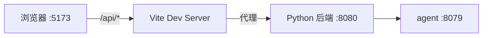

# 测试控制台前端（Web）运维文档

本文档说明控制台 Web 前端（`frontend/web`）的开发、构建、部署与常见问题处理。

## 1. 技术栈与依赖

| 项 | 版本 |
|---|---|
| React | ^18.2 |
| TypeScript | ^5.2 |
| Vite | ^5.2 |
| Tailwind CSS | ^3.4 |

运行时依赖仅 `react` / `react-dom`，其余均为开发依赖。无第三方 UI 组件库与图标库。

## 2. 本地开发

```bash
cd frontend/web
npm install
npm run dev
```

- 开发服务器默认 `http://127.0.0.1:5173`；
- Vite 已配置代理：`/api/*` 自动转发到 `http://127.0.0.1:8080`（Python 后端），因此开发前需先启动后端；
- 路径别名 `@` 指向 `src/`。



## 3. 构建

```bash
cd frontend/web
npm run build        # 等价于 tsc && vite build
```

- 先执行 `tsc` 做全量类型检查，任一类型错误都会中断构建；
- 产物输出到 `dist/`（`emptyOutDir: true` 会先清空）；
- JS/CSS 带内容哈希，配合后端 `/assets` 强缓存。

构建产物由后端挂载：

- **Python 后端**：`PRIVACY_CONSOLE_STATIC_DIR`（默认 `../web/dist`）；
- **Go 后端**：同样可直接挂载 `web/dist` 提供 UI。

## 4. 部署形态

前端是**纯静态资源**，无独立进程，部署即「把 `dist/` 交给后端挂载」：

1. **本地 / 单机**：构建后由 Python 或 Go 后端托管，浏览器访问 `http://127.0.0.1:8080`（或 `8081`）。
2. **生产同源**：控制台与后端同域部署，`api/client.ts` 的 `API_BASE` 默认为空串（同源），无需额外配置。
3. **独立静态托管**（可选）：把 `dist/` 放到 Nginx / CDN，并配置 `/api/*` 反向代理到后端；此时需保证 CORS 允许跨域。

## 5. 后端切换说明

页面顶部的后端切换器在两个代理后端间切换：

- `Python REST (8080)` — `http://127.0.0.1:8080`
- `Go gRPC (8081)` — `http://127.0.0.1:8081`

默认选中**与当前页面同源**的后端（页面由谁提供服务就默认调用谁）；Vite 开发模式等其他来源回退到 Python REST。切换后前端会更新 `API_BASE` 并重新拉取 samples 与 health。

## 6. 常见问题

| 现象 | 可能原因 | 处理 |
|---|---|---|
| `npm run build` 报类型错误 | 代码与契约不一致 | 按提示修复；重点检查 `types/api.ts` 与后端模型是否同步 |
| 开发页空白 / 404 | 后端未启动，`/api/samples` 代理失败 | 先启动 Python 后端（`cd frontend/backend && ./run.sh`） |
| 切换后端后报 CORS / 连接失败 | 目标后端未监听 | 确认 `8080` / `8081` 端口服务已启动 |
| 样式丢失 / 类名未生效 | Tailwind 未扫描到字面量类名 | 分类配色须以字面量写在 `categories.ts`，不可动态拼接 |
| 构建后页面仍为旧版 | 浏览器缓存了 `index.html` | `index.html` 不应强缓存；必要时强制刷新 |
| 请求历史不生效 | 浏览器隐私模式禁用 localStorage | 属预期降级，不影响请求功能 |

## 7. 代码质量

```bash
cd frontend/web
npx tsc --noEmit     # 类型检查（不产出文件）
npm run lint         # ESLint（react-hooks / react-refresh 规则）
```

提交前应保证 `tsc --noEmit` 与 `npm run build` 均通过。
