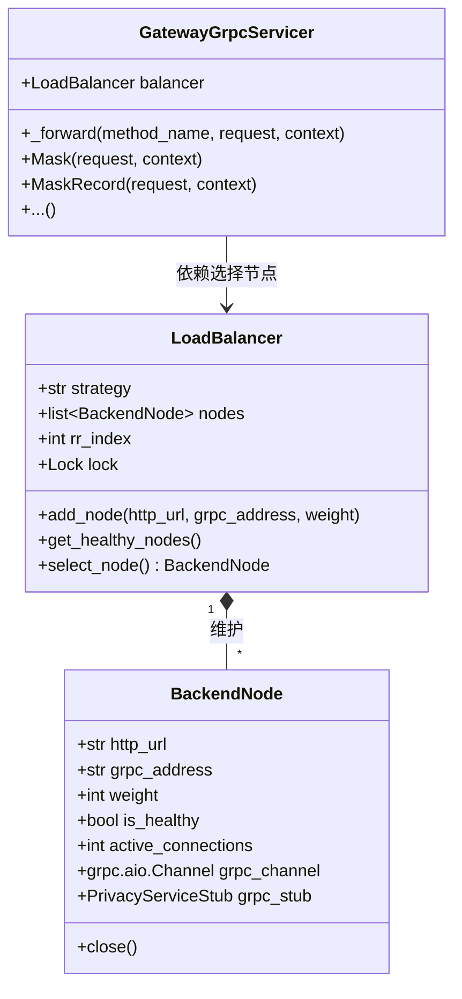

# 代理转发与负载均衡网关设计说明书 (System Design Document)

## 1. 系统架构与拓扑 (System Architecture)

系统由**统一网关 (Gateway/Load Balancer)** 和**后端工作节点池 (Backend Worker Pool)** 组成。网关同时暴露 REST HTTP 与 gRPC 监听端口，客户端请求首先到达网关，再由网关的分发引擎路由给健康的后端节点。

```mermaid
graph TD
    Client[客户端 (Client)] -- HTTP/gRPC --> Gateway[网关 (Gateway/Load Balancer)]
    
    subgraph Gateway [网关内部结构]
        HTTPProxy[HTTP 代理服务 (FastAPI)]
        gRPCProxy[gRPC 代理服务 (grpc.aio)]
        LB[负载均衡引擎 (LoadBalancer)]
        HC[健康检查器 (HealthChecker)]
        
        HTTPProxy --> LB
        gRPCProxy --> LB
        HC -->|定时检测更新健康状态| LB
    end
    
    LB -- HTTP 转发 --> Node1[Agent Node 1 (8079/50051)]
    LB -- gRPC 转发 --> Node2[Agent Node 2 (8080/50052)]
    LB -- HTTP/gRPC --> NodeN[Agent Node N (8081/50053)]
```

## 2. 核心模块与类设计 (Module & Class Design)

网关的所有代码被组织在新模块 `privacy_local_agent.gateway` 下，保持良好的内聚性与低耦合。



### 2.1 BackendNode (后端节点实体)
- **职责**：封装单个后端节点的连接信息，包含 HTTP 地址、gRPC 地址、权重、当前健康状态以及活跃连接数。
- **长连接管理**：持有 `grpc.aio.insecure_channel` 异步通道以及对应的 `PrivacyServiceStub` 客户端代理，避免为每次请求重新建连。

### 2.2 LoadBalancer (负载均衡引擎)
- **职责**：维护节点列表，实现轮询、随机、最小连接数等算法，提供线程/协程安全的节点选择方法。
- **协程安全**：由于网关工作在 async 环境下，`select_node` 使用 `asyncio.Lock` 保护轮询计数器 (`rr_index`)，防止多协程并发导致的状态冲突。

### 2.3 HTTP 代理模块 (http_proxy.py)
- **技术实现**：基于 FastAPI。
- ** catch-all 转发**：使用 FastAPI 路由路径通配符 `{path:path}` 匹配所有路径：
  ```python
  @app.api_route("/{path:path}", methods=["GET", "POST", "PUT", "DELETE", "OPTIONS", "HEAD", "PATCH"])
  async def proxy_http(path: str, request: Request):
      ...
  ```
- **请求转发流程**：
  1. 通过 `LoadBalancer.select_node()` 获取一个健康的后端节点。
  2. 提取原请求的 Method, Headers, Query Params 以及 Body。
  3. 复用应用级全局单例 `request.app.state.http_client` 发送异步请求至 `f"{node.http_url}/{path}"`。为了兼容测试环境 (如 TestClient 在各个测试用例中切换 Event Loop) 并保障高并发稳定性，网关在 `proxy_request` 路由中实现了**事件循环感知机制 (Event-Loop-Aware Caching)**：当检测到当前协程运行的 Event Loop 与缓存的 `http_client` 绑定 Loop 不一致时，会自动在后台优雅关闭旧客户端并重新为当前 Loop 构造并缓存 `httpx.AsyncClient` 实例，杜绝了 `Event loop is closed` 的运行时错误。
  4. 将返回的 Response 状态码、响应头与二进制内容原封不动包装为 `fastapi.Response` 返回给客户端。

### 2.4 gRPC 代理模块 (grpc_proxy.py)
- **技术实现**：基于 `grpc.aio` 异步框架。
- **接口契约**：实现由 protobuf 编译生成的 `privacy_pb2_grpc.PrivacyServiceServicer` 接口。
- **转发适配器**：
  - 实现通用私有方法 `_forward(method_name, request, context)`。
  - 通过 `getattr(node.grpc_stub, method_name)` 动态反射调用对应节点的 gRPC Stub 方法。
  - 支持异常捕获，若后端 gRPC 调用抛出 `grpc.RpcError`，则将其状态码与详细描述通过 `context.abort()` 回传给调用方。

## 3. 负载均衡算法实现细则

### 3.1 轮询 (Round-Robin)
- 轮询索引 `rr_index` 初始为 0。
- 每次获取节点时，取健康的节点列表 `healthy_nodes`。
- 返回 `healthy_nodes[rr_index % len(healthy_nodes)]`，并将 `rr_index` 自增 1。

### 3.2 随机选择 (Random)
- 直接使用 `random.choice(healthy_nodes)` 在所有健康节点中随机抽取一个。

### 3.3 最小连接数 (Least Connections)
- 节点被分发请求前，其 `active_connections` 加 1；请求处理完毕（无论成功或失败），其 `active_connections` 减 1。
- 调度时，遍历所有健康的节点，返回 `min(healthy_nodes, key=lambda node: node.active_connections)`。
- 对并发较高的长耗时计算任务，能有效避免部分节点过载。

## 4. 高可用与健康检查机制 (High Availability)

健康检查由一个后台协程（守护任务）执行：
- **触发频率**：默认每 5 秒执行一次检查。
- **检查内容**：
  - 发送 HTTP `GET` 请求至 `<http_url>/health`，预期状态码为 200，且 JSON 内容中 `status == "ok"`。
  - 发送 gRPC `Health` RPC 请求至 `<grpc_address>`，预期响应中 `status == "ok"`。
- **状态决策**：必须同时满足 HTTP 和 gRPC 检查通过，节点才会被标记为 `is_healthy = True`；否则标记为 `False`。
- **平滑切流**：被标记为不健康的节点将直接被 `get_healthy_nodes()` 排除，不再参与分发，直到下一次健康检查通过。

## 5. 错误处理与容错逻辑

1. **无可用节点 (No Backends Available)**：
   - 若当前可用节点池为空，HTTP 代理返回 `503 Service Unavailable`。
   - gRPC 代理通过 `context.abort(grpc.StatusCode.UNAVAILABLE, "No healthy backend nodes available")` 回应。
2. **连接超时与网络波动**：
   - 转发 HTTP 时设置合理的超时时间（如 `timeout=30.0`），捕获 `httpx.RequestError`。若发生网络异常，抛出 `502 Bad Gateway`。
   - 转发 gRPC 时，捕获 `grpc.RpcError` 并利用 gRPC 状态传递链将错误透传。

## 6. 分布式隐私预算记账设计 (Distributed Shared Budget Accountant Design)

为了避免多实例负载均衡部署时预算管理失效，`BudgetAccountant` 实现了双模式架构：
1. **内存模式 (Memory Mode)**：在未配置持久化数据库时运行，通过线程锁保护单例对象，适用于单进程极致吞吐场景。
2. **SQLite 持久化模式 (SQLite Persistence Mode)**：
   - 当环境变量 `PRIVACY_BUDGET_DB` 被配置为本地 SQLite 数据库文件路径时启用。
   - 网关或 Worker 初始化时自动创建并预插入包含预算上限与累计消费的表 `privacy_budgets`。
   - **原子性保障 (Atomicity)**：所有 `spend(epsilon, delta)` 写入操作均包裹在 `BEGIN IMMEDIATE` 独占事务中，确保 SQLite 数据库引擎独占锁定该表。读出累计消费、执行验证、递增更新、提交事务一体化完成。当扣减失败（超扣）时，触发事务自动回滚（ROLLBACK），实现多节点实例并发下的强一致性。

