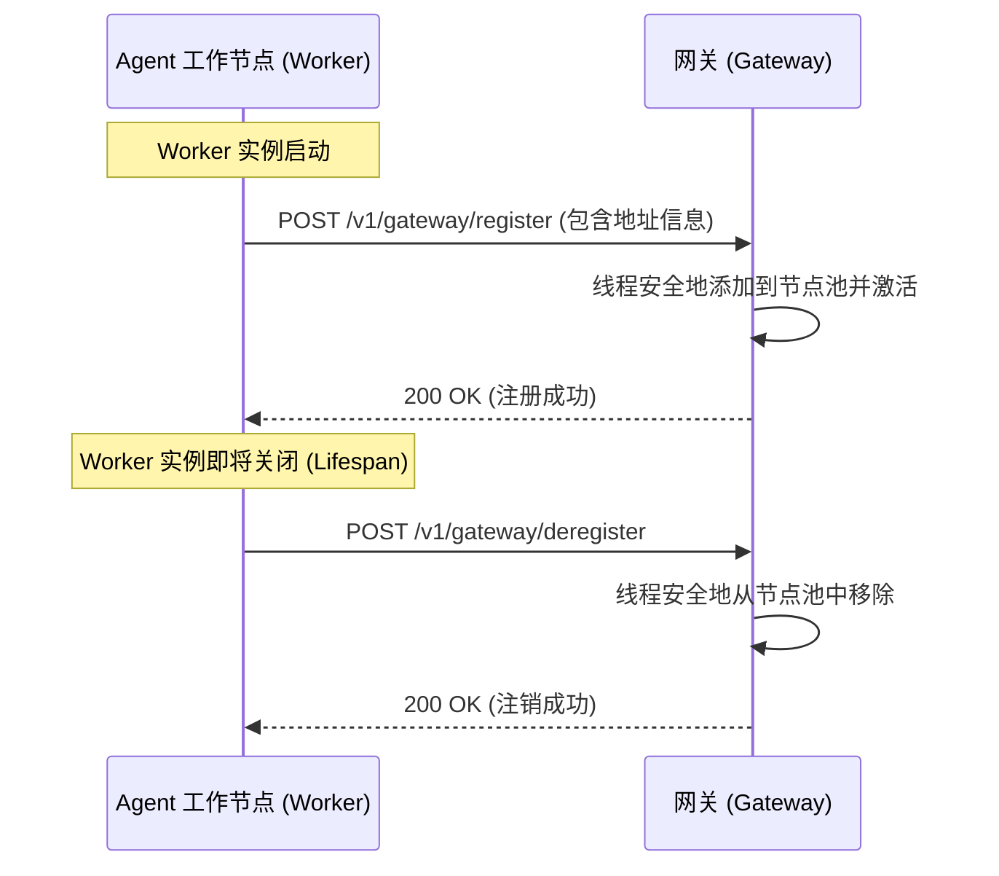
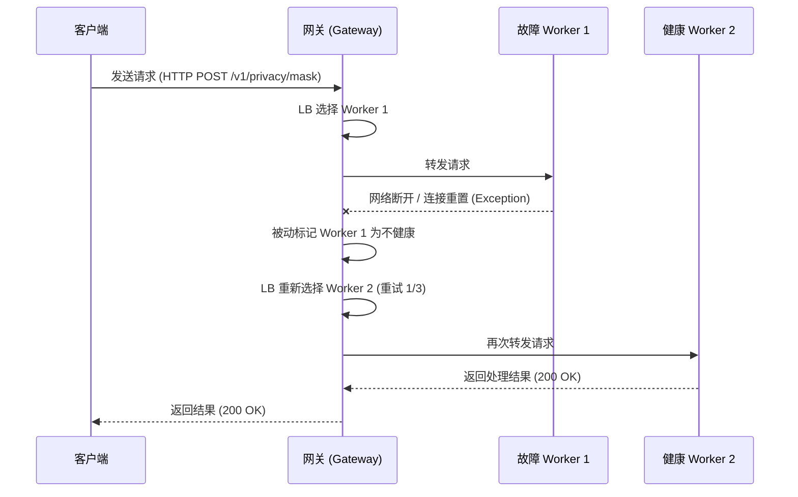

# 代理网关与负载均衡优化设计方案 (Optimizations & Enhancements)

为进一步提升系统的工程设计水平，使其在面对大规模并发与动态环境时更加稳健，我们提出以下两项核心优化方案：**自适应重试与被动健康检测** 和 **动态节点自注册 API**。

---

## 优化方案一：自适应重试与被动健康检测 (Adaptive Retries & Passive Health Checking)

### 1. 当前设计痛点
在现有设计中，网关在转发请求时若遇到网络连接重置、连接拒绝或超时（如后端进程异常退出或网络瞬时波动）：
1. 会直接将 `502 Bad Gateway` (HTTP) 或 `UNAVAILABLE` (gRPC) 返回给客户端。
2. 只有等到下一次的主动健康检查（默认 5 秒后）才会感知节点离线。
这在生产高吞吐场景下会导致部分请求失败，不符合高可用标准。

### 2. 优化设计
引入**被动健康检测与自适应重试**机制：
- **故障即刻感知（被动检测）**：如果在请求转发期间发生连接类异常（HTTP 抛出 `httpx.RequestError`，gRPC 抛出 `grpc.StatusCode.UNAVAILABLE`），网关立刻将该节点的 `is_healthy` 属性置为 `False`，实现毫秒级响应。
- **自动故障转移重试 (Failover Retry)**：
  - 网关捕获上述网络异常后，不直接向客户端报错，而是再次调用 `LoadBalancer.select_node()` 获取另一个健康的后端节点，重新发送请求。
  - 支持配置最大重试次数（默认为 3 次）。
  - 若尝试了所有节点均失败，才向客户端返回不可用错误。

---

## 优化方案二：动态节点自注册 API (Dynamic Node Self-Registration)

### 1. 当前设计痛点
目前后端工作节点的列表必须静态配置在网关的 YAML 配置文件或 `GATEWAY_BACKENDS` 环境变量中。
在云原生或动态扩缩容场景下，每次增加/减少 Agent 实例都需要修改网关配置并重启网关进程，运维成本高，且存在短暂的停机风险。

### 2. 优化设计
在网关上建立**动态注册表接口**，支持节点自注册：
- **REST 接口定义**：
  - `POST /v1/gateway/register`：节点启动时调用，向网关注册自己。
    - 请求体：`{"http_url": "http://127.0.0.1:8080", "grpc_address": "127.0.0.1:50052", "weight": 1}`
  - `POST /v1/gateway/deregister`：节点正常退出（如 lifespan shutdown）时调用，向网关注销自己。
    - 请求体：`{"http_url": "http://127.0.0.1:8080", "grpc_address": "127.0.0.1:50052"}`
- **线程安全更新**：
  - 负载均衡器的 `add_node` 和注销逻辑通过锁（`asyncio.Lock`）保护，保障动态伸缩时的并发安全。
- **防止重复注册**：
  - 注册时若发现相同地址的节点已存在，则重置其健康状态（`is_healthy = True`）和活跃连接计数，避免重复添加导致地址池膨胀。

---

## 接口设计与交互序列 (Sequence Diagram)

### 动态自注册与注销流程

### 自适应重试流程 (以 HTTP 转发为例)

---

## 优化方案三：连接池复用与 Keep-Alive 调优 (Connection Pool Reuse & Keep-Alive Tuning)

### 1. 当前设计痛点
在网关的 HTTP 代理层，原有设计在处理每次转发请求时，都会使用 `async with httpx.AsyncClient() as client` 上下文管理器临时创建一个 HTTP 客户端。这会在高并发场景下导致频繁的 TCP 三次握手和 TLS 握手开销，浪费系统套接字文件描述符，在高吞吐下甚至会导致 `OSError: Cannot assign requested address`（源端口耗尽）。

### 2. 优化设计
引入 **应用级单例连接池复用**：
- **生命周期绑定**：在网关 FastAPI 应用初始化时，通过 `lifespan` 挂钩创建全局唯一的 `httpx.AsyncClient`，并将其挂载在 `app.state.http_client` 上。在网关退出时优雅地调用 `aclose()` 关闭连接池。
- **连接池参数调优**：
  - `max_connections=500`：设置最大并发连接数为 500。
  - `max_keepalive_connections=100`：保持常开的 Keep-Alive 空闲连接上限为 100，避免连接快速断开重连。
  - 转发时直接使用 `request.app.state.http_client` 提交请求。

---

## 优化方案四：基于 SQLite 的分布式共享隐私预算记账 (Distributed Shared Budget Accountant via SQLite)

### 1. 当前设计痛点
在单实例部署时，`BudgetAccountant` 采用线程安全的内存单例记录各命名空间的隐私预算（`epsilon`/`delta`）。
但在负载均衡集群模式下，多个 `privacy-local-agent` 实例分别拥有独立的内存空间。客户端的高频请求被分发到不同实例时，实例之间的预算状态是完全隔离的。这会导致总体消耗的隐私预算超过上限（例如：三个实例均认为自己只消耗了 4.0 epsilon，但系统总和已经消耗了 12.0 epsilon，突破了差分隐私的数学安全边界）。

### 2. 优化设计
设计 **基于 SQLite 的分布式持久化预算账本**：
- **零依赖与进程安全文件锁**：使用 Python 内置的 `sqlite3` 数据库。内置的文件锁（Database Lock）支持在多实例、多容器挂载同一共享目录卷时，保障多进程原子并发操作预算（通过事务排他锁实现）。
- **向下兼容性**：
  - 默认情况下（未配置本地数据库路径），`BudgetAccountant` 依然在内存中运行，保证单机极速执行。
  - 当通过环境变量 `PRIVACY_BUDGET_DB`（例如 `privacy_budget.db`）指定数据库路径时，自动切换为 SQLite 持久化模式。
- **原子扣减事务**：
  - 在 `spend(epsilon, delta)` 操作中，开启 `BEGIN IMMEDIATE` 独占性事务。
  - 读取当前 `spent` 消耗值并验证，若超出 `total` 限制则立即抛出 `PrivacyBudgetExhausted` 并回滚事务。
  - 验证通过则就地 `UPDATE` 写入，并 `COMMIT` 提交，完美防范并发条件下的超扣（Race Condition）。

