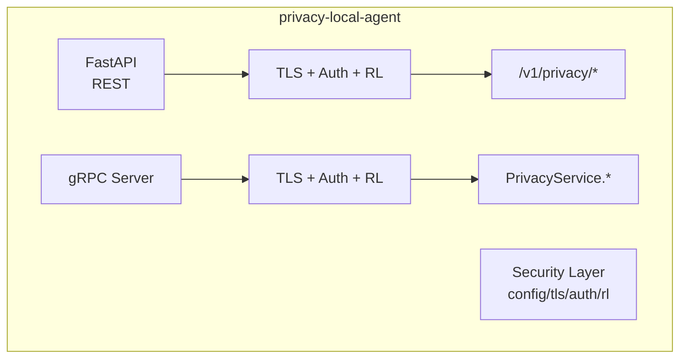

# 生产安全加固设计文档

> Scope: P0 — TLS/mTLS、认证鉴权、速率限制。

## 1. 概述

本文档定义 `privacy-local-agent` 生产安全模块的技术架构、设计原理与实现细节。该模块为 REST 与 gRPC 双协议提供可选的传输安全、身份认证、权限鉴权与速率限制能力。

## 2. 设计目标

- 为 REST/gRPC 提供可选的服务器端 TLS，gRPC 额外支持可选的 mTLS。
- 区分内部服务与外部服务两类身份，按最小权限原则控制接口访问。
- 基于调用者身份与接口路径/方法进行速率限制。
- 所有安全能力默认关闭，通过环境变量显式开启。

## 3. 威胁模型与缓解措施

| 威胁 | 缓解措施 |
|---|---|
| 链路上窃听隐私请求/响应 | REST/gRPC 服务端 TLS 加密 |
| 中间人篡改请求 | TLS + 客户端校验服务器证书；mTLS 同时校验客户端证书 |
| 未授权调用消耗隐私预算 | API Key / mTLS 认证 + 接口级 scope 鉴权 |
| 凭证泄露后横向越权 | 外部服务使用最小 scope；内部服务使用独立内部 Key |
| 暴力调用导致资源/预算耗尽 | 基于身份的速率限制 |
| K8s 探针因认证失败被误判 | `/health` 与 `Health` 默认匿名、不限速 |

## 4. 总体架构



安全层对 REST 与 gRPC 共享同一套配置与身份模型：

- `SecuritySettings`：统一从环境变量加载。
- `Identity`：调用者身份（internal/external + name + scopes）。
- `tls.py`：为 Uvicorn 与 gRPC server 构造 TLS 参数。
- `auth.py`：FastAPI dependency + gRPC interceptor。
- `ratelimit.py`：FastAPI dependency + gRPC interceptor。

## 5. 模块设计

### 5.1 `security/config.py`

使用 Pydantic v2 `BaseModel` 解析环境变量。

核心字段：

```python
class SecuritySettings(BaseModel):
    tls_enabled: bool = False
    tls_cert_file: Path | None = None
    tls_key_file: Path | None = None
    tls_ca_file: Path | None = None
    tls_client_auth: Literal["none", "optional", "require"] = "none"
    tls_key_password: str | None = None

    auth_enabled: bool = False
    auth_internal_mtls_enabled: bool = True
    internal_keys: dict[str, KeyConfig] = Field(default_factory=dict)
    external_keys: dict[str, KeyConfig] = Field(default_factory=dict)

    rate_limit_enabled: bool = False
    rate_limit_default_rps: float = 10.0
    rate_limit_default_burst: float = 20.0
    rate_limit_per_endpoint: dict[str, RateLimitConfig] = Field(default_factory=dict)
    rate_limit_redis_url: str | None = None

    health_no_auth: bool = True
    health_no_rate_limit: bool = True
```

API Key 通过 JSON 环境变量注入：

```bash
PRIVACY_AUTH_INTERNAL_KEYS_JSON='{"sk-internal-1":{"name":"secretpad","scopes":["*"]}}'
PRIVACY_AUTH_EXTERNAL_KEYS_JSON='{"sk-external-1":{"name":"portal","scopes":["privacy:mask","classification:read"]}}'
```

### 5.2 `security/tls.py`

#### REST

为 `uvicorn.run()` 生成 SSL 参数字典：

```python
def uvicorn_ssl_kwargs(settings: SecuritySettings) -> dict:
    return {
        "ssl_keyfile": str(settings.tls_key_file),
        "ssl_certfile": str(settings.tls_cert_file),
        "ssl_keyfile_password": settings.tls_key_password,
        "ssl_cert_reqs": _map_client_auth(settings.tls_client_auth),
        "ssl_ca_certs": str(settings.tls_ca_file) if settings.tls_ca_file else None,
    }
```

`ssl_cert_reqs` 映射：

| `tls_client_auth` | `ssl.CERT_*` |
|---|---|
| none | `ssl.CERT_NONE` |
| optional | `ssl.CERT_OPTIONAL` |
| require | `ssl.CERT_REQUIRED` |

#### gRPC

```python
def grpc_server_credentials(settings: SecuritySettings) -> grpc.ServerCredentials:
    private_key = settings.tls_key_file.read_bytes()
    certificate_chain = settings.tls_cert_file.read_bytes()
    if settings.tls_client_auth == "require":
        root_certificates = settings.tls_ca_file.read_bytes()
        return grpc.ssl_server_credentials(
            ((private_key, certificate_chain),),
            root_certificates=root_certificates,
            require_client_auth=True,
        )
    return grpc.ssl_server_credentials(((private_key, certificate_chain),))
```

### 5.3 `security/identity.py`

```python
@dataclass(frozen=True)
class Identity:
    service_type: Literal["internal", "external"]
    name: str
    scopes: list[str]

    def has_permission(self, permission: str) -> bool:
        return "*" in self.scopes or permission in self.scopes
```

接口权限映射：

| REST 路径 | 权限 |
|---|---|
| `/v1/privacy/mask` | `privacy:mask` |
| `/v1/privacy/mask_record` | `privacy:mask` |
| `/v1/privacy/hash` | `privacy:hash` |
| `/v1/privacy/dp/count` | `privacy:dp` |
| `/v1/privacy/dp/sum` | `privacy:dp` |
| `/v1/privacy/dp/mean` | `privacy:dp` |
| `/v1/privacy/k_anonymize/record` | `privacy:kano` |
| `/v1/privacy/qol/obfuscate` | `privacy:qol` |
| `/v1/privacy/budget` | `privacy:budget` |
| `/v1/privacy/classify/*` | `classification:read` |

| gRPC 方法 | 权限 |
|---|---|
| `Mask` / `MaskRecord` | `privacy:mask` |
| `Hash` | `privacy:hash` |
| `DPCount` / `DPSum` / `DPMean` | `privacy:dp` |
| `KAnonymizeRecord` | `privacy:kano` |
| `ObfuscateQuery` | `privacy:qol` |
| `ClassifyField` / `ClassifyRecord` / `ClassifyTable` | `classification:read` |

### 5.4 `security/auth.py`

#### API Key 认证

从 `Authorization: Bearer <token>` 或 gRPC metadata `authorization` 中提取 token，在 `internal_keys` 与 `external_keys` 中查找。

#### mTLS 认证（gRPC）

```python
auth_context = context.auth_context()
cn = auth_context.get("x509_common_name", [b""])[0].decode()
```

若 CN 匹配配置的 `internal_cn_allowlist`，返回 internal identity。

#### FastAPI Dependency

```python
async def get_current_identity(request: Request) -> Identity:
    if not settings.auth_enabled:
        return Identity("internal", "anonymous", ["*"])
    if is_health_path(request.url.path) and settings.health_no_auth:
        return Identity("internal", "health-probe", ["*"])
    token = extract_bearer_token(request.headers.get("authorization"))
    identity = api_key_auth.authenticate(token)
    if identity is None:
        raise HTTPException(status_code=401, detail="Unauthorized")
    return identity
```

#### 权限依赖

```python
def require_permission(permission: str):
    async def checker(identity: Identity = Depends(get_current_identity)):
        if not identity.has_permission(permission):
            raise HTTPException(status_code=403, detail="Forbidden")
    return Depends(checker)
```

#### gRPC Auth Interceptor

Unary interceptor：在 `intercept_service` 中读取 metadata/auth_context，构造 identity 并校验权限；未通过则提前返回错误。

### 5.5 `security/ratelimit.py`

依赖 `limits` 库：

```python
from limits import storage, strategies

storage = storage.MemoryStorage() if not redis_url else storage.RedisStorage(redis_url)
limiter = strategies.MovingWindowRateLimiter(storage)
```

- 限流键：`f"{identity.name}:{method_or_path}"`
- 默认规则：`default_rps` requests/second，burst = `default_burst`
- 每接口覆盖：`PRIVACY_RATE_LIMIT_PER_ENDPOINT_JSON`

REST 超速：`HTTP 429 Too Many Requests`
gRPC 超速：`grpc.StatusCode.RESOURCE_EXHAUSTED`

## 6. REST 与 gRPC 集成

### REST (`main.py`)

```python
from fastapi import Depends
from .security.auth import get_current_identity, require_permission
from .security.ratelimit import rate_limit_dependency

@app.get("/health")
def health(): ...

app.include_router(
    classification_router,
    dependencies=[Depends(get_current_identity), Depends(rate_limit_dependency)],
)

@app.post("/v1/privacy/mask", dependencies=[require_permission("privacy:mask")])
def mask(req: MaskRequest): ...
```

### gRPC (`grpc_server.py`)

```python
from .security.auth import AuthInterceptor
from .security.ratelimit import RateLimitInterceptor
from .security.tls import grpc_server_credentials

interceptors = []
if settings.auth_enabled:
    interceptors.append(AuthInterceptor(settings))
if settings.rate_limit_enabled:
    interceptors.append(RateLimitInterceptor(settings))

server = grpc.server(
    futures.ThreadPoolExecutor(max_workers=max_workers),
    interceptors=tuple(interceptors),
)

if settings.tls_enabled:
    server.add_secure_port(f"[::]:{port}", grpc_server_credentials(settings))
else:
    server.add_insecure_port(f"[::]:{port}")
```

### 统一启动器 (`server.py`)

```python
from .security.config import settings
from .security.tls import uvicorn_ssl_kwargs

ssl_kwargs = uvicorn_ssl_kwargs(settings) if settings.tls_enabled else {}
uvicorn.run(app, host=REST_HOST, port=REST_PORT, log_level="info", **ssl_kwargs)
```

## 7. 部署约定

### 7.1 证书管理

- 服务器证书与私钥挂载到 `/certs/server.crt`、`/certs/server.key`。
- CA 证书挂载到 `/certs/ca.crt`（mTLS 模式必需）。
- 私钥口令通过环境变量注入，生产建议通过 K8s Secret 管理。

### 7.2 K8s 探针

```yaml
livenessProbe:
  httpGet:
    path: /health
    port: 8079
    scheme: HTTP
readinessProbe:
  httpGet:
    path: /health
    port: 8079
```

保持 `PRIVACY_HEALTH_NO_AUTH=true` 与 `PRIVACY_HEALTH_NO_RATE_LIMIT=true`。

### 7.3 多副本限速

单副本使用内存计数器；多副本时配置 `PRIVACY_RATE_LIMIT_REDIS_URL`。

## 8. 错误码

| 场景 | REST | gRPC |
|---|---|---|
| 未认证 | 401 Unauthorized | `UNAUTHENTICATED` |
| 越权 | 403 Forbidden | `PERMISSION_DENIED` |
| 超速 | 429 Too Many Requests | `RESOURCE_EXHAUSTED` |
| TLS 握手失败 | SSL/TLS 连接断开 | `UNAVAILABLE` |

## 9. 测试策略

- 使用 `cryptography` 动态生成 CA/服务器/客户端证书链。
- REST TLS 测试：使用 `httpx` 访问 HTTPS 端口，验证信任/不信任 CA。
- gRPC TLS/mTLS 测试：使用 `grpc.ssl_channel_credentials` + metadata。
- 认证测试：FastAPI `TestClient` 设置 headers；gRPC metadata。
- 限速测试：短时间连续调用直到触发限流。

## 10. 工业化评分 / Industrialization Scorecard

> **工业化软件 = 功能正确 + 性能稳定 + 安全可靠 + 可维护 + 可观测 + 可快速迭代**
>
> 评估框架参考 ISO/IEC 25010 与 Google SRE 实践，采用 6 维度加权评分（1–10 分）。

### 10.1 加权评分表

| 维度 | 权重 | 得分 | 说明 |
|------|------|------|------|
| 功能完整性 | 20% | 9/10 | TLS/mTLS、API Key + mTLS 认证、scope 鉴权、移动窗口限速；REST/gRPC 双协议；Redis 可选 |
| 性能 | 15% | 8/10 | 内存存储零网络开销；MovingWindow 策略；Redis 可选扩展多副本 |
| 可靠性 | 20% | 8/10 | 所有安全能力默认关闭，显式开启；健康探针豁免；优雅降级 |
| 安全性 | 15% | 9/10 | 威胁模型完整；最小权限原则；凭证不硬编码；K8s Secret 注入 |
| 可维护性 | 15% | 8/10 | `from __future__` 全覆盖；Pydantic v2 配置；模块拆分清晰（5 个文件） |
| 工程化 | 15% | 6/10 | `privacy_auth_denials_total` Counter 存在；但 auth/ratelimit 缺少结构化日志与延迟指标 |
| **总分** | **100%** | **8.10** | |

### 10.2 结论

**通过（Pass）**——满足工业化要求，可进入主线。

### 10.3 亮点

- 威胁模型与缓解措施表完整，覆盖 6 类威胁。
- 安全能力全默认关闭，不影响开发与测试。
- 接口级 scope 权限映射清晰（REST 路径 + gRPC 方法）。
- 健康探针豁免设计避免 K8s 误判。

### 10.4 改进建议

| 优先级 | 建议 | 影响维度 |
|--------|------|----------|
| P1 | 为 auth.py/ratelimit.py 添加 `get_logger(__name__)` + `extra={}` 结构化日志 | 工程化 +1.5 |
| P1 | 添加 `privacy_auth_latency_seconds` Histogram | 工程化 +0.5 |
| P2 | 添加 API Key 轮换机制文档 | 安全性 +0.5 |
| P3 | 补充审计日志（谁在什么时间访问了什么接口） | 安全性 +0.5 |
