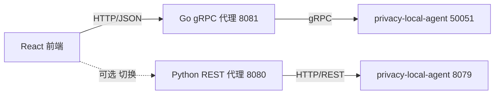

# Go gRPC 代理后端 — 运维文档

> 面向本地开发与部署运维的操作手册：开发模式与生产模式的区别、配置方式、跨域（CORS）解决方案、启停与排障。
>
> 关联文档：[design.md](design.md)（架构设计）、[api.md](api.md)（接口参考）、[test.md](test.md)（测试策略）。
> Python REST 后端的对应运维文档见 [backend/docs/ops.md](../../backend/docs/ops.md)。

---

## 1. 定位与端口总览

本后端（`frontend/backend-go`）是测试控制台的 **Go gRPC 代理**，基于 Gin + grpc-go，把前端的 REST 请求**转换为 gRPC 调用**转发给 `privacy_local_agent`，并可选地托管前端构建产物（SPA）。它与 Python 后端对前端暴露**一致的 JSON 契约**，二者可通过页面顶部 Backend Selector 自由切换。

控制台涉及的进程与默认端口：

| 进程 | 默认地址 | 协议 | 说明 |
|---|---|---|---|
| `privacy_local_agent` | `127.0.0.1:8079` | REST | 隐私能力服务（供 Python 后端使用） |
| `privacy_local_agent` | `127.0.0.1:50051` | gRPC | 隐私能力服务（上游，本后端调用） |
| Python REST 代理后端 | `127.0.0.1:8080` | HTTP | 另一可选后端，转发 REST + 托管 UI |
| **Go gRPC 代理后端** | `127.0.0.1:8081` | HTTP | 本文档主角，转发 gRPC + 托管 UI |
| Vite 开发服务器 | `localhost:5173` | HTTP | 仅前端开发模式使用 |

整体链路：



---

## 2. 开发模式 vs 生产模式

两种模式的核心区别在于 **前端从哪里被加载** 以及 **请求是否跨域**。

### 2.1 对比总览

| 维度 | 开发模式 | 生产模式 |
|---|---|---|
| 前端加载来源 | Vite 开发服务器 `localhost:5173`（热更新） | 后端托管的 `web/dist` 静态文件 |
| 前端构建 | 不需要构建，源码直跑 | 需先 `pnpm build` 产出 `web/dist` |
| API 请求走向 | 跨域直连后端绝对地址（5173 → 8081） | 与后端同源（8081 → 8081） |
| 是否触发 CORS | **是**（端口不同，依赖后端 CORS 中间件） | **否**（同源，天然无跨域） |
| 后端运行方式 | `go run ./cmd/server`（改代码手动重启） | 预编译二进制 `./bin/backend-go`，稳定运行 |
| 适用场景 | 前端/后端联调、快速迭代 | 一键体验、演示、部署 |

### 2.2 开发模式

前端与后端分别独立运行，前端由 Vite 提供热更新，请求跨域打到后端。

**启动步骤：**

```bash
# 1. 启动上游 agent（REST 8079 + gRPC 50051）
python -m privacy_local_agent.server

# 2. 启动 Go 代理后端（8081）
cd frontend/backend-go
go run ./cmd/server

# 3. 启动 Vite 前端开发服务器（5173，热更新）
cd frontend/web
corepack pnpm install   # 首次
corepack pnpm dev       # 打开 http://localhost:5173
```

此模式下页面来源是 `http://localhost:5173`，而前端 BackendSelector 会把 API 基址设为后端的**绝对地址**（切到 Go 后端即 `http://127.0.0.1:8081`），因此所有 `/api/*` 请求都是**跨域**的，必须依赖后端的 CORS 中间件（见第 4 节）。

> Go 后端没有热重载，修改代码后需手动重新 `go run`。如需边改边跑，可配合 `air` 等工具。

### 2.3 生产模式

前端先构建为静态产物，由后端同源托管，浏览器从后端（8081）同时拿到页面与 API，**无跨域**。

**启动步骤（推荐一键脚本）：**

```bash
# 一键启动 agent + Go 后端（自动补依赖、构建前端、预编译 Go 二进制）
./frontend/start-go.sh

# 访问 http://127.0.0.1:8081 即可打开控制台
# 按 Ctrl+C 停止所有服务；或在另一终端执行 ./frontend/stop-go.sh
```

**手动方式：**

```bash
# 1. 构建前端产物到 frontend/web/dist
cd frontend/web
corepack pnpm install
corepack pnpm build

# 2. 启动 agent
python -m privacy_local_agent.server

# 3. 预编译并启动 Go 后端
cd frontend/backend-go
go build -o bin/backend-go ./cmd/server
./bin/backend-go
```

后端启动时若检测到 `../web/dist` 存在（由 `PRIVACY_CONSOLE_STATIC_DIR` 控制），会自动挂载 `/assets` 静态资源并注册 SPA 回退路由（非 `/api` 路由一律返回 `index.html`）；若目录不存在则打印日志并退化为「API 模式」，仅提供 `/api/*`。

### 2.4 双后端模式（可选）

如需在页面顶部 Backend Selector 中自由切换 Python REST / Go gRPC 两个后端：

```bash
./frontend/start-all.sh    # 同时启动 agent + Python(8080) + Go(8081)
./frontend/stop-all.sh     # 停止
```

打开 `http://127.0.0.1:8080` 或 `http://127.0.0.1:8081` 均可，切换后端时请求会跨域到另一端口，同样依赖 CORS 中间件。

---

## 3. 配置参考

所有配置通过环境变量加载，均有本地开发默认值，零配置即可运行。定义见 [internal/config/config.go](../internal/config/config.go)。

| 环境变量 | 默认值 | 说明 |
|---|---|---|
| `PRIVACY_AGENT_GRPC_HOST` | `127.0.0.1` | 上游 agent gRPC 主机 |
| `PRIVACY_AGENT_GRPC_PORT` | `50051` | 上游 agent gRPC 端口 |
| `PRIVACY_AGENT_API_KEY` | （空） | 可选 Bearer Token；agent 开启认证时必填，自动附加到 gRPC 元数据 |
| `PRIVACY_CONSOLE_HOST` | `127.0.0.1` | 本后端 HTTP 监听地址 |
| `PRIVACY_CONSOLE_PORT` | `8081` | 本后端 HTTP 监听端口 |
| `PRIVACY_CONSOLE_STATIC_DIR` | `../web/dist` | 前端构建产物目录；**显式设为空**则禁用 SPA 托管（纯 API 模式） |

> 注意 `PRIVACY_CONSOLE_STATIC_DIR` 使用 `os.LookupEnv` 区分「未设置」与「设为空」：不设置 → 用默认值 `../web/dist`；显式设为空字符串 → 禁用静态托管。

**配置示例：**

```bash
# 指向远程 agent 的 gRPC 端口并启用认证
PRIVACY_AGENT_GRPC_HOST=10.0.0.5 \
PRIVACY_AGENT_GRPC_PORT=50051 \
PRIVACY_AGENT_API_KEY=your-key \
./bin/backend-go
```

```bash
# 禁用 UI 托管，仅作为纯 gRPC→REST 代理
PRIVACY_CONSOLE_STATIC_DIR= ./bin/backend-go
```

---

## 4. 跨域（CORS）解决方案

### 4.1 为什么会出现跨域

浏览器同源策略要求「协议 + 域名 + 端口」三者一致，否则为跨域。本控制台在以下三种场景触发跨域：

1. **开发模式**：页面在 `localhost:5173`（Vite），API 在 `127.0.0.1:8081`，端口不同；
2. **双后端切换**：页面由 8081 提供，但用户切到 Python 后端 `127.0.0.1:8080`（反向亦然）；
3. **分离部署**：UI 与后端部署在不同域名/端口（如 nginx 单独托管 dist）。

### 4.2 方案一：同源部署（生产推荐）

生产模式下前端 `dist` 由后端直接托管，页面与 API 同源（都是 `127.0.0.1:8081`），**从根本上不产生跨域**，无需任何 CORS 配置。这是最简单、最安全的方式。

### 4.3 方案二：后端 CORS 中间件（开发默认）

后端内置宽松 CORS 中间件（[internal/handlers/handlers.go](../internal/handlers/handlers.go) 的 `corsMiddleware`），允许任意来源跨域，专为本地开发设计：

```go
func corsMiddleware() gin.HandlerFunc {
    return func(c *gin.Context) {
        c.Writer.Header().Set("Access-Control-Allow-Origin", "*")
        c.Writer.Header().Set("Access-Control-Allow-Methods", "GET, POST, OPTIONS")
        c.Writer.Header().Set("Access-Control-Allow-Headers", "Content-Type, Authorization")
        // OPTIONS 预检请求直接返回 204，不进入后续 handler
        if c.Request.Method == "OPTIONS" {
            c.AbortWithStatus(http.StatusNoContent)
            return
        }
        c.Next()
    }
}
```

浏览器发起的 `OPTIONS` 预检请求由该中间件拦截并返回 `204`，前端无需任何额外处理。

> 安全提示：`Access-Control-Allow-Origin: *` 仅适用于本地可信环境。若将后端暴露到不可信网络，应收紧为具体来源，或改用方案一/方案四。

### 4.4 方案三：Vite 开发代理（同源回退）

`vite.config.ts` 配置了 `/api` 代理（默认指向 Python 后端 8080）。若想在 Vite 开发模式下同源访问 Go 后端，可把代理目标改为 8081：

```ts
// frontend/web/vite.config.ts
server: {
  port: 5173,
  proxy: {
    '/api': { target: 'http://127.0.0.1:8081', changeOrigin: true },
  },
}
```

当 API 基址为空（同源）时，请求 `http://localhost:5173/api/*` 会被 Vite 透明转发到后端，不触发 CORS。此方案适合只想对接单一后端的纯前端开发。

### 4.5 方案四：反向代理（分离部署）

若 UI 与后端必须分域名部署，可用 nginx 等反向代理把 `/api` 转发到后端，对浏览器保持同源：

```nginx
server {
    listen 80;
    server_name console.example.com;

    # 静态托管前端产物
    location / {
        root /var/www/privacy-console/dist;
        try_files $uri $uri/ /index.html;   # SPA 路由回退
    }

    # API 反向代理到 Go 后端，保持同源，规避 CORS
    location /api/ {
        proxy_pass http://127.0.0.1:8081/api/;
        proxy_set_header Host $host;
        proxy_set_header X-Real-IP $remote_addr;
    }
}
```

### 4.6 方案选型小结

| 场景 | 推荐方案 | 是否跨域 |
|---|---|---|
| 生产一键部署 | 方案一 同源部署 | 否 |
| 本地前后端联调 | 方案二 后端 CORS 中间件 | 是（已自动处理） |
| 纯前端开发（单后端） | 方案三 Vite 代理 | 否 |
| UI 与后端分域名部署 | 方案四 反向代理 | 否 |

---

## 5. 启动与停止

### 5.1 一键脚本

| 脚本 | 作用 |
|---|---|
| `./frontend/start-go.sh` | 启动 agent + Go 后端（自动补依赖、构建前端、预编译二进制），Ctrl+C 停止 |
| `./frontend/stop-go.sh` | 读取 `frontend/.pids/` 中的 PID 安全停止 |
| `./frontend/start-all.sh` | 启动 agent + Python + Go 双后端 |
| `./frontend/stop-all.sh` | 停止双后端全部进程 |

`start-go.sh` 支持 `--rebuild` 强制重建前端与 agent 依赖（Go 二进制每次均重新编译）：

```bash
./frontend/start-go.sh --rebuild
```

### 5.2 手动启停

```bash
# 开发（改代码后手动重启）
cd frontend/backend-go && go run ./cmd/server

# 生产（预编译二进制）
cd frontend/backend-go
go build -o bin/backend-go ./cmd/server
./bin/backend-go

# 停止：Ctrl+C，或 kill 对应进程
```

### 5.3 优雅关闭

后端监听 `SIGINT`（Ctrl+C）与 `SIGTERM`（kill / 容器停止），收到信号后：

1. 停止接收新连接；
2. 等待所有活跃请求处理完毕，**最长等待 5 秒**；
3. 关闭 gRPC 客户端连接，释放 TCP 与 HTTP/2 资源。

实现见 [cmd/server/main.go](../cmd/server/main.go)。该机制保证容器编排（K8s/Docker）停止服务时不丢请求。

### 5.4 PID 管理

一键脚本会把进程 PID 写入 `frontend/.pids/`（如 `agent-go.pid`、`console-go.pid`），`stop-go.sh` 据此精确停止，避免误杀其他进程。

---

## 6. 健康检查与验证

```bash
# 后端自身 + 上游 agent gRPC 连通性
curl http://127.0.0.1:8081/api/health

# agent REST 直连健康检查
curl http://127.0.0.1:8079/health
```

`/api/health` 返回 `backend`（本后端状态）、`agent`（上游 gRPC 连通性）、`via`/`protocol`（后端身份标识，Go 后端为 `go-grpc`/`gRPC`）等字段，详见 [api.md](api.md)。

**Go 测试：**

```bash
cd frontend/backend-go

# 单元测试（无需 agent）
go test -short ./...

# 全部测试（集成测试需 agent 运行在 127.0.0.1:50051，否则自动跳过）
go test ./...
```

---

## 7. 常见问题排查

| 现象 | 可能原因 | 处理 |
|---|---|---|
| 前端报 CORS 错误 | 后端未启动 / CORS 中间件被移除 | 确认 8081 在监听；检查 `handlers.go` 的 `corsMiddleware` |
| 启动即退出 `failed to create agent client` | agent gRPC 未启动或地址不符 | 启动 agent；核对 `PRIVACY_AGENT_GRPC_HOST/PORT` |
| gRPC 调用返回认证错误 | agent 开启了认证 | 设置 `PRIVACY_AGENT_API_KEY` |
| 访问 `/` 返回 404 | `web/dist` 未构建 | `cd frontend/web && corepack pnpm build` 后重启 |
| 静态托管未生效 | `PRIVACY_CONSOLE_STATIC_DIR` 被设为空 | 去掉该变量或指向正确的 dist 目录 |
| 端口被占用 `http server failed` | 8081 已被其他进程使用 | 改 `PRIVACY_CONSOLE_PORT`，或 `./frontend/stop-go.sh` 清理残留 |
| 部分端点 404 / 不支持 | 该端点为 REST 专属（如 `/livez`、`/v1/privacy/budget`） | 切回 Python REST 后端（见 README「已知限制」） |
| 改后端代码不生效 | Go 无热重载 | 重新 `go run` 或重新编译二进制 |

---

## 8. 生产加固建议

- 将 CORS 的 `Access-Control-Allow-Origin: *` 收紧为实际来源白名单；
- 当前 gRPC 使用 `insecure.NewCredentials()`，生产应替换为 TLS/mTLS 证书；
- 通过 `PRIVACY_AGENT_API_KEY` 启用对 agent 的认证；
- 如需对外提供 HTTPS，在前置反向代理（nginx/网关）终结证书；
- 利用内置的优雅关闭机制，配合 K8s `preStop` / `terminationGracePeriodSeconds` 平滑下线。
