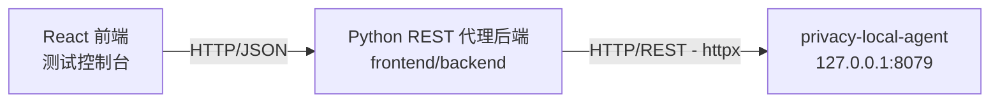

# Python REST 代理后端设计

## 1. 背景与选型原因

`privacy-local-agent` 的核心服务同时通过 REST（FastAPI，默认 `127.0.0.1:8079`）与 gRPC（默认 `127.0.0.1:50051`）暴露全部隐私原语（脱敏、差分隐私、K-匿名、查询混淆、数据分类）。

前端测试控制台（React）需要一个"代理层"来屏蔽跨域、统一响应格式并托管构建产物。本后端（`frontend/backend`）选择 **Python + FastAPI + httpx** 直接转发到 agent 的 **REST** 接口，原因如下：

- **与 agent 同语言**：请求/响应的 Pydantic 模型、字段命名与 agent 完全一致，转发层几乎零适配成本。
- **原生异步**：FastAPI 基于 ASGI，配合 `httpx.AsyncClient` 连接池可以高并发地转发请求，且与 agent 的异步生态无缝衔接。
- **二进制友好**：借助 `pyarrow` 直接在代理层解析 Arrow IPC 流，把二进制响应转换为前端可展示的 JSON 记录。
- **开发体验**：`uvicorn --reload` 热重载 + Pydantic v2 自动校验，本地开发反馈极快。

> 与之对应，`frontend/backend-go` 提供了 Go + gRPC 的等价实现，用于验证 gRPC 通信链路。两个后端对前端暴露**完全一致**的 JSON 契约，前端可通过右上角选择器无缝切换，并通过响应中的 `via` / `protocol` 字段直观确认当前通信方式。

## 2. 总体架构



Python 代理后端本身**不实现任何隐私算法**，只负责：

1. 接收前端的 HTTP/JSON 请求（`/api/proxy` / `/api/batch` / `/api/upload` / `/api/lb_test`）；
2. 通过应用级单例 `httpx.AsyncClient` 连接池转发到 agent 的 REST 端点；
3. 按 `Content-Type` 解析响应（JSON / Arrow IPC / 其他二进制）并统一包装；
4. 把 agent 的错误状态码与 `detail` 透传给前端；
5. 以静态资源形式托管构建好的 React SPA（`web/dist`），浏览器可直接访问控制台页面。

## 3. 目录布局

```text
frontend/backend/
├── app/
│   ├── __init__.py
│   ├── main.py               # FastAPI 入口：路由、Pydantic 模型、静态 SPA 托管
│   ├── client.py             # PrivacyAgentClient：转发到 agent 的 httpx 客户端
│   ├── config.py             # Settings：基于 pydantic-settings 的环境变量配置
│   ├── fixtures/
│   │   └── samples.py        # 所有 agent 端点的示例请求载荷
│   └── routes/
│       └── __init__.py       # 预留的路由分包（当前路由集中在 main.py）
├── tests/
│   ├── test_routes.py        # /api/health、/api/samples、/api/proxy 单元测试
│   └── test_upload_lb.py     # /api/upload、/api/lb_test 单元测试
├── docs/                     # 设计、API、测试文档
│   ├── design.md
│   ├── api.md
│   └── test.md
├── smoke_test.py             # 经 /api/proxy 逐个调用所有示例端点的冒烟测试
├── requirements.txt          # 运行时依赖
├── run.sh                    # 一键启动脚本（uvicorn --reload）
└── README.md
```

## 4. 代理转发机制

### 4.1 统一代理入口 `/api/proxy`

前端把"想发给 agent 的请求"封装为统一结构：

```json
{
  "method": "POST",
  "path": "/v1/privacy/mask",
  "body": { "field_name": "email", "value": "alice@example.com" }
}
```

`client.request` 按以下优先级选择请求体形态：

1. `raw_payload_b64`（base64 二进制，如 Arrow IPC）> `body`（JSON）> 无请求体；
2. 转发后按响应 `Content-Type` 解析：
   - `application/vnd.apache.arrow.stream` → 用 `pyarrow` 解析为记录 + schema 元数据；
   - `application/json` → 直接 `response.json()`；
   - 其他二进制 → base64 编码后返回，保证前端能安全展示。

### 4.2 文件上传 `/api/upload`

前端以 multipart 上传 CSV/JSON 与操作类型，后端读取文件内容后**原样以 multipart 透传**给 agent 的 `/v1/privacy/process_file`。文件解析与隐私算法全部由 agent 负责，后端仅做转发与 `ProxyResponse` 包装。

### 4.3 批量测试 `/api/batch`

`requests` 中的子请求被**顺序**逐个转发，单个失败不中断整批，最终汇总 `total / passed / failed` 与逐项结果。

### 4.4 负载均衡测试 `/api/lb_test`

由本后端自行实现 `round_robin` / `random` / `least_connections` 三种分发策略，向用户填写的多个 agent REST 地址并发发送探测请求，统计各节点命中数与延迟分布（avg/min/max），供前端可视化对比。探测逻辑通过可注入的 `httpx.AsyncBaseTransport` 与端点解耦，便于用 `MockTransport` 单测。

## 5. 响应包装与后端身份标识

所有代理响应统一包装为 `ProxyResponse`：

```json
{ "status": 200, "duration_ms": 12.3, "data": { ... }, "via": "python-rest", "protocol": "REST" }
```

- `status` / `duration_ms` / `data`：逻辑状态码、转发耗时、agent 返回数据；
- `via` = `"python-rest"`：标识本请求由 Python REST 后端处理；
- `protocol` = `"REST"`：标识本后端与 agent 的通信协议。

`via` / `protocol` 与 Go 后端（`go-grpc` / `gRPC`）形成对照，是"双后端无缝切换可被直观验证"的关键设计。

## 6. 静态 SPA 托管

采用"`/assets` 静态目录 + 其余路径回退 `index.html`"的经典 SPA 方案：

- `/assets/*` 直接返回带内容哈希的 JS/CSS 构建产物（强缓存友好，内容变则 URL 变）；
- 其余非 API 路径一律返回 `index.html`，由前端路由接管；
- `index.html` **不带哈希**，必须返回 `Cache-Control: no-cache`，否则重新构建前端后浏览器仍加载旧版本；
- 静态目录不存在时（仅后端开发场景）应用仍正常启动，只提供 API。

## 7. 可测试性设计

- 使用 `fastapi.testclient.TestClient` 直接调用应用路由，无需真实启动服务；
- 通过 `unittest.mock.AsyncMock` 对 `agent_client.request` / `request_multipart` 打桩，单元测试**不依赖**运行中的 agent；
- `_run_lb_test` 接受可注入的 `transport`，用 `httpx.MockTransport` 伪造后端节点；
- `smoke_test.py` 面向真实环境，经 `/api/proxy` 逐个调用所有示例端点，失败只打印不中断。

## 8. 安全与可观测性

- **认证**：`PrivacyAgentClient._headers` 在配置了 `PRIVACY_AGENT_API_KEY` 时附加 `Authorization: Bearer <key>`；
- **直连保证**：`httpx.AsyncClient(trust_env=False)` 不读取系统代理，避免本地代理工具（如 Clash）导致"connection failed"；
- **输入校验**：所有请求体均为 Pydantic v2 模型，作为输入安全的第一道防线；
- **CORS**：宽松中间件仅服务于本地 Vite 开发服务器，生产环境控制台与后端同源部署；
- **错误透传**：agent 的非 2xx 状态码与 `detail` 原样透传，前端看到的错误与直连 agent 一致。

## 9. 扩展方式

新增一个代理端点时：

1. 在 `app/fixtures/samples.py` 中添加 `EndpointSample`（含示例 body 与 `backend` 可用性标识）；
2. 若为常规 JSON 接口，无需改动后端——前端经 `/api/proxy` 即可透明转发；
3. 若需要二进制载荷，使用 `raw_payload_b64` + `content_type` 字段；
4. 若为文件上传类接口，参考 `/api/upload` 经 `request_multipart` 转发；
5. 在 `tests/` 中补充对应的单元测试（mock `agent_client`）。
