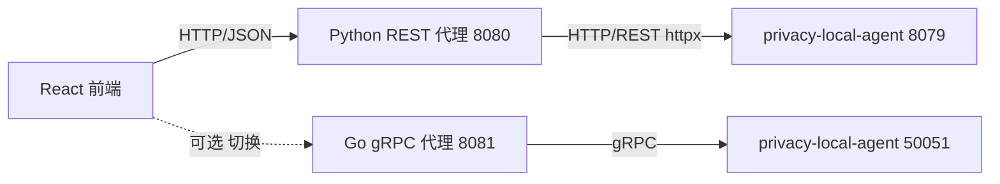

# Python REST 代理后端 — 运维文档

> 面向本地开发与部署运维的操作手册：开发模式与生产模式的区别、配置方式、跨域（CORS）解决方案、启停与排障。
>
> 关联文档：[design.md](design.md)（架构设计）、[api.md](api.md)（接口参考）、[test.md](test.md)（测试策略）。
> Go gRPC 后端的对应运维文档见 [backend-go/docs/ops.md](../../backend-go/docs/ops.md)。

---

## 1. 定位与端口总览

本后端（`frontend/backend`）是测试控制台的 **Python REST 代理**，基于 FastAPI + httpx，把前端的 REST 请求转发到 `privacy_local_agent` 的 REST 接口，并可选地托管前端构建产物（SPA）。

控制台涉及的进程与默认端口：

| 进程 | 默认地址 | 协议 | 说明 |
|---|---|---|---|
| `privacy_local_agent` | `127.0.0.1:8079` | REST | 隐私能力服务（上游） |
| `privacy_local_agent` | `127.0.0.1:50051` | gRPC | 隐私能力服务（供 Go 后端使用） |
| **Python REST 代理后端** | `127.0.0.1:8080` | HTTP | 本文档主角，转发 REST + 托管 UI |
| Go gRPC 代理后端 | `127.0.0.1:8081` | HTTP | 另一可选后端，转发 gRPC + 托管 UI |
| Vite 开发服务器 | `localhost:5173` | HTTP | 仅前端开发模式使用 |

整体链路：



---

## 2. 开发模式 vs 生产模式

两种模式的核心区别在于 **前端从哪里被加载** 以及 **请求是否跨域**。

### 2.1 对比总览

| 维度 | 开发模式 | 生产模式 |
|---|---|---|
| 前端加载来源 | Vite 开发服务器 `localhost:5173`（热更新） | 后端托管的 `web/dist` 静态文件 |
| 前端构建 | 不需要构建，源码直跑 | 需先 `pnpm build` 产出 `web/dist` |
| API 请求走向 | 跨域直连后端绝对地址（5173 → 8080） | 与后端同源（8080 → 8080） |
| 是否触发 CORS | **是**（端口不同，依赖后端 CORS 中间件） | **否**（同源，天然无跨域） |
| 后端热重载 | `uvicorn --reload`（改代码自动重启） | 关闭 reload，稳定运行 |
| 适用场景 | 前端/后端联调、快速迭代 | 一键体验、演示、部署 |

### 2.2 开发模式

前端与后端分别独立运行，前端由 Vite 提供热更新，请求跨域打到后端。

**启动步骤：**

```bash
# 1. 启动上游 agent（REST 8079 + gRPC 50051）
python -m privacy_local_agent.server

# 2. 启动 Python 代理后端（8080，带热重载）
cd frontend/backend
./run.sh            # 等价于 uvicorn app.main:app --host 127.0.0.1 --port 8080 --reload

# 3. 启动 Vite 前端开发服务器（5173，热更新）
cd frontend/web
corepack pnpm install   # 首次
corepack pnpm dev       # 打开 http://localhost:5173
```

此模式下页面来源是 `http://localhost:5173`，而前端 BackendSelector 会把 API 基址设为后端的**绝对地址**（默认 `http://127.0.0.1:8080`），因此所有 `/api/*` 请求都是**跨域**的，必须依赖后端的 CORS 中间件（见第 4 节）。

> 说明：`vite.config.ts` 中还配置了 `/api → http://127.0.0.1:8080` 的开发代理，作为同源回退方案。但当前前端默认总是通过 BackendSelector 使用绝对基址，实际走的是 CORS 直连路径；Vite 代理仅在把基址改回同源时生效。

### 2.3 生产模式

前端先构建为静态产物，由后端同源托管，浏览器从后端（8080）同时拿到页面与 API，**无跨域**。

**启动步骤（推荐一键脚本）：**

```bash
# 一键启动 agent + Python 后端，并自动构建前端（若 dist 缺失）
./frontend/start.sh

# 访问 http://127.0.0.1:8080 即可打开控制台
# 按 Ctrl+C 停止所有服务；或在另一终端执行 ./frontend/stop.sh
```

**手动方式：**

```bash
# 1. 构建前端产物到 frontend/web/dist
cd frontend/web
corepack pnpm install
corepack pnpm build

# 2. 启动 agent
python -m privacy_local_agent.server

# 3. 启动后端（不带 --reload）
cd frontend/backend
uvicorn app.main:app --host 127.0.0.1 --port 8080
```

后端启动时若检测到 `../web/dist` 存在（由 `PRIVACY_CONSOLE_STATIC_DIR` 控制），会自动挂载为静态资源并在 `/` 提供 SPA；若不存在则退化为「API 模式」，访问 `/` 返回 404，仅 `/api/*` 可用。

### 2.4 双后端模式（可选）

如需在页面顶部 Backend Selector 中自由切换 Python REST / Go gRPC 两个后端：

```bash
./frontend/start-all.sh    # 同时启动 agent + Python(8080) + Go(8081)
./frontend/stop-all.sh     # 停止
```

打开 `http://127.0.0.1:8080` 或 `http://127.0.0.1:8081` 均可，切换后端时请求会跨域到另一端口，同样依赖 CORS 中间件。

---

## 3. 配置参考

所有配置通过环境变量加载（支持 `frontend/backend/.env` 文件），均有本地开发默认值，零配置即可运行。定义见 [app/config.py](../app/config.py)。

| 环境变量 | 默认值 | 说明 |
|---|---|---|
| `PRIVACY_AGENT_URL` | `http://127.0.0.1:8079` | 上游 agent 的 REST 基地址 |
| `PRIVACY_AGENT_API_KEY` | （空） | 可选 Bearer Token；agent 开启认证时必填 |
| `PRIVACY_CONSOLE_HOST` | `127.0.0.1` | 本后端监听地址 |
| `PRIVACY_CONSOLE_PORT` | `8080` | 本后端监听端口 |
| `PRIVACY_CONSOLE_STATIC_DIR` | `../web/dist` | 前端构建产物目录（相对 backend/ 工作目录）；设为空则禁用 SPA 托管 |

**配置示例：**

```bash
# 指向远程 agent 并启用认证
PRIVACY_AGENT_URL=http://10.0.0.5:8079 \
PRIVACY_AGENT_API_KEY=your-key \
uvicorn app.main:app --host 0.0.0.0 --port 8080
```

```ini
# frontend/backend/.env（pydantic-settings 自动加载）
PRIVACY_AGENT_URL=http://127.0.0.1:8079
PRIVACY_CONSOLE_PORT=8080
```

> 注意：`run.sh` 会读取 `PRIVACY_CONSOLE_HOST` / `PRIVACY_CONSOLE_PORT` 决定监听地址；`--reload` 仅用于开发，生产请去掉。

---

## 4. 跨域（CORS）解决方案

### 4.1 为什么会出现跨域

浏览器同源策略要求「协议 + 域名 + 端口」三者一致，否则为跨域。本控制台在以下三种场景触发跨域：

1. **开发模式**：页面在 `localhost:5173`（Vite），API 在 `127.0.0.1:8080`，端口不同；
2. **双后端切换**：页面由 8080 提供，但用户切到 Go 后端 `127.0.0.1:8081`；
3. **分离部署**：UI 与后端部署在不同域名/端口（如 nginx 单独托管 dist）。

### 4.2 方案一：同源部署（生产推荐）

生产模式下前端 `dist` 由后端直接托管，页面与 API 同源（都是 `127.0.0.1:8080`），**从根本上不产生跨域**，无需任何 CORS 配置。这是最简单、最安全的方式。

### 4.3 方案二：后端 CORS 中间件（开发默认）

后端内置宽松 CORS 中间件（[app/main.py](../app/main.py)），允许任意来源跨域，专为本地开发设计：

```python
app.add_middleware(
    CORSMiddleware,
    allow_origins=["*"],          # 允许任意来源（含 Vite 5173）
    allow_credentials=True,
    allow_methods=["*"],
    allow_headers=["*"],
)
```

浏览器发起的 `OPTIONS` 预检请求由该中间件自动响应，前端无需任何额外处理。

> 安全提示：`allow_origins=["*"]` 仅适用于本地可信环境。若将后端暴露到不可信网络，应收紧为具体来源列表，或改用方案一/方案四。

### 4.4 方案三：Vite 开发代理（同源回退）

`vite.config.ts` 配置了 `/api` 代理，使前端开发服务器把 API 请求「转发」到后端，对浏览器表现为同源：

```ts
// frontend/web/vite.config.ts
server: {
  port: 5173,
  proxy: {
    '/api': { target: 'http://127.0.0.1:8080', changeOrigin: true },
  },
}
```

当 API 基址为空（同源）时，请求 `http://localhost:5173/api/*` 会被 Vite 透明转发到 `8080/api/*`，不触发 CORS。此方案适合只想对接单一后端的纯前端开发。

### 4.5 方案四：反向代理（分离部署）

若 UI 与后端必须分域名部署，可用 nginx 等反向代理把 `/api` 转发到后端，对浏览器保持同源：

```nginx
server {
    listen 80;
    server_name console.example.com;

    # 静态托管前端产物
    location / {
        root /var/www/privacy-console/dist;
        try_files $uri $uri/ /index.html;   # SPA 路由回退
    }

    # API 反向代理到后端，保持同源，规避 CORS
    location /api/ {
        proxy_pass http://127.0.0.1:8080/api/;
        proxy_set_header Host $host;
        proxy_set_header X-Real-IP $remote_addr;
    }
}
```

### 4.6 方案选型小结

| 场景 | 推荐方案 | 是否跨域 |
|---|---|---|
| 生产一键部署 | 方案一 同源部署 | 否 |
| 本地前后端联调 | 方案二 后端 CORS 中间件 | 是（已自动处理） |
| 纯前端开发（单后端） | 方案三 Vite 代理 | 否 |
| UI 与后端分域名部署 | 方案四 反向代理 | 否 |

---

## 5. 启动与停止

### 5.1 一键脚本

| 脚本 | 作用 |
|---|---|
| `./frontend/start.sh` | 启动 agent + Python 后端（自动补依赖、构建前端），Ctrl+C 停止 |
| `./frontend/stop.sh` | 读取 `frontend/.pids/` 中的 PID 安全停止 |
| `./frontend/start-all.sh` | 启动 agent + Python + Go 双后端 |
| `./frontend/stop-all.sh` | 停止双后端全部进程 |

`start.sh` 支持 `--rebuild` 强制重装依赖并重建前端：

```bash
./frontend/start.sh --rebuild
```

### 5.2 手动启停

```bash
# 启动（开发，带热重载）
cd frontend/backend && ./run.sh

# 启动（生产）
cd frontend/backend
uvicorn app.main:app --host 127.0.0.1 --port 8080

# 停止：Ctrl+C，或 kill 对应进程
```

### 5.3 PID 管理

一键脚本会把进程 PID 写入 `frontend/.pids/`（如 `agent.pid`、`console.pid`），`stop.sh` 据此精确停止，避免误杀其他进程。

---

## 6. 健康检查与验证

```bash
# 后端自身 + 上游 agent 连通性
curl http://127.0.0.1:8080/api/health

# agent 直连健康检查
curl http://127.0.0.1:8079/health
```

`/api/health` 返回结构（详见 [api.md](api.md)）：

- `backend: "ok"` — 后端自身存活；
- `agent: {...}` — agent 可达，附原始 `/health` 返回与延迟；
- `agent: "unreachable"` — agent 不可达（仍返回 HTTP 200，便于前端友好提示）。

**冒烟测试**（遍历所有示例端点）：

```bash
cd frontend/backend
source .venv/bin/activate
python smoke_test.py
```

---

## 7. 常见问题排查

| 现象 | 可能原因 | 处理 |
|---|---|---|
| 前端报 CORS 错误 | 后端未启动 / CORS 中间件被移除 | 确认 8080 在监听；检查 `app/main.py` 的 `CORSMiddleware` |
| `/api/health` 中 `agent: "unreachable"` | agent 未启动或端口不符 | 启动 agent；核对 `PRIVACY_AGENT_URL` |
| 请求报 `connection failed` | 系统代理（如 Clash）劫持直连 | 客户端已用 `trust_env=False` 规避；检查是否改了该设置 |
| 访问 `/` 返回 404 | `web/dist` 未构建 | `cd frontend/web && corepack pnpm build` 后重启 |
| agent 返回 401/403 | agent 开启了认证 | 设置 `PRIVACY_AGENT_API_KEY` |
| 端口被占用 | 8080 已被其他进程使用 | 改 `PRIVACY_CONSOLE_PORT`，或 `./frontend/stop.sh` 清理残留 |
| 改后端代码不生效 | 生产模式未开 reload | 开发用 `./run.sh`（带 `--reload`）；生产手动重启 |

---

## 8. 生产加固建议

- 将 `allow_origins=["*"]` 收紧为实际来源白名单；
- 生产去掉 `--reload`，并配置多 worker（`uvicorn ... --workers N`）；
- 通过 `PRIVACY_AGENT_API_KEY` 启用对 agent 的认证；
- 如需 TLS，在前置反向代理（nginx/网关）终结证书，后端本身保持 HTTP；
- 结合 [observability](../../../docs/production_observability/ops.md) 接入日志与指标采集。
